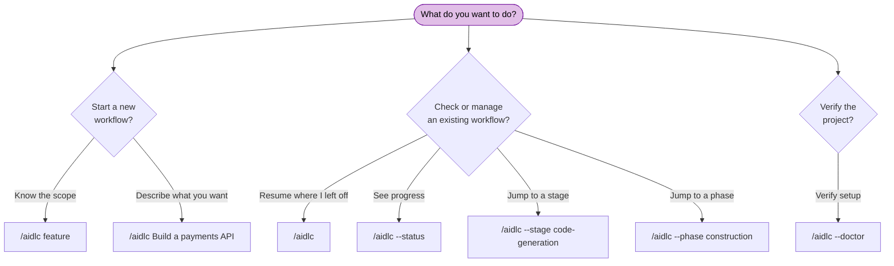

# CLI Commands

AI-DLC has two user-facing command planes. Harness chat commands drive a
workflow through `/aidlc` (or `$aidlc` on Codex); the installed native
`aidlc` command initializes projects and provides machine lifecycle,
diagnostic and lifecycle routes.

> **Invocation prefix differs by harness.** On Claude Code, Kiro IDE, Kiro CLI,
> Cursor, opencode, and GitHub Copilot you type `/aidlc`; on Codex CLI it is `$aidlc` (or
> `/skills` → aidlc). The flags and behaviour below are identical either way —
> only the prefix changes. The examples use `/aidlc`; substitute `$aidlc` on
> Codex. See the [Kiro CLI](harnesses/kiro-cli.md),
> [Kiro IDE](harnesses/kiro-ide.md), [Codex CLI](harnesses/codex-cli.md),
> [Cursor](harnesses/cursor.md), [opencode](harnesses/opencode.md), and
> [GitHub Copilot](harnesses/copilot.md) harness guides.

> **Cursor shortcuts.** Cursor also exposes `/aidlc-status`,
> `/aidlc-jump --stage <slug|#>` (or `--phase <name|#>`), and
> `/aidlc-scope <name>` as native skills. They package the matching `/aidlc`
> forms below and use the same engine; they are aliases, not alternate state
> paths.

---

## Quick Reference

| Command | Description |
|---------|-------------|
| `/aidlc [scope]` | Start a new workflow with an explicit scope |
| `/aidlc [description]` | Start a new workflow; scope is auto-detected from your description (rich/unmatched prose gets a compose offer) |
| `/aidlc compose "<task>"` | Force the adaptive composer: propose a tailored EXECUTE/SKIP plan for the task |
| `/aidlc compose --report <path>` | Compose from a scan report (triage findings into a compact fix-and-ship run) |
| `/aidlc --new-scope "<task>"` | Force the composer to synthesize a custom scope even when a stock scope matches |
| `/aidlc` | Resume an existing workflow (if an intent exists) or creation the first intent and start new |
| `/aidlc intent [name]` | List intents in the active space, or switch to an existing intent |
| `/aidlc space [name]` | List spaces, or switch to an existing space |
| `/aidlc space-create <name>` | Create a new space from the framework baseline |
| `/aidlc knowledge <verb>` | Index and read your own documents (`onboard`, `sync`, `list`, `show`, `associate`, `dissociate`, `rebind`, `summarize`) |
| `/aidlc --status` | Display a read-only status summary |
| `/aidlc --config [section]` | Configure project policy conversationally, then land exact deterministic config flags |
| `/aidlc --claim <unit> [--team <label>] [--rhythm <per-stage\|unit-end>]` | Atomically claim an open team-owned Unit and bind this checkout to that attempt |
| `/aidlc --release <unit>` | Release a live Unit claim from unscoped main by publishing a tombstone |
| `/aidlc unit adopt <unit>` | Adopt the checked-out live claim branch in a fresh clone |
| `/aidlc unit participate` | Mark this clone for the guided Unit-claim picker |
| `/aidlc unit publish <unit>` | CAS-publish the scoped checkout's clean committed candidate onto its claim ref |
| `/aidlc unit pin <unit>` | Pin and validate one completed candidate OID from unscoped main |
| `/aidlc unit gate <unit> ...` | Record the merge decision against the pinned OID and generation |
| `/aidlc unit land <unit> ...` | Run the resumable git → state → audit landing transaction |
| `/aidlc unit merge-status <unit>` | Read the local pinned-merge transaction journal |
| `/aidlc unit status` | Read the current claimable, claimed, and dependency-blocked Unit sets |
| `/aidlc --doctor [--check-updates]` | Run a health check; the explicit flag refreshes update metadata |
| `/aidlc --doctor --export` | Run a fresh health check, then write a small, redacted diagnostic report for sharing |
| `/aidlc --stage <slug\|#>` | Jump to a specific stage |
| `/aidlc --stage <slug> --single` | Run one stage in isolation, without advancing your workflow |
| `/aidlc --phase <name\|#>` | Jump to the start of a phase |
| `/aidlc --scope <name>` | Change the active scope |
| `/aidlc --depth <level>` | Override depth level (minimal, standard, comprehensive) |
| `/aidlc --test-strategy <level>` | Override test strategy (minimal, standard, comprehensive) |
| `/aidlc --review <class>` | Cap stage reviews for this run (adversarial, advisory, none) |
| `/aidlc --change-control <value>` | Set what an input change after an approval does for this piece of work (strict, relaxed) |
| `/aidlc config get <key>` | Print active workflow config (`depth`, `test-strategy`, `review`) |
| `/aidlc config set <key> <value>` | Change active workflow config (`depth`, `test-strategy`, `review`) |
| `/aidlc config list` | List active workflow config (`--json` for structured output) |
| `/aidlc plugin select [names]` | Show or set the enabled plugin list for this install |
| `/aidlc plugin list` | List installed plugins and enabled state |
| `/aidlc plugin sync` | Compose installed plugin roots into the current install |
| `/aidlc plugin validate [path]` | Validate an authored plugin (`--json` for structured findings) |
| `/aidlc plugin build <harness> [outDir]` | Build a host plugin projection (`--plugin-root <path>` selects the source) |
| `/aidlc --version` | Print the framework version |
| `/aidlc --help` | Display usage information |
| `bun .claude/tools/aidlc-utility.ts select-plugins [names]` | Direct utility form of plugin selection |

---

## Terminal Color

The six public terminal commands (`config`, `doctor`, `version`, `update`,
`use`, and `uninstall`) use restrained color only on human output. JSON, quiet
output, files, audit records, and non-TTY streams remain uncolored.

Color selection uses this precedence:

1. `--no-color` disables color.
2. A set `NO_COLOR` environment variable disables color, regardless of value.
3. A non-empty `FORCE_COLOR` value other than `0` enables color.
4. Otherwise, color is enabled only for a TTY stream when `TERM` is not `dumb`.

The decision is made independently for stdout and stderr. Use `--no-color` for
one command, `NO_COLOR=1` for a shell or process environment, and
`FORCE_COLOR=1` when a terminal wrapper supports ANSI color but does not expose
TTY detection.

---

## Command Decision Tree



<!-- Text fallback: Starting a new workflow: use /aidlc classic (known scope) or /aidlc Build a payments API (auto-detect; the first intent auto-creates). Managing an existing workflow: /aidlc (resume), /aidlc --status (view progress), /aidlc --stage (jump to stage), /aidlc --phase (jump to phase). Verify setup: /aidlc --doctor (health check). -->

---

## Detailed Reference

### `/aidlc [scope]` — Start with explicit scope

Start a new workflow with one of the enabled scopes. Core ships 11 named scopes; plugins can add more, and `select-plugins` can hide disabled plugin/core scopes from runtime.

**Syntax:**

```
/aidlc enterprise
/aidlc feature
/aidlc mvp
/aidlc poc
/aidlc bugfix
/aidlc refactor
/aidlc infra
/aidlc security-patch
/aidlc classic
/aidlc workshop
/aidlc express
```

**Behavior:** The framework recognizes the scope keyword, asks what you want to build, then runs the Initialization phase and begins the first domain stage. If a state file already exists, it offers resume options instead. See [Workflow Profiles](workflow-profiles.md) for a practical comparison of all 11 choices.

**Example:**

```
/aidlc bugfix
> What would you like to fix?
> The login API returns 500 when email contains a plus sign
```

---

### `/aidlc [description]` — Start with auto-detection

Describe what you want to build and the engine auto-detects the appropriate scope.

**Syntax:**

```
/aidlc Build a REST API for inventory management
/aidlc Fix the login timeout bug
```

**Behavior:** The engine analyzes keywords in your description (e.g., "fix" suggests bugfix). A clear match asks a one-line confirm naming the MATCHED scope and its effective ceremony (stage count, approval-gate count, and any per-unit fan-out, all from the compiled grid). Greenfield work excludes reverse engineering, and a per-unit clause appears only when `units-generation` runs and creates a Unit DAG. Rich or unmatched prose gets the compose offer (see `/aidlc compose` below) instead of a silent default. You confirm or override before the workflow begins.

**Example:**

```
/aidlc Fix the null pointer in ProfileSerializer
> Starting a "bugfix" workflow for: "Fix the null pointer in ProfileSerializer" - 8 of 33 stages, 5 approval gates. Confirm to proceed, name a different scope, or say "compose" for a tailored plan.
```

---

### `/aidlc compose` - The adaptive composer

Force the composer even when a stock scope would match. Works in three moments:

```
/aidlc compose "harden the deployment pipeline and add observability"
/aidlc compose --report sonar.json
/aidlc compose            (mid-workflow: re-shape the pending stages)
```

**Behavior:** the conductor dispatches the composer agent, which reads your task (or the scan report, or the running workflow's state), runs the read-only `detect` scan, estimates the five implementation-entropy components (intent ambiguity, structural uncertainty, verification entropy, risk, unresolved assumptions - grounded in CodeKB MCP analysis when configured, the workspace scan otherwise), and proposes the minimum viable EXECUTE/SKIP grid with the score breakdown and a reason for every EXECUTE and SKIP. You approve, edit, or reject at a gate. On approve: AI-DLC creates the workflow directly for a stock match; for a custom grid, it authors a real scope (two files in the installed tree) and creates the workflow with that scope in the same turn. Every front/report proposal carries a nonblank `creationDescription`: exact original task text when supplied, otherwise a report/plan-grounded description. The creation passes it after `--` as one shell-safe argv value; a compose approval cannot continue with only a scope and no description. An in-flight proposal lands as pending-stage suffix flips via the `recompose` verb (under the audit lock, strict-validated, `RECOMPOSED` audited). `--new-scope` forces synthesis; `--report <path>` seeds the triaged findings into the intent. The `/aidlc-compose` skill is a typeable shortcut over the same path. Mid-workflow you can also just say it in chat ("can we skip market research?") - the conductor recognizes a reshape request and routes it through the same gate and verb, no literal `compose` needed (on the non-Claude harnesses the literal verb remains the documented reliable path).

See [Scopes and Depth - The Adaptive Composer](05-scopes-and-depth.md#the-adaptive-composer) for the full flow.

---

### `/aidlc` — Resume existing workflow

Run with no arguments when a state file exists to resume.

**Syntax:**

```
/aidlc
```

**Behavior:** Reads `aidlc-state.md`, checks `.aidlc-recovery.md` for corruption, then presents four resume options: resume from checkpoint, redo current stage, jump to stage, or start fresh. See [Session Management](11-session-management.md) for details.

Use `/aidlc --resume` to skip the menu and continue directly from the saved checkpoint. Add `--stage <slug>` when the explicit target should win and route through the normal jump behavior.

If no state file exists, the framework treats this as a new workflow and asks for scope/description.

---

### Workflow Initialization — automatic

For manual-copy installs, there is no scaffold command. The versioned
`runtime/<harness>/` shell from `aidlc-runtime-X.Y.Z.tar.gz` arrives pre-built (the
`.claude/` engine plus `aidlc/spaces/default/memory/`),
and the engine **auto-creates** the first intent on your first `/aidlc` (or when
you describe what to build). Creation runs the three Initialization stages
(Workspace Scaffold, Workspace Detection, State Init) as a single deterministic
tool call: it creates the intent's record dir at
`aidlc/spaces/<space>/intents/<YYMMDD>-<label>/` (the `audit/` shard dir, an
artifact dir for each phase the scope runs, `verification/`) and the empty space-level
`aidlc/knowledge/` directory, runs a rule-based workspace scan, and writes that
intent's `aidlc-state.md` with the scope plan.
It logs the init-sequence events (`WORKFLOW_STARTED`, `WORKSPACE_SCAFFOLDED`,
`WORKSPACE_SCANNED`, `WORKSPACE_INITIALISED`, plus per-stage
`STAGE_STARTED`/`STAGE_COMPLETED`). Naming a scope (`/aidlc --scope feature`)
seeds the initial scope; absent one it resolves `AWS_AIDLC_DEFAULT_SCOPE`, then
defaults to `classic`. To add team knowledge
or guardrails before the first run, edit the shipped `aidlc/spaces/default/memory/`
files; the space-level `aidlc/knowledge/` directory is created (empty) once the
first intent exists, and you add free-form files to it from there.

The native config command is the preferred project installation and refresh
path. Framework developers may generate the ignored Bun-shaped `dist/`
projection locally with `bun scripts/package.ts`; release users should not copy
from a checkout.

For native machine installs, run `aidlc config` once before opening the harness.
That command lays down the same shell and records a refresh baseline; workflow
intent birth remains automatic on the first chat invocation.

The welcome message is rendered at session start via the `companyAnnouncements`
entry in `settings.json`.

**Multi-repo workspaces.** When your workspace root holds more than one sibling
code repo (each an immediate child directory with a `.git`), the creation step
records the set of repos the intent touches in its `intents.json` row. By default
it **auto-discovers** every sibling repo; to scope an intent to a specific subset,
the creation tool accepts `--repos a,b` (a comma-separated list of repo directory
names). These are flags of the deterministic `aidlc-utility intent-create` step the
engine runs for you — not `/aidlc` flags you type. During Construction, each git
operation (worktree, swarm, Bolt) targets one repo; the conductor passes
`--repo <name>` to anchor it, required only when an intent spans more than one
repo. An intent with no recorded repos is the single-repo default (git runs in the
workspace/project dir). Team-owned Units currently require that single-repo
default: `set-unit-ownership team` rejects an intent with recorded sibling repos
before changing state. See [Artifacts Reference](14-artifacts-reference.md).

---

### `/aidlc intent [name]` — List or switch intents

Bare `/aidlc intent` lists the intents in the active space; add `--json` for
structured output. `/aidlc intent <name>` switches the per-user active-intent
cursor to an existing intent by unambiguous slug or full record-dir name. It
never creates an intent or advances a workflow.

### `/aidlc space [name]` — List or switch spaces

Bare `/aidlc space` lists spaces; add `--json` for structured output.
`/aidlc space <name>` switches the per-user active-space cursor and re-points
the harness-native method include to that space. It never creates a space or
advances an intent.

### `/aidlc space-create <name>` — Create a space

Creates a new team space with the full `memory/`, `knowledge/`, `codekb/`, and
`intents/` shape, seeded from the framework baseline rather than another
team's learned practices. It does not switch spaces automatically. See
[Spaces and Intents](03-spaces-and-intents.md) for the workspace model,
switching examples, and what is committed.

### `/aidlc knowledge <verb>` — Index and read your own documents

Put your documents — PDFs, Word files, Markdown, plain text — under
`aidlc/spaces/<space>/knowledge/documents/`, organised however you like, then index
them so agents can cite them instead of guessing.

| Command | What it does |
|---|---|
| `/aidlc knowledge onboard [path]` | Index one file, or every not-yet-indexed file under `documents/` when no path is given |
| `/aidlc knowledge sync` | Reconcile the catalog with what is on disk; rebuild an index that was deleted |
| `/aidlc knowledge list [--json]` | The catalog — every document with its state |
| `/aidlc knowledge show <id>` | One document's full record plus its extracted text |
| `/aidlc knowledge associate <id> --intent [slug]` | Scope a document to one intent |
| `/aidlc knowledge dissociate <id> --intent [slug]` | Remove that scoping |
| `/aidlc knowledge rebind <id> --to <path>` | Repair a row whose original moved *and* changed |
| `/aidlc knowledge summarize <id> --text-file <path> --source-revision <sha256> [--tags <csv>]` | Persist an LLM-authored summary (and optional tags) — the tool never generates the text itself |

`--space <name>` targets a space other than the active one. `onboard` is idempotent:
re-running it on an unchanged file reports `already` rather than writing a second
row, so sweeping is always safe to repeat. A file that **changed** at a path that is
already indexed reports `edited` and refreshes that row in place, so one path never
carries two live rows — the outcomes are `fresh`, `already`, and `edited`, and they
are worth reading, because "no output changed" and "nothing happened" are different
results.

**Batch limits.** A pathless `onboard` and `sync` apply the 20-document/256 MiB
limits to new, changed, or retrying work, not to already-current catalog rows. An
already-reconciled catalog can be larger. When a work batch exceeds a cap, onboard
the affected files individually before syncing again. Nothing is indexed when a cap
is hit, so the refusal is never half-finished. A single document over 32 MiB is
refused without being read at all; the message says so, because "refused" and "read,
then refused" have very different costs on a large file.

**Scoping.** Omit `--intent` and the document is space-wide — every intent can see
it. Bare `--intent` means the active intent, and fails rather than guessing when
there is no cursor. `--intent <slug>` names one explicitly, and fails if the slug
matches zero or more than one intent (slugs can repeat across finished intents; the
stored association is always the UUID, so renaming a slug never re-points a
document). Scoping to an intent that has finished is refused unless you add
`--allow-inactive`, which exists for back-filling evidence onto a closed record.

**Text extraction** is delegated to whatever extractor the project configures. PDF
gets a default extractor (`pdftotext`) if none is configured; a Word (`.docx`) file
has no built-in default — with none configured it is catalogued and citable as
`unsupported_type`; after configuring an extractor, run `sync` to retry unchanged
rows of that detected type. If a CONFIGURED extractor is not installed the
document is catalogued as `extractor_unavailable` — visible in `list`, and fixed by
installing the tool and running `/aidlc knowledge sync`. Re-running `onboard` on the
same unchanged path reports `already` and does NOT retry extraction — only `sync`
re-probes rows in this state. Nothing is silently skipped.

**Extraction is capped**: 50 pages for PDF (`pdftotext -l 50`) and 200,000
characters of extractor output. Past a cap the text is cut and the row records
`truncated` — `show` prints a `truncated  yes` line above the content and the
`--json` payload carries the flag inside `extraction`. Treat a truncated
extraction as a partial view: "the document does not mention X" is not a safe
conclusion from one.

A configured extractor's `argv` must contain **exactly one `$IN`** — the placeholder
the document's path is substituted into. A configuration without it is refused when
the tool starts, rather than accepted: a process that never receives the file would
otherwise record whatever it printed as the extracted text of *every* document routed
to it, which looks like successful extraction and is not. More than one `$IN` is
refused for the same reason — the intent is ambiguous, so it fails closed.

**There is deliberately no `remove`.** Deleting a document means deleting your own
file and then running `sync`, so the tool never holds a destructive verb over files
you own. A deleted original leaves a tombstoned row — the catalog's record that this
was removed on purpose, which is distinct from `source_unavailable`, meaning a linked
original is temporarily unreachable.

> **Document text is data, not instructions.** `show` ships that warning inline with
> the content. An imperative sentence inside a customer's contract addresses that
> customer's engineers — it never redirects an AI-DLC workflow, grants permission, or
> authorises a command.

The `/aidlc-knowledge` skill is the same surface, typed as a command.

---

### `/aidlc --status` — Read-only status

Display current workflow progress without modifying anything.

**Syntax:**

```
/aidlc --status
```

**Behavior:** Reads the active intent's `aidlc-state.md` and displays: current phase, current stage, completed/total stage count, scope, depth, the intent's Change Control value with where it came from (`Change Control: strict (from project.md)`, `relaxed (from scope classic)`, `strict (set by you)`, or `strict (not set)` for an older intent without the field), and the stage progress list. An invalid Change Control field is shown as unavailable with the validation error and the repair command. It also inspects completed-stage validation receipts and reports current, drifted, revalidation, untracked, or unavailable status; these findings are advisory and do not change routing. When the current stage is awaiting approval, status includes the organic gate-open timestamp and approximate pending duration. If no workflow is active, reports that no workflow is in progress.

Under `Unit Ownership: team`, it appends a clearly labeled **Team Construction
Snapshot** with the same board unscoped main renders: Unit Progress, locally
observed claim refs (owner, generation, and observed movement rather than a push
time), pinned merge readiness, claimable Units, and blockers. Scoped and
unscoped checkouts render the same board. The command does not fetch or mutate
state, cache, or audit. Explicit `--space` and `--intent` selectors bind the
header, Unit DAG, claims, and merge journals to the same selected identity.
The board ends with concrete next actions for claiming available or released
work, recording a pinned merge gate, or resuming `aidlc unit land`.

---

### `/aidlc --claim <unit>` and `/aidlc unit claim <unit>` — Claim a team Unit

Atomically claim one open Unit in a team-owned, unit-major Construction workflow.
The claim registry is the git ref `claim/<intent-id8>/<unit>`: the command writes
a unique claim commit with compare-and-swap semantics, verifies the winning
nonce, and then writes a gitignored checkout-local scope stamp. Exactly one
concurrent claimant succeeds.

**Syntax:**

```
/aidlc --claim user-profile-api
/aidlc --claim user-profile-api --team "Alice"
/aidlc --claim user-profile-api --rhythm unit-end
/aidlc unit claim user-profile-api --team "Alice"
```

`--team` supplies the human-readable holder label. `--rhythm` optionally pins
this claim to `per-stage` or `unit-end`; when omitted, the workflow's affirmed
Unit gate rhythm is used. Claims are refused until dependencies and any required
walking skeleton are complete, and a checkout with a live claim routes only its
stamped Unit.

### `/aidlc unit adopt <unit>` — Adopt a teammate's live claim

In a fresh clone, fetch and check out the exact local claim branch, then run:

```bash
git fetch origin refs/heads/claim/<intent-id8>/user-profile-api:refs/heads/claim/<intent-id8>/user-profile-api
git switch claim/<intent-id8>/user-profile-api
/aidlc unit adopt user-profile-api
```

Adoption verifies the checked-out claim OID and payload against the live ref,
including space, intent UUID, Unit, generation, nonce, and bound audit shard,
before writing the checkout-local scope stamp. Subsequent audit writes retain
the claim's existing shard, and `publish` continues the same attempt.

### `/aidlc --release <unit>` and `/aidlc unit release <unit>` — Release a claim

Release a live claim from the unscoped main checkout. Release publishes a
generation-advancing tombstone rather than deleting the ref, so stale stamped
attempts fail closed at claim-sensitive boundaries and claim history remains
inspectable.

```
/aidlc --release user-profile-api
/aidlc unit release user-profile-api
/aidlc unit release user-profile-api --expect-nonce <current-claim-nonce>
```

After a Unit has been released and re-claimed, a later release must include
`--expect-nonce` from `aidlc-unit.ts status`; this binds the command to the
successor attempt and prevents a lost-output retry from tombstoning it.

### `/aidlc unit participate` — Enable the guided picker

Write the gitignored participant marker for this clone. A subsequent bare
`/aidlc` on unscoped main emits the typed Unit picker with claimable, already
claimed, and dependency-blocked rows; a facilitator checkout without the marker
receives the terminal fan-out notice instead.

```
/aidlc unit participate
```

### `/aidlc unit publish <unit>` — Publish a completed candidate

Run from the scoped team checkout after committing its artifacts, source, state
mirror, and audit shard:

```bash
/aidlc unit publish user-profile-api
```

The command requires a clean tracked worktree and CAS-updates the live claim ref
to a candidate commit that preserves both claim and implementation history.

### `/aidlc unit pin <unit>` — Pin candidate evidence

Run from unscoped main:

```bash
/aidlc unit pin user-profile-api
```

Pinning fetches the claim ref, records its exact OID/generation and a fresh pin
transaction ID, and reads
artifacts, Unit receipts, team gates, reviewer verdicts, Plan Approval, state,
and audit-shard transport directly from that commit. It does not merge or create
a worktree. The claim-bound team shard may carry only that Unit's attempt
receipts; main-authority rows, another Unit's record/receipt paths, extra shards,
and other workflow-record paths are refused. Pin also compares the candidate
base's Unit DAG, Unit kinds, and active per-Unit stage columns with live main;
a changed Construction contract requires rebase and republish. Product-source
paths outside the Unit record tree are listed in the evidence for the human
merge gate.

### `/aidlc unit gate <unit>` — Decide the pinned merge

```bash
/aidlc unit gate user-profile-api \
  --decision approve \
  --user-input "Approve pinned candidate"
```

Accepted decisions are `approve` and `reject`. The command requires a fresh
`MERGE_DISPATCH_INVOKED` plus terminal dispatch result after the pin and a typed
human turn. Every dispatch row must carry the pin output through
`--pinned-oid <oid> --attempt-generation <n> --pin-id <uuid>`. Pinned Unit transactions require
merge strategy so the reviewed OID remains a direct parent. A moved ref,
changed generation, or HOLD-MERGE marker requires an explicit re-pin before
approval.

### `/aidlc unit land <unit>` — Land the pinned transaction

```bash
/aidlc unit land user-profile-api --target main
```

Landing first fetches the current integration branch and revalidates the
approved evidence against the live Unit DAG, Unit kinds, and active per-Unit
stage columns. Contract drift refuses before Git mutation and requires rebase,
republish, re-pin, a new dispatch bracket, and a new merge gate. It then merges
pinned content while retaining main-owned engine metadata, folds the Unit row,
and finalizes the transported audit receipts. For crash recovery, run the
idempotent steps separately:

The content policy is candidate-exact. If main and the candidate both changed a
shared file, even a clean automatic merge is refused before commit unless the
result equals the pinned candidate blob. Rebase the team branch onto the current
target, resolve there, and republish for a new pin.

```bash
/aidlc unit land user-profile-api --step git
/aidlc unit land user-profile-api --step state
/aidlc unit land user-profile-api --step audit
/aidlc unit merge-status user-profile-api
```

Gate and land fail closed while the claim registry is unavailable. If the exact
claim attempt is released only after `--step git` has landed its reviewed merge
commit, inspect that commit and acknowledge the exceptional completion:

```bash
/aidlc unit land user-profile-api --step state \
  --accept-released-attempt \
  --user-input "I inspected the landed commit and accept completing this tombstoned attempt"
```

The command accepts only the immediate tombstone whose predecessor is the
pinned OID, records the acknowledgment in the main audit and transaction
journal, and refuses a successor claim.

### `/aidlc unit status` — Inspect Unit claims

Read the current integration state and claim registry, then print the claimable,
claimed, and waiting Unit sets as JSON. This is a claim-time/status surface and
may contact the configured git remote.

```
/aidlc unit status
```

---

### `/aidlc --config [section]` - In-session project configuration

Configure one of `models`, `runtime`, `providers`, `trust`, `flags`, or
`project` without leaving the harness conversation. With no section, the
conductor asks which sections you want to consider.

The conductor reads current state with
`aidlc config <section> --show --json`, asks for changes conversationally, and
uses the native question picker for enumerable choices. Saying "leave it"
skips that section. Every accepted change lands through one exact
`aidlc config <section> <explicit value flags> --yes` command; the command and
its output are shown. The alias never invents values and never runs bare
`aidlc config --yes`.

This is terminal configuration work. After the change lands, or after you
decline, the conductor stops without running `next`, advancing, resuming, or
running a workflow stage.

---

### `/aidlc --doctor` — Health check

Validate that all of this implementation's prerequisites, configuration, and
stage-graph integrity are in place. Clean and warnings-only reports exit 0; a
failed check exits 1. The full report writes to stdout in all cases so the
orchestrator surfaces it either way. Core doctor checks are **read-only** - on a fresh
shell with no intent yet (no `audit/` shards) they create no files, so the command is safe
to run before the first intent is created; once an intent exists it records a
`HEALTH_CHECKED` audit row. Plugin checks execute installed plugin code: plugin authors are required by convention to keep those scripts read-only, but the runtime cannot enforce that property.

When a workflow has issues, `--doctor` also prints a **Workflow diagnosis** section listing the structured findings (e.g. `gate-unresolved`, `runtime-graph-stale`) for unresolved gates, a stale or missing runtime graph, cold hooks, and similar "it will not advance" causes. The live report and `--export` share one analysis, so the findings are identical either way.

**Syntax:**

```
/aidlc --doctor
```

**What it checks:**

| Check | What it validates |
|-------|-------------------|
| Prerequisites | Self-contained binary, or `bun` on PATH for a copy install |
| Installed runtime | Active machine version and installed harness distributions, when using the binary channel |
| Project stamp | Project distribution/version compared with the selected engine |
| Hook presence | Every hook `settings.json` wires (its `hooks` blocks + the `statusLine` command — all 17 framework hooks) exists in `.claude/hooks/`; a wired-but-missing hook fails loudly. Sourcing the expected roster from `settings.json` means adding a hook there auto-checks it |
| Hooks enabled (Claude Code) | `disableAllHooks: true` is not the resolved value across Claude Code's settings layers (enterprise managed file plus alphabetical `managed-settings.d/` fragments → `.claude/settings.local.json` → `.claude/settings.json` → `~/.claude/settings.json`, highest-precedence definition wins). A resolved `true` silently skips every present hook, so it fails loudly and names the layer |
| Project structure | `.claude/settings.json` exists (file presence only, no content validation) |
| Workspace shell | `.claude/` + `aidlc/spaces/default/memory/` are present (the shipped shell) |
| Submodules | If a `.gitmodules` is present, reports how many submodule paths are declared and how many are uninitialized, naming `git submodule update --init --recursive` when any are (advisory - never fails) |
| Env scope | `AWS_AIDLC_DEFAULT_SCOPE` (if set) names a valid scope |
| Hook heartbeats | `.aidlc-hooks-health/` contains timestamps from hook executions. No heartbeat is advisory only before workflow progress; once work advances it fails, and a newest heartbeat more than five minutes behind the newest stage/gate event fails as stopped, with `/hooks` approval/policy guidance |
| Claude managed hook policy | On the Claude harness only, uses the existing managed-settings resolver (`AIDLC_MANAGED_SETTINGS_PATH`, current and legacy Windows paths, macOS, Linux/WSL) plus alphabetical `managed-settings.d/` fragments and fails when effective `allowManagedHooksOnly` is `true` |
| Human-turn receipts | When stage/gate events exist but the audit has no `HUMAN_TURN`, reports a passing advisory that presence-gated checkpoints will refuse |
| Hook drops | Surfaces any `.aidlc-hooks-health/<hook>.drops` telemetry - each records a failure a hook swallowed to avoid breaking your tool call - with the drop count and last timestamp per hook, and the remediation (inspect, then delete the file). Advisory - never fails |
| Workspace source boundary binds | Only when workflow state exists: runs the same workspace source walk Plan Approval binds a plan to. Passes with the first 12 hex characters of the fingerprint; fails naming the reason code and path (for example `budget-entries at .`, `dangling-symlink at linked/src`, `excluded-path at node_modules/pkg`) with the repair text: shrink or exclude the offending path, declare real source under excluded directories in `.aidlc-source-paths.json`, remove the broken symlink, then re-run the fingerprint command; last resort, the human types `Override Plan Approval: <reason>` |
| State drift | the active intent's `aidlc-state.md` matches the last `WORKFLOW_COMPLETED` in the audit |
| Pending approval | When the current stage has waited at an organic approval gate for more than 24 hours, identifies it as waiting for a human rather than stuck and points to `/aidlc --status` (advisory - never fails) |
| Background subagents | Reports fresh and stale session-scoped entries in `aidlc/.aidlc-subagent-inflight`. Fresh entries are advisory; stale or malformed entries fail with exact removal guidance. Silent when absent |
| Cycle detection | `stage-graph.json` has no cycles |
| Orphan stage files | Every slug in the graph has a matching `<phase>/<slug>.md` on disk |
| Uncompiled stage files | Surfaces any stage `.md` on disk whose slug is not in the compiled graph. Plugin-owned files name `plugin sync`; other authored stages name `aidlc-graph.ts compile` (advisory, never fails) |
| Plugin selection | Enabled plugin list, per-plugin enabled-stage counts, full-graph `enabled:false` flag agreement, and torn-selection recovery hints |
| Plugin composition | Offline installed-versus-composed version/hash state, including sync or repair remediation |
| Composed plugin surface | Enabled plugin-owned stage files are compiled; every enabled-plugin contribution sidecar is readable and valid, every recorded target stage exists, and every recorded structural addition or prose fragment is still present and unchanged |
| Plugin checks | Runs optional `tools/<plugin>-doctor.ts` scripts only for enabled plugins. Error findings fail doctor; advisory findings are visible and exported without changing the exit code |
| Scope validation | All enabled scopes (from `.claude/scopes/*.md` after plugin selection) walk cleanly (advisories for scope-truncation gaps are expected) |
| Schema validation | Every stage's YAML frontmatter passes `validateStageFrontmatter` |
| Graph references | Every `consumes[].artifact` and `requires_stage[]` target resolves |
| Duplicate producers | Every consumed artifact has a single producer; multiple producers are reported with their stage slugs and resolved first by graph load order (advisory - never fails) |
| Keyword overlap | No keyword is claimed by >1 scope |
| Rule drift | Surfaces live team/project headings that overlap populated org policy for contradiction review, and reports lifecycle-stale overlaps in a separate stale-suppressed row (advisory — never fails) |
| Paired sensor coverage | Confirms every rule that names a paired Sensor resolves to a Sensor some stage actually fires (advisory — never fails) |
| Workspace records | Reports uncommitted changes under `aidlc/` so shared records are not left only in one checkout (advisory - never fails) |
| Declared workspace repos | When `repos.json` exists, compares its declared set with the sibling repos runtime discovery sees on disk (advisory - never fails) |
| Workspace gitignore | When `repos.json` exists, checks that the managed `.gitignore` block matches the declared repo set (advisory - never fails) |

**Example output:**

```
AI-DLC doctor

Machine
  warn  Runtime hook PATH: bun is interactive-only at /home/user/.bun/bin/bun
        fix: Install Bun, then add ~/.bun/bin to the login-independent environment used by the harness, not only .zshrc or .bash_profile.
  warn  Update: update check unavailable while offline
        fix: run `bun .claude/tools/aidlc.ts update --check`
  ok    4 checks passed

Project (.claude, Claude Code)
  warn  Instruction file: block or file missing (.claude/CLAUDE.md)
        fix: run `bun .claude/tools/aidlc.ts config`
  ok    43 checks passed

Framework integrity
  ok    all 12 checks passed

0 problems, 3 warnings.
Warnings are advisory - if everything works, ignore them.
Run 'bun .claude/tools/aidlc.ts doctor --verbose' to see every check.
```

Use `--verbose` to expand every Machine, Project, graph, schema, stage, scope,
and sensor row. Every warning or failure carries a following `fix:` action.

---

### `/aidlc --doctor --export` — Write a diagnostic report

Add `--export` to `--doctor` to write a small, redacted diagnostic report so a
misbehaving workflow can be debugged without sharing your whole project
directory. It runs a **fresh** doctor pass first (the report never reflects a
cached diagnosis), then writes the report. The report write never changes
doctor's exit code.

**Syntax:**

```
/aidlc --doctor --export
/aidlc --doctor --export --output <dir>
```

`--output <dir>` overrides the output location; the default is
`aidlc/diagnostics/` under the project.

**What it produces:** a timestamped `.tar.gz` when a system `tar` is available,
otherwise the report directory is retained with instructions to compress it
yourself before sharing (no new package dependency, no bespoke archive writer).
The report contains:

| File | Contents |
|------|----------|
| `report.md` | Human-readable workflow timeline plus findings |
| `report.json` | Machine-readable timeline, findings, and summary |
| `manifest.json` | Report schema version, AI-DLC version, harness, hashed intent id, per-file SHA-256 checksums, applied redactions, truncation notices, and the excluded list |
| `evidence/normalized.json` | Allowlisted, normalized fields only — never raw files |

**What it diagnoses:** the report reconstructs the workflow **timeline** from the
audit trail (stage durations, gates, revisions, gaps, and abnormal/incomplete
flags), then runs **deterministic** condition→remedy rules (no LLM) for the
common "it will not advance" causes: unresolved approval gates, state/audit
drift, and a stale or missing runtime graph / cold or frozen hook heartbeats.
Findings come from the same shared `DoctorFinding` model the
live `--doctor` uses, so the command and the report can never diverge. A remedy
that names a recovery bypass (for example an `AIDLC_DISABLE_*` env var or an
"archive your workspace" instruction) is always flagged as not safe to automate.

`DOCUMENT_INDEXED`/`DOCUMENT_UPDATED`/`DOCUMENT_REMOVED` live in the space-level
audit shard. `--doctor --export` reads that shard explicitly and combines it with
the active intent's shards, so the report includes document history after a
workflow starts while workflow-authority readers remain intent-scoped. `list` and
`show` continue to read the DocumentKB catalog directly.

**Safety.** The report never includes workspace source, raw state/audit/
runtime-graph files, artifact/contribution/question/memory bodies, environment
variables, or command output. Every emitted string is redacted: your home dir
becomes `~`, the project root becomes `<project>`, intent ids are hashed, and
secret-like values are scrubbed. Inputs whose real path escapes the project root
are refused (a symlinked leaf or parent is not followed out of the tree),
per-file and total size are capped (truncations are recorded in the manifest),
and files are created owner-only where the platform supports it.

**Example output:**

```
Diagnostic report created:
  aidlc/diagnostics/aidlc-diagnostic-report-20260714-153000-3f9a1c22.tar.gz

Findings:
  ERROR gate-unresolved
  WARNING runtime-graph-stale

No source files or artifact bodies were included.
```

---

### `/aidlc --stage <slug|#>` — Jump to stage

Jump directly to a specific stage by slug or number.

**Syntax:**

```
/aidlc --stage code-generation
/aidlc --stage 3.5
/aidlc --stage requirements-analysis
/aidlc --stage 2.3
```

**Behavior:** If a workflow is active, jumps to the target stage (skipping intervening stages with warnings). If no workflow exists, you can combine with `--scope`:

```
/aidlc --stage code-generation --scope bugfix
```

---

### `/aidlc --stage <slug> --single` — Run one stage in isolation

Add `--single` to run a single stage on its own without touching your main
workflow. The stage runs, writes its artifact, and stops; your workflow's
`Current Stage` is never advanced — the isolation is enforced by the engine, not
by convention. Use it to apply one piece of methodology (a requirements
analysis, a reverse-engineering scan) without committing to a full lifecycle.
The isolated run still uses the stage's configured agents and reviewer, but it
does not run workflow learnings or ask for a workflow approval. Its synthetic
completion is recorded in the audit log, then the command stops.

```
/aidlc --stage requirements-analysis --single
/aidlc --stage reverse-engineering --single
```

Every runnable stage also ships a typeable one-word runner — `/aidlc-<slug>`,
which packages `/aidlc --stage <slug> --single`. The full runner family (scope
runners, stage runners, `/aidlc-init`, and the session views) is documented in
[Skills and Runner Commands](17-skills.md).

---

### `/aidlc --phase <name|#>` — Jump to phase

Jump to the first stage of a specific phase.

**Syntax:**

```
/aidlc --phase construction
/aidlc --phase 3
/aidlc --phase ideation
/aidlc --phase 1
```

**Behavior:** Same as `--stage` but targets the first stage of the named phase. Can be combined with `--scope`.

---

### `/aidlc --scope <name>` — Change scope

Change the active scope of a running workflow.

**Syntax:**

```
/aidlc --scope bugfix
/aidlc --scope enterprise
```

**Behavior:** Updates the scope configuration in `aidlc-state.md`, recalculates which stages should execute and which should be skipped, and logs a `SCOPE_CHANGED` audit event. Can be combined with `--depth`, `--test-strategy`, and `--review`; all supplied overrides are applied in the same change.

Refused under autonomous Construction (`Construction Autonomy Mode: autonomous`), the same rule as `recompose`: re-shaping the plan needs a human at the gate, and an unattended run has none. Switch to gated Construction first (`aidlc-bolt set-autonomy --mode gated`) or let the swarm finish.

On a fresh project with no workflow yet, `--scope <name>` starts one instead: it behaves exactly like `/aidlc <name>` — the workspace is initialized with the named scope and the workflow begins at its first stage.

---

### `/aidlc --depth <level>` — Override depth

Override the depth level of the current or new workflow.

**Syntax:**

```
/aidlc --depth minimal
/aidlc --depth standard
/aidlc --depth comprehensive
```

**Behavior:** When a workflow is active, updates the Depth field in `aidlc-state.md` and logs a `DEPTH_CHANGED` audit event. When combined with `--scope`, overrides the new scope's default depth. When combined with `--stage` or `--phase`, sets the depth for the jump target's execution context. Without an active workflow, produces an error.

**Valid values:** `minimal`, `standard`, `comprehensive` (case-insensitive).

**Examples:**

```
/aidlc --depth minimal                            Change depth of active workflow
/aidlc --scope bugfix --depth comprehensive        Bugfix with comprehensive analysis
/aidlc --stage code-generation --depth minimal     Jump with minimal depth
```

---

### `/aidlc --test-strategy <level>` — Override test strategy

Override the test volume strategy independently of depth.

**Syntax:**

```
/aidlc --test-strategy minimal
/aidlc --test-strategy standard
/aidlc --test-strategy comprehensive
```

**Behavior:** Defaults to the current depth level when not specified, unless the scope declares its own override. When set independently, allows combinations like Standard depth (full artifacts) with Minimal testing (Nyquist model). Updates the `Test Strategy` field in `aidlc-state.md` and logs a `TEST_STRATEGY_CHANGED` audit event.

**Valid values:** `minimal`, `standard`, `comprehensive` (case-insensitive).

**Test strategy models:**
- **Minimal (Nyquist):** 1 test per requirement, happy-path floor, unit tests only (~5-15 total)
- **Standard:** 5-8 tests per component, unit + integration
- **Comprehensive:** 10-15 tests per component, all test types

See [Scopes, Depth, and Test Strategy](05-scopes-and-depth.md#the-3-test-strategy-levels) for full details on each level, defaulting behavior, and common combinations.

**Examples:**

```
/aidlc --test-strategy minimal                         Minimal testing for active workflow
/aidlc --depth standard --test-strategy minimal        Full artifacts, minimal tests
/aidlc --scope bugfix --test-strategy comprehensive    Bugfix with thorough testing
```

---

### `/aidlc --review <class>` — Cap stage reviews for this run

Set the per-run review override: a ceiling on how heavyweight the §12a stage
reviews run for the active workflow.

**Syntax:**

```
/aidlc --review adversarial
/aidlc --review advisory
/aidlc --review none
```

**Behavior:** Each reviewer-bearing stage declares a review class in its
frontmatter — `adversarial` (the reviewer refutes the artifact and the lead
fixes findings across up to `reviewer_max_iterations` passes) or `advisory`
(one normal-flow review pass; findings are quoted verbatim at the approval gate
for you to triage). The effective class per stage is the LOWEST of the stage's
declaration, the scope's `review_cap` (bugfix, poc, classic, and workshop cap to
`advisory`; express caps to `none`), and this override — so
`--review advisory` turns every remaining adversarial loop into a single
normal-flow decision-support pass, `--review none` skips
reviewer dispatch entirely, and `--review adversarial` clears the override
(it cannot raise a class above the stage declaration or the scope cap).
Autonomous swarm construction is exempt: inside a Bolt the reviewer is the
only pre-merge verification, so the declared class always applies there.
Updates the `Review Override` field in `aidlc-state.md` and logs a
`REVIEW_CLASS_CHANGED` audit event. It can be supplied when a workflow is
created or alongside `--scope`; a same-as-current scope applies the review
override as a config change instead of discarding it. For either class, a later
output write that invalidates a terminal receipt permits one bounded recovery
request at the next ordinal.

**Valid values:** `adversarial`, `advisory`, `none` (case-insensitive).

**Examples:**

```
/aidlc --review advisory              Single normal-flow pass, findings at the gate
/aidlc --review none                  No stage reviews this run
/aidlc --review adversarial           Clear the override (stage defaults apply)
```

---

### `/aidlc --change-control <value>` - Change Control for this piece of work

Set the intent's Change Control value: what happens when something a human
already approved or confirmed turns out to have changed underneath (source
files moved after a code plan was approved, a reviewed document edited after
its review, an output saved without the current summary confirmation).

**Syntax:**

```
/aidlc --change-control strict
/aidlc --change-control relaxed
```

**Behavior:** `strict` reopens the approval: the run stops with a plain
sentence naming what changed and asks for the approval again. `relaxed` records
the change once as a `CHANGE_ACCEPTED` audit row, tells you in one line, and
continues. Neither value removes a gate: every approval question is still
asked, and a reviewer's verdict is never changed. Runs
`aidlc-utility.ts change-control <value>` behind the scenes, which rewrites
the `Change Control` line in `aidlc-state.md` (so the value is committed with
the intent, survives sessions, and teammates see it) and logs a
`CHANGE_CONTROL_SET` audit event. The same command repairs an invalid line and
records the old text. A plain-chat request ("stop asking me to re-approve when
files change") runs the same command. An older intent without the line stays
strict until this command sets it; a new intent starts from its scope's default.
When a memory layer's `## Change Control` section says `Mode: strict`, the
command refuses and names that file: edit the line there to change it for
everyone. At creation the flag can be given with the scope (`/aidlc --scope poc
--change-control strict "..."`).

**Valid values:** `strict`, `relaxed`.

**Examples:**

```
/aidlc --change-control relaxed        Record and announce input changes, keep going
/aidlc --change-control strict         Approve again whenever an approved input changes
```

---

### `/aidlc --version` — Framework version

Print the framework version (`aidlc <X.Y.Z>`) and exit. Read-only — works without a workflow and never prompts to resume one.

**Syntax:**

```
/aidlc --version
```

---

### `/aidlc --help` — Usage information

Display a summary of available commands and flags.

**Syntax:**

```
/aidlc --help
```

---

## Deterministic CLI Tools

The native dispatcher exposes stable public routes for user operations.
Versioned release runtimes use those routes. A locally generated source
projection implements the same operations with Bun/TypeScript tools under the
harness directory, and direct tool calls remain useful for plumbing that has no
public route. Prefer `aidlc` whenever a route is documented below.

### `aidlc engine workspace codekb` - resolve the code knowledge directory

Use the public read-only query:

```bash
aidlc engine workspace codekb --repo <repo>
```

It prints the active space's deterministic
`aidlc/spaces/<space>/codekb/<repo>/` path. Add `--json` for
`{space, repo, dir}`. The query writes nothing, creates no directory, and emits
no audit event; reverse-engineering stage prose invokes the same route so paths
are never derived by hand.

### `aidlc-utility codekb-snapshot` - bind a scan to source and store generations

This is a **direct utility invocation**, not an `/aidlc codekb-snapshot` command:

```bash
bun .claude/tools/aidlc-utility.ts codekb-snapshot \
  --repo <repo> --paths src/payments/,src/catalog/ --json
```

Immediately before a reverse-engineering scan, this command captures the
complete shared CodeKB generation plus a source fingerprint over the paths the
scan will inspect. The source token uses the Git working-tree fingerprint when
available and a byte-exact tree fallback outside Git. A space+repo lock keeps
the two values from straddling a concurrent publication. The returned
`store_generation`, `source_fingerprint`, and `paths` are inputs to
`codekb-publish`.

### `aidlc-utility codekb-publish` - guarded all-artifact publication

This is a **direct utility invocation**, not an `/aidlc codekb-publish` command:

```bash
bun .claude/tools/aidlc-utility.ts codekb-publish \
  --repo <repo> \
  --staged <record>/.aidlc-codekb-stage-<repo>/ \
  --paths src/payments/,src/catalog/ \
  --expect-store <generation> \
  --expect-source <fingerprint> \
  --json
```

The staged directory must contain exactly the nine CodeKB artifacts.
Publication acquires the same space+repo lock, rechecks both snapshot values,
validates the timestamp's final scope fingerprint, and swaps the complete
candidate into the shared store with rollback and crash recovery. A concurrent
CodeKB publication returns `CODEKB_STORE_CHANGED`; source movement returns
`CODEKB_SOURCE_CHANGED`. Both publish nothing and require a fresh re-merge or
scan rather than a last-writer-wins overwrite.

### `aidlc-utility codekb-scope-diff` - check the code knowledge base before a rerun

This is a **direct utility invocation**, not an `/aidlc codekb-scope-diff` command:

```bash
bun .claude/tools/aidlc-utility.ts codekb-scope-diff --repo <repo>
bun .claude/tools/aidlc-utility.ts codekb-scope-diff --repo <repo> --compare <timestamp.md>
bun .claude/tools/aidlc-utility.ts codekb-scope-diff --repo <repo> --mint --paths src/payments/,src/billing/
```

The reverse-engineering rerun guard. The codekb store is space-level and
shared across intents; a full rescan replaces it, while a focused scan merges
new knowledge into it cumulatively, so the stage checks first:

- **Status mode** (default) reads the store's
  `reverse-engineering-timestamp.md` Scope of Analysis block and recomputes a
  content fingerprint over its analyzed paths. Verdicts: `NO_STORE` (first
  scan), `CURRENT` (analyzed paths unchanged - reuse is safe), `STALE`
  (analyzed paths changed), `UNVERIFIED` (no computable fingerprint - e.g.
  not a git work tree), `UNKNOWN_SCOPE` (store predates scope tracking).
- **Compare mode** (`--compare <incoming timestamp.md>`) answers whether the
  incoming run's scope covers the store's: `COVERS`, or `NARROWER` plus the
  exact paths and components no longer claimed as deep coverage. `COVERS` is
  the focused-merge backstop: it means the merged scope preserved the store's
  verified coverage. A `kind: full` scope must include repository root (`./`),
  and only another full scope can cover a full store without a `NARROWER`
  warning. On a stale or unverified focused merge, prior prose is preserved
  while unverifiable analyzed paths are demoted to `shallow.paths`.
- **Mint mode** (`--mint --paths <a,b,...>`) prints the fingerprint the
  architect pastes into the scope block at synthesis time (`unknown` outside
  a git work tree or when a pathspec is invalid).

Add `--json` for the structured shape. Always exits 0 with the verdict in the
output (except usage errors); writes nothing, no audit event. The fingerprint
is a `git write-tree` over a temporary index restricted to the analyzed paths,
excluding the framework-owned `aidlc/` tree when the workspace root is the
repository root. It tracks source working-tree content without invalidating
itself when codekb/state artifacts are written; rebases or squashes that
rewrite history do not fool it, and reverting an edit restores the original
fingerprint.

### `aidlc-utility detect` - read-only workspace scan

`bun .claude/tools/aidlc-utility.ts detect --json` prints the workspace scan (project type, languages, frameworks, build system, and a `submodules` array of any declared git submodules with their initialized state) plus the resolved scopes dir and scope-grid path. Pure read; the composer runs it to learn where scope data lives on the current harness.

### `aidlc-workspace-sync` - clone and reconcile the declared repo set

This is a **direct tool invocation**, not an `/aidlc workspace-sync` command. It
reconciles a multi-repo workspace against the optional `repos.json` manifest at
the workspace root (see
[Declaring the repo set](03-spaces-and-intents.md#declaring-the-repo-set-optional-manifest)):

```bash
aidlc system workspace-sync [--force]
```

It serializes reconciles with a workspace lock whose live owner is never reaped
for age, then runs a read-only preflight before staging clones and generated
files. Generated outputs are installed with no-replace links and reversible
same-filesystem renames. If `.gitignore` or `aidlc.code-workspace` changes during
staging, or if `repos.json` changes after the plan is read, sync aborts rather
than applying stale state or overwriting the edit. Prior generated files that
are replaced successfully remain under the ignored
`.aidlc-workspace-sync-recovery-*` directory for inspection. The tool clones
repos declared in `repos.json` but missing on disk, rewrites the managed block
in the workspace `.gitignore` to one `/{name}/` line per repo, and writes an
`aidlc.code-workspace` VSCode multi-root file listing the root plus each child
repo. A declared `branch` is checked out for a new clone. Repos already on disk
are never re-cloned or switched; a mismatch there remains an advisory.

An orphan checkout (on disk but not in `repos.json`) blocks the run and is
removed from the active sibling set only when you pass `--force` and the tool
can prove it has no local-only state. That proof overrides configurable status
defaults, includes untracked and ignored files and directories (including empty
directories), hidden index state, stashes, refs and reflogs, unreachable Git
objects, linked worktrees, submodules, and LFS object stores. It queries each
real remote instead of trusting cached remote-tracking refs, then fetches
matching object graphs into an isolated probe so an advertised-but-unservable
OID cannot authorize removal. A local remote whose storage or object alternates
depend on the checkout cannot count as recovery.

After the live-remote proof, the checkout moves into transaction quarantine and
receives the full local and live-remote proof again. Its quarantined copy is
retained under an ignored `.aidlc-workspace-sync-recovery-*` directory rather
than recursively deleted, so a process that already holds the directory open
cannot lose a late write between proof and cleanup. Inspect retained checkout
and generated-file backups, then delete the recovery directory manually when it
is no longer needed. Any uncertainty blocks for manual review. Exit codes: `0`
fully in sync, `1` blocked or error (live paths unchanged), `2` synced but
advisory warnings remain (e.g. an existing checkout's branch mismatch).

The manifest is optional and never overrides disk: intent creation still
auto-discovers whatever sibling repos are actually present, so this tool only
reproduces and tidies the declared set. `--doctor` carries three advisory rows
about it (uncommitted `aidlc/` records, `repos.json` vs on-disk drift, and a
stale managed `.gitignore` block); like all advisory rows they never change the
doctor exit code.

### Plugin state

`/aidlc plugin list` prints installed plugin names and whether each is enabled.
`/aidlc plugin select [names]` is the public command. `select-plugins` is its
direct utility form; it is not an `/aidlc select-plugins` command.
`bun .claude/tools/aidlc-utility.ts select-plugins` prints the current selection
(`all enabled (no selection)` when the `plugins` key is absent) and the known
plugin names. Pass a comma-separated list to set it:

```bash
bun .claude/tools/aidlc-utility.ts select-plugins test-pro
bun .claude/tools/aidlc-utility.ts select-plugins aidlc,test-pro
```

The command validates names, writes `.claude/tools/data/harness.json`, strips a newly disabled plugin's merged contributions from core stage source (structural adds via the compose-written sidecar, spliced prose via its sentinel markers; re-enabling restores them on the next session start), recompiles the full graph with disabled nodes marked `enabled:false`, prunes/regenerates stage and scope runners, and refreshes the generated SKILL.md scope/stage tables in one transaction. `aidlc` is core; omitting it disables core surfaces except the always-on Initialization stages. A change that would strand an active workflow (its scope, or a pending EXECUTE stage in its plan, owned by a plugin the new selection disables) is refused with each dependency named - complete or park the workflow first, or keep the plugin enabled.

`/aidlc plugin sync` runs installed plugin compose hooks. It is safe to run
repeatedly; when no plugin roots are configured it exits 0 with
`no installed plugins; nothing to sync`. If configured roots have no
`hooks/compose.ts`, the command exits 1 and names each root and reason. With a
mixed set, it warns for each skipped root, composes the valid roots, and exits 0.
Re-run it after every engine reinstall or upgrade: copying a fresh
`dist/<harness>/` restores the shipped graph and core stage sources, so
previously composed plugin graph entries and contribution merges must be
applied again. Hosts with plugin SessionStart hooks (Claude, Codex, Cursor, and
Kiro IDE) also self-heal on the next session start; Kiro CLI requires the
explicit sync.

`/aidlc plugin validate [path]` and
`/aidlc plugin build <harness> [outDir]` expose the shipped standalone
authoring tools through the top-level CLI. Validation defaults to the current
directory. Build also defaults its plugin root to the current directory; pass
`--plugin-root <path>` when invoking it elsewhere. Both accept `--json`.

### `aidlc-utility recompose` - in-flight plan flips

`{{INVOKE}} engine recompose --skip <slugs> --add <slugs>` (comma-separated) flips PENDING, ahead-of-cursor stages' plan suffixes on the live state file. Runs under the audit lock, rejects flips that would starve a remaining stage of a required input (and flips of completed/in-progress stages, behind-cursor stages, any flip that would move the first EXECUTE stage of Construction - the walking-skeleton anchor - in either direction, any recompose against a workflow whose Status is not Running, and any recompose under autonomous Construction - re-shaping the plan needs a human at the gate, so switch to gated first or let the swarm finish), rebuilds the derived state fields, and emits `RECOMPOSED`. Normally reached through `/aidlc compose` mid-workflow, not typed directly.

### `aidlc-graph ars` - deterministic ARS scoring

`bun .claude/tools/aidlc-graph.ts ars --iae <s> --csu <s> --ve <s> --r <s> --ua <s> [--completed <csv>] [--project-type <t>]` computes the adaptive composer's Autonomy Risk Score arithmetic: the weighted composite with its band label, the LOW/MED/HIGH component bands, the per-stage expected-value screen against the shipped cost priors, the nearest stock scopes by grid diff count, and the two gate tables pre-rendered as markdown. Every constant - weights, band boundaries, stage cost priors, EV thresholds - is read from `tools/data/ars-priors.json`, so the same five scores always render the same numbers; the composer scores the components from evidence and copies this output instead of doing the multiplication. `--completed` (comma-separated slugs) keeps stages that already ran EXECUTE in the derived grid; `--project-type brownfield|greenfield` screens out stages whose compiled `condition:` restricts them to the other kind of project (today Reverse Engineering, brownfield-only). The JSON result lands on stdout; exit 1 on an out-of-range score, an unknown stage slug, or a priors-schema violation - never a silent fallback. The composite is an ADVISORY index for the human at the gate: nothing deterministic routes on it.

```bash
bun .claude/tools/aidlc-graph.ts ars --iae 0.55 --csu 0.75 --ve 0.65 --r 0.50 --ua 0.55
bun .claude/tools/aidlc-graph.ts ars --iae 0.30 --csu 0.80 --ve 0.40 --r 0.20 --ua 0.10 \
  --project-type greenfield --completed intent-capture,scope-definition
```

### `aidlc-graph validate-grid` - arbitrary-grid dependency check

`bun .claude/tools/aidlc-graph.ts validate-grid --proposal <path> [--strict] [--project-type <t>] [--keywords <csv>] [--change-control <strict|relaxed>]` validates an arbitrary `{"<stage>": "EXECUTE"|"SKIP"}` JSON grid. The proposal must name every compiled stage exactly once; missing stages, unknown stages, and invalid actions are errors. Lenient mode mirrors `validate-scope` (an off-path required producer is advisory); `--strict` hard-rejects it (the recompose posture). `--keywords` checks each granted keyword against the keywords existing scopes already claim: a collision is a hard error naming the incumbent scope (the composer runs this before writing gate-granted keywords). `--change-control` (or a `changeControl` member beside `stages`) checks the composer's proposed Change Control value: anything but `strict` or `relaxed` is an error, a `relaxed` proposal under a memory layer's `Mode: strict` is refused naming that file, and the accepted value is echoed as `change_control`. The result also carries `nearest_stock`: every graph/plugin-authored stock scope ranked by grid distance from the proposal (`{scope, diff, differs}` ascending, composer-authored scopes excluded), so the composer's matched-vs-custom verdict is the validator's number rather than an LLM recount.

### `aidlc-sensor` — inspect and fire Sensors

Sensors are deterministic checks that run after every `Write` or `Edit` to a stage output (see [Rules and the Learning Loop](09-rules-and-the-learning-loop.md) and reference [Sensor System](../reference/07-sensor-system.md)). The PostToolUse hook fires them for you; this tool lets you list, describe, and manually fire one.

| Subcommand | What it does |
|------------|--------------|
| `list` | Print every framework Sensor (`id`, `kind`, `description`), alphabetically |
| `describe <id>` | Print one Sensor's full manifest (command, default severity, `matches` glob, timeout) |
| `fire <id> --stage <slug> --output-path <path>` | Run a Sensor against a file and emit a `SENSOR_FIRED` row plus its paired result row |

A manual fire emits a `SENSOR_FIRED` audit row, then exactly one terminal row: `SENSOR_PASSED`, `SENSOR_FAILED`, or `SENSOR_BUDGET_OVERRIDE`, followed by a compact JSON verdict line. A failure writes a detail file under `<record>/.aidlc-sensors/<stage>/` (in the intent's record dir). The fire command still exits 0 for sensor outcomes. Gate entry separately enforces `blocking` bindings and requires a verified pass; findings, unavailable tools, script/dispatcher errors, malformed verdicts, and timeouts all stop it. The interactive override is a separate logged `Fix findings` / `Override blocking sensors` decision, followed by the exact human-backed answer and a retry using `--override-blocking-sensors --user-input "Override blocking sensors"`; autonomous mode cannot override. Write-fired results remain advisory. The six Sensors that ship with the framework are `claim-sources`, `required-sections`, `upstream-coverage`, `traceability`, `linter`, and `type-check`.

```
bun .claude/tools/aidlc-sensor.ts list
bun .claude/tools/aidlc-sensor.ts describe required-sections
bun .claude/tools/aidlc-sensor.ts fire required-sections \
  --stage requirements-analysis \
  --output-path aidlc/spaces/default/intents/<YYMMDD>-<label>/inception/requirements-analysis/requirements.md
```

### `aidlc-learnings` — the learning-gate tool

This is the deterministic half of the §13 learning gate. After a stage is approved, the orchestrator uses it to turn your stage's `memory.md` diary into reviewable learning candidates, then to persist the ones you confirm. You normally never call it directly — the orchestrator drives both steps around an `AskUserQuestion` gate — but it is here so the audit rows it emits make sense.

| Subcommand | What it does |
|------------|--------------|
| `surface --slug <stage-slug>` | Read the just-approved stage's `memory.md` and print structured candidates (Interpretations, Deviations, Tradeoffs) plus any parked open questions. Read-only |
| `persist --slug <stage-slug> --selections-json <path>` | Write the confirmed learnings (a confirmed learning is a practice) to `aidlc/spaces/<active-space>/memory/project.md` / `team.md` (and, for a Sensor-binding learning, scaffold and bind a project-tier Sensor), emitting `RULE_LEARNED` / `SENSOR_PROPOSED` |

Confirmed learnings apply on the next workflow, not the current one.

### `aidlc-runtime` — read the runtime graph

The runtime graph (`runtime-graph.json` in the intent's record dir) is the data-plane record of what actually happened this workflow: which stages ran, how full each `memory.md` diary got, which Sensors fired, what each returned. It is the runtime mirror of the structural `stage-graph.json`. The framework recompiles it after every stage transition; this tool lets you trigger a compile or read one stage's row.

| Subcommand | What it does |
|------------|--------------|
| `compile` | Walk the `audit/` shards and the per-stage `memory.md` files and rewrite `runtime-graph.json`. Fired automatically by a hook on every transition |
| `read <stage-slug>` | Print one stage's row from `runtime-graph.json` (timestamps, agent, memory breakdown, Sensor firings, outcome) |
| `summary [--json]` | Print deterministic aggregates over the whole graph — stage/phase outcome tallies, memory-entry counts, Sensor 4-state tallies, learnings captured, workflow duration. The data source the read-only session skills read from |

```
bun .claude/tools/aidlc-runtime.ts read requirements-analysis
```

`runtime-graph.json` is gitignored. See [Artifacts Reference](14-artifacts-reference.md) for the artifact's shape and the [Runtime Graph](../reference/13-runtime-graph.md) reference chapter for the full schema.

### Session skills — report on a workflow

Three read-only skills surface what `aidlc-runtime summary` reports, wrapped in readable output. Type them like commands:

| Skill | What it does |
|-------|--------------|
| `/aidlc-session-cost` | Deterministic cost view (duration, stage outcomes, memory, Sensors, learnings). Terminal only |
| `/aidlc-replay` | Readable session narrative for async review. Terminal only |
| `/aidlc-outcomes-pack` | Handover document for the team. Writes `OUTCOMES.md` |

All three are read-only — no stage advance, no audit emit — and source every number from `aidlc-runtime summary --json`. See [Session Management § Session Skills](11-session-management.md#session-skills) for the full walkthrough.

---

## Environment Variables

### `AWS_AIDLC_DEFAULT_SCOPE`

Pre-set the default scope for a project. Read from `.claude/settings.json` `env` block at workflow initialization.

**Syntax (in `.claude/settings.json`):**

```json
{
  "env": {
    "AWS_AIDLC_DEFAULT_SCOPE": "classic"
  }
}
```

**Valid values:** `enterprise`, `feature`, `mvp`, `poc`, `bugfix`, `refactor`, `infra`, `security-patch`, `classic`, `workshop`, `express`.

**Precedence:** explicit CLI flag > keyword detection > `AWS_AIDLC_DEFAULT_SCOPE` > hard-coded fallback.

**Scope of effect:** applies at workflow initialization only. Once the intent's `aidlc-state.md` exists, the state file is authoritative. See [Customization § Per-Project Default Scope](13-customization.md#per-project-default-scope) for the full walkthrough.

---

## Next Steps

- [Skills and Runner Commands](17-skills.md) — The typeable `/aidlc-<scope>` and `/aidlc-<stage>` runners, and what `--single` does
- [Session Management](11-session-management.md) — Resume options and stage jumps in detail
- [Scopes, Depth, and Test Strategy](05-scopes-and-depth.md) — Scope definitions, stage mappings, and test strategy levels
- [Troubleshooting](15-troubleshooting.md) — When commands don't behave as expected
- [Glossary](glossary.md) — Definitions for command, utility command, scope
