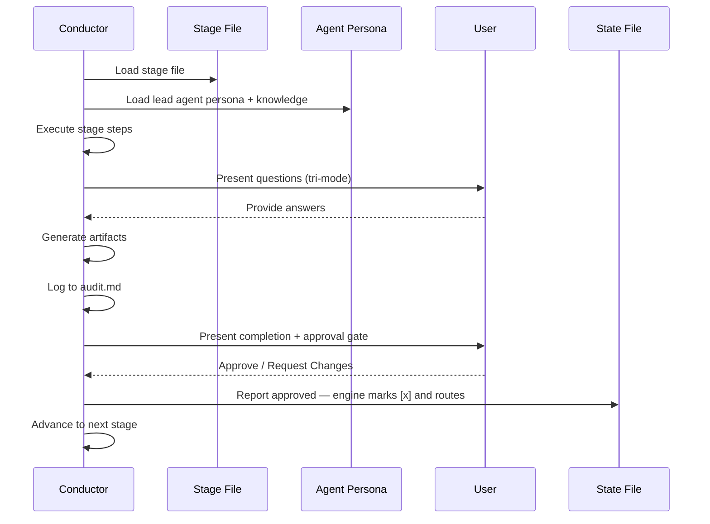
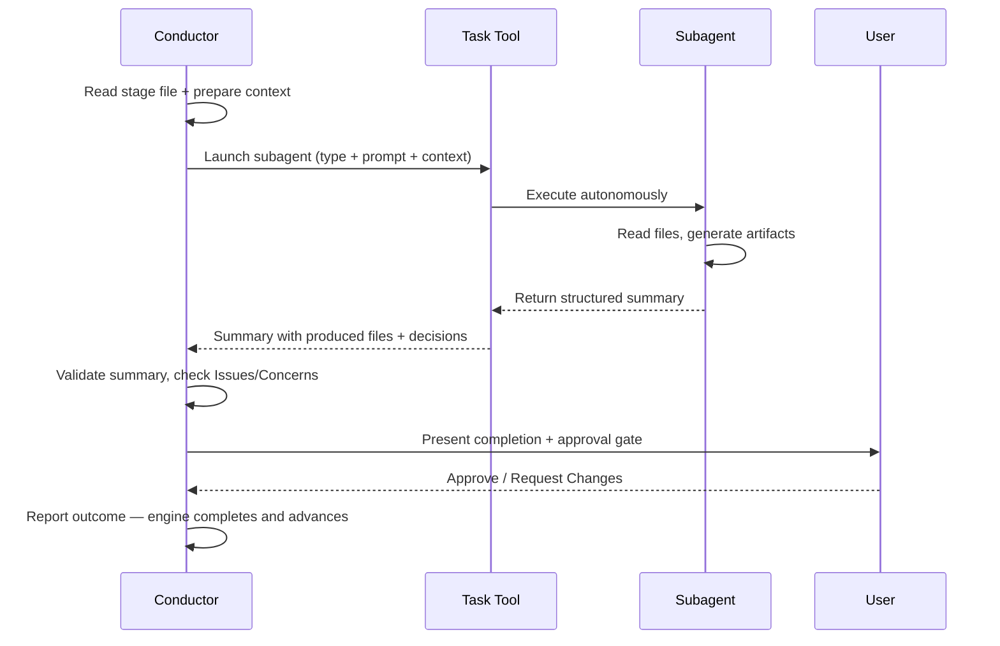

# Architecture

> **Source**: Derived from the engine and conductor (`.claude/tools/aidlc-orchestrate.ts` and `.claude/skills/aidlc/SKILL.md`) and surrounding files.

## Overview

AI-DLC uses a hybrid execution model: some stages run inline (the conductor loads the agent persona and executes directly in conversation), while others delegate to subagents via the Claude Code Task tool. Inline stages support user interaction (questions, clarifications, approval). Subagent stages run autonomously and return structured summaries.

```mermaid
graph LR
    subgraph INITIALIZATION["INITIALIZATION (0.1-0.3)"]
        Z1["Workspace Scaffold"]
        Z4["State Init"]
        Z1 -.->|"3 stages"| Z4
    end

    subgraph IDEATION["IDEATION (1.1-1.7)"]
        I1["Intent Capture"]
        I7["Approval & Handoff"]
        I1 -.->|"7 stages"| I7
    end

    subgraph INCEPTION["INCEPTION (2.1-2.9)"]
        N1["Reverse Engineering"]
        N7["Delivery Planning"]
        N1 -.->|"9 stages"| N7
    end

    subgraph CONSTRUCTION["CONSTRUCTION (3.1-3.7)"]
        C1["Functional Design"]
        C7["CI Pipeline"]
        C1 -.->|"7 stages per unit"| C7
    end

    subgraph OPERATION["OPERATION (4.1-4.7)"]
        O1["Deployment Pipeline"]
        O7["Feedback & Optimization"]
        O1 -.->|"7 stages"| O7
    end

    Z4 -->|"auto-proceed"| I1
    I7 -->|"Verification Gate 1"| N1
    N7 -->|"Verification Gate 2"| C1
    C7 -->|"Verification Gate 3"| O1
    O7 -.->|"Feedback Loop"| I1

    style INITIALIZATION fill:#f3e5f5,stroke:#9c27b0,color:#000
    style IDEATION fill:#e8f5e9,stroke:#4caf50,color:#000
    style INCEPTION fill:#e3f2fd,stroke:#2196f3,color:#000
    style CONSTRUCTION fill:#fff3e0,stroke:#ff9800,color:#000
    style OPERATION fill:#fce4ec,stroke:#e91e63,color:#000
```



## Five Layers

**Rules** (`rules/`) -- Organization and project guardrails. Self-learning: human corrections become persistent behavioral rules. Only ~35 lines total -- kept minimal to avoid context bloat in non-AI-DLC conversations.

**Agents** (`agents/*.md`) -- Fourteen flat agent files: 11 domain-expert personas, 2 review-only agents, and the adaptive-workflows composer. Each defines its role, responsibilities, collaboration pattern, tools, and relevant memory focus. Authored core personas carry `disallowedTools: Task`; the packager keeps that native denial where supported and projects the same no-nested-delegation boundary to each harness's tool policy. Kiro agent Markdown omits the unsupported key, while Kiro CLI agent JSON and Kiro IDE `tools:` grants exclude the `subagent` tool from delegates.

**Knowledge** (`knowledge/`) -- Two-tier methodology reference:
- `aidlc-shared/` -- Principles, verification, brownfield safeguards, **audit event taxonomy** (canonical event registry), state template
- `aidlc-<agent>-agent/` -- Per-agent methodology files (architecture patterns, testing strategies, etc.)

**Skills** (`skills/aidlc/`) -- The orchestrator entry point (`SKILL.md`), the static/recovery/governance protocol files plus four conditionally loaded reviewer/ensemble/Construction/swarm modules under `aidlc-common/protocols/`, and 33 stage files across 5 phase directories (`stages/initialization/`, `stages/ideation/`, `stages/inception/`, `stages/construction/`, `stages/operation/`).

**Hooks** (`hooks/`) -- Framework hooks for audit emission (PostToolUse on Write/Edit), session lifecycle (SessionStart, SessionEnd), state sync (PostToolUse on TaskUpdate), state validation (PreCompact), subagent tracking (SubagentStop), and statusline rendering. All framework files prefixed `aidlc-*.ts`.

## Configuration Layers

> **Audience**: contributors deciding where a new concern (a rule, a piece of methodology, a sensor binding, a domain-knowledge fact) belongs.
> **Source-of-truth status**: this is the routing principle. When code and this section disagree, this section wins; the code is being miscategorised.

Configuration in this repo partitions along **two orthogonal axes**, not one.

### Axis 1 — who authors it?

- **Framework-authored** — ships with the AI-DLC distribution. Same content for every project. Updated when the framework releases. Never edited by users in their own workspaces.
- **Team-authored** — written by humans (or by a stage running in this workspace, then affirmed by humans). Specific to this project. Persists across workflows in this workspace. Editable.

### Axis 2 — when is it consumed?

- **Loaded continuously (harness configuration)** — read at session start; available to every stage in every workflow run in this workspace. Lives under `.claude/`.
- **Per-workflow artefact** — produced by a specific stage as output, read by later stages as input. Lives under the intent's record dir (`aidlc/spaces/<space>/intents/<YYMMDD>-<label>/`, written `<record>/` below). Re-produced on each workflow run.

### The four quadrants

Crossing the two axes gives four quadrants. Three are populated; one is intentionally empty.

|  | Framework-authored | Team-authored |
|---|---|---|
| **Loaded continuously** (harness config) | `.claude/skills/`, `.claude/agents/`, `.claude/knowledge/`, `aidlc/spaces/<active-space>/memory/org.md`, `aidlc/spaces/<active-space>/memory/phases/*.md`, `.claude/scopes/`, `.claude/tools/data/scope-grid.json`, `.claude/tools/data/stage-graph.json` | `aidlc/spaces/<active-space>/memory/team.md`, `aidlc/spaces/<active-space>/memory/project.md` |
| **Per-workflow artefact** | *(empty by design)* | `<record>/aidlc-state.md`, `<record>/audit/*.md` (per-clone shards), `<record>/<phase>/<stage>/*.md`, `.aidlc/worktrees/bolt-*/` |

The framework doesn't produce per-workflow artefacts because such outputs would have to ship with the distribution — which makes them framework-authored harness config, not per-workflow output. The empty cell is the routing rule's signature, not a gap.

> **Framework-authored = ships from upstream; treat as immutable in your project.** Nothing in git or the file system enforces this — `.claude/` is editable territory and you can edit `org.md` or the `phases/*.md` files if you want. But the convention is: override at `team.md` / `project.md` (the right-hand cell) instead of mutating the framework defaults. That keeps your overrides visible at review time, lets the framework upgrade cleanly, and prevents drift between projects sharing the same framework version.

### Boundary tests for placing a new concern

When a new concern arrives, two questions resolve where it goes:

1. **Same content for every project, or project-specific?** Framework-authored vs team-authored.
2. **Loaded into agent context every session, or read only by specific stages?** Harness config vs per-workflow artefact.

Worked examples:

- *"We always squash-merge to main"* — project-specific (other teams use rebase) and loaded continuously (the conductor reads it on every Bolt merge). Goes to `aidlc/spaces/<active-space>/memory/team.md`.
- *"ALWAYS use Result<T,E> in service layer; NEVER throw"* — project-specific and loaded continuously (agents read it on every code-gen). Goes to `aidlc/spaces/<active-space>/memory/project.md`.
- *"Trunk-based development is the recommended branching strategy"* — same for every project (framework opinion) and loaded continuously (read at delivery-planning). Goes to `aidlc/spaces/<active-space>/memory/org.md`.
- *"The 5 common branching strategies and their trade-offs"* — same for every project (framework reference) and loaded continuously (aidlc-pipeline-deploy-agent reads when discovering branching strategy). Goes to `.claude/knowledge/aidlc-pipeline-deploy-agent/branching-strategies.md`.
- *"This run's requirements analysis"* — project-specific and per-workflow (each run produces fresh analysis). Goes to `<record>/inception/requirements-analysis/`.
- *"State in the worktree hosting Bolt-1 mid-Construction"* — project-specific and per-workflow (regenerated for each swarm-mode Bolt). Goes to that worktree's copy of the record dir, `.aidlc/worktrees/bolt-1/<record>/aidlc-state.md`.

### Sub-categories of harness config (top row)

The top row partitions further by **form of content**:

- **Framework harness mechanics** → frontmatter / JSON. Workflow ordering, stage definitions, artifact production, gate semantics. Read by tools deterministically. Lives in `.claude/skills/`, `.claude/tools/data/`.
- **Framework domain reference** → agent KB prose under `.claude/knowledge/aidlc-<agent>-agent/`. The menu of options for a domain (the 5 branching strategies, the deployment patterns, the testing methodologies). Read by the owning agent when it needs the menu.
- **Framework methodology defaults** → prose at `aidlc/spaces/<active-space>/memory/org.md`. What the framework recommends until a team affirms otherwise. Written in the team's voice (because if the team doesn't override, the org defaults *are* the team's voice).
- **Team practices** → prose at `aidlc/spaces/<active-space>/memory/team.md`. The team's selection — "this is how we work", populated by practices-discovery's affirmation gate. Read by agents at decision points (delivery-planning reads branching strategy; the conductor reads walking-skeleton stance in `SKILL.md`).
- **Project overrides** → prose at `aidlc/spaces/<active-space>/memory/project.md`. Project-specific corrections that override team and org defaults; also populated by practices-discovery's affirmation gate.
- **Guardrails** (`## Forbidden`, `## Mandated`, `## Corrections` sections) — present in `org.md`, `team.md`, and `project.md`. Corrective rules for agents — `ALWAYS X`, `NEVER Y`. Loaded into agent context continuously.

### What not to put in `.claude/` directly

Two cases that look like configuration but aren't:

- **Durable repository analysis outputs.** Reverse-engineering's 9 brownfield artifacts (`code-structure.md`, `architecture.md`, etc.) describe the latest scan for one repository. They live at `aidlc/spaces/<active-space>/codekb/<repo>/`, not in `.claude/` or an intent record. Reverse Engineering re-runs for each applicable workflow and refreshes that shared per-repository knowledge.
- **Run-state.** The `aidlc-state.md` file is per-workflow truth-of-now. It belongs in the intent's record dir, not in `.claude/`. Same for the `audit/` shards.

### Cross-row promotion — the practices-discovery exception

Most stages write to one row. A few stages write to both, with the cross-row write gated by team affirmation. **Practices-discovery (Inception 2.2) is the only stage that does this.** Its outputs are:

- `<record>/inception/practices-discovery/team-practices.md` — per-workflow audit trail (bottom row).
- On affirmation, content is copied to the space memory layer — `aidlc/spaces/<active-space>/memory/team.md` AND `memory/project.md` — team-authored harness config (top-right cell).

The audit-trail copy proves what was affirmed in this run; the `.claude/` copy becomes the team's standing configuration that every future workflow loads.

The pattern (scan → draft → affirm → publish) matches reverse-engineering's structure. The difference is the *consequence*: reverse-engineering's affirmation just means "this scan is accurate"; practices-discovery's affirmation means "the framework can write these words into our standing config and load them on every future workflow."

Without the affirmation gate, the framework would put words in the team's mouth — and worse, those words would persist across workflows. With the gate, the team always wrote it.

This pattern is rare and should be deliberate. Use it only when all three are true:
1. The stage's output is constitutive truth about the team, project, or workspace.
2. That truth should affect every future workflow run, not just this one's downstream stages.
3. The team is willing to author the truth — review and approve at a gate, not just let the framework write it.

If any of the three is false, default to per-workflow-only.

### Cross-references

- [Agent System](05-agent-system.md) — agent file structure (top-left cell mechanics).
- [Knowledge System](10-knowledge-system.md) — `knowledge/` two-tier shape.
- [Stage Definition](15-stage-definition.md) — stage frontmatter spec (the harness mechanics format).
- [Stage Protocol](04-stage-protocol.md) — execution rules per stage.

## Execution Models

**Inline stages** -- The conductor reads the lead agent's flat file (e.g., `agents/aidlc-architect-agent.md`) and knowledge from `knowledge/[agent]/` for persona framing, then executes the stage directly in conversation. This allows real-time user interaction: asking questions, resolving ambiguity, and iterating on artifacts before approval.

Twenty-nine stages use inline execution, including all three Initialization stages (Workspace Scaffold, Workspace Detection, State Init — all run deterministically inside `aidlc-utility intent-create`), all Ideation stages, six Inception stages (Requirements Analysis, Refined Mockups, Domain Design, Units Generation, Contract Design, Delivery Planning), six Construction stages (Functional Design, NFR Requirements, NFR Design, Infrastructure Design, Build and Test, CI Pipeline), and all Operation stages. Note: Build and Test (3.6) runs once after all units are complete, not per-unit.

**Subagent stages** -- The conductor prepares context (prior artifacts, project description, workspace findings) and delegates to a Claude Code Task tool subagent. The subagent executes autonomously and returns a structured summary. This is used for stages that benefit from focused, independent work without user interaction during execution. If a subagent call fails, the conductor retries once with a reduced-context prompt, then offers the user inline execution or skip-and-revisit as fallback options.

Four stages use dispatched execution: Reverse Engineering (2.1, `mode: pipeline` — developer scan then architect synthesis-and-write), Practices Discovery (2.2, `mode: subagent` — pipeline-deploy lead draft, mutually blind quality/developer/devsecops spokes, human interview, lead integration), User Stories (2.4, `mode: mob` — product lead draft plus design/developer/quality contribution rounds), and Code Generation (3.5, focused developer subagent). The complete topology is 29 inline / 2 subagent / 1 pipeline / 1 mob. Workspace Detection (0.2) runs deterministically inside `aidlc-utility intent-create`, not as a subagent.

```mermaid
flowchart LR
    subgraph INLINE["Mode 1: Inline"]
        direction TB
        IN1["Conductor reads\nstage file"]
        IN2["Load agent persona\n+ knowledge"]
        IN3["Execute stage steps\ndirectly in conversation"]
        IN4["User interaction\navailable"]
        IN5["Approval gate\n(AskUserQuestion)"]
        IN1 --> IN2 --> IN3 --> IN4 --> IN5
    end

    subgraph SUBAGENT["Mode 2: Subagent (simple)"]
        direction TB
        SA1["Conductor reads\nstage file"]
        SA2["Prepare context:\nartifacts + persona"]
        SA3["Task tool call\n(subagent_type specified)"]
        SA4["Subagent executes\n(no user interaction)"]
        SA5["Return structured\nsummary to conductor"]
        SA6["Conductor presents\ncompletion + approval"]
        SA1 --> SA2 --> SA3 --> SA4 --> SA5 --> SA6
    end

    subgraph TWOSTEP["Mode 3: Pipeline (2-link RE chain)"]
        direction TB
        TS1["Conductor reads\nRE stage file"]
        TS2["Task: aidlc-developer-agent\ncode scan"]
        TS3["Developer returns\nscan results"]
        TS4["Task: aidlc-architect-agent\nsynthesis"]
        TS5["Architect produces\n9 artifacts"]
        TS6["Conductor presents\ncompletion + approval"]
        TS1 --> TS2 --> TS3 --> TS4 --> TS5 --> TS6
    end

    style INLINE fill:#e8f5e9,stroke:#4caf50,color:#000
    style SUBAGENT fill:#e3f2fd,stroke:#2196f3,color:#000
    style TWOSTEP fill:#fff3e0,stroke:#ff9800,color:#000
```



### Conductor Inline Stage Execution



### Conductor Subagent Delegation



## Source vs distribution (one core, many harnesses)

The framework is **authored once and generated per harness** — today Claude
Code, Kiro CLI, Kiro IDE, Codex CLI, Cursor, opencode, and GitHub Copilot, and
any capable CLI you port it to. The
hand-authored source is a harness-neutral `core/` plus a thin `harness/<name>/`
surface per CLI; `bun scripts/package.ts` materializes ignored local
`dist/<harness>/` trees:

```
core/                  # hand-authored, harness-neutral (tools, aidlc-common,
                       #   agents, rules, scopes, sensors, knowledge, hooks,
                       #   3 session skills); prose uses the {{HARNESS_DIR}} token
harness/<name>/        # per-CLI surface: manifest.ts + orchestrator skill +
                       #   harness files (+ emit.ts for codex)
scripts/package.ts     # the build: copy core (token→.claude/.kiro/.codex) +
                       #   harness, compile the graph, generate runners, emit;
                       #   writes both channels; `--check` builds twice and compares
scripts/build-binaries.ts # release-only binary compiler + smoke gate, writing
                       #   per-target executable + runtime/<harness>/ bundles
                       #   under ignored build/binaries/
dist/<harness>/        # GENERATED + ignored: claude/.claude, kiro/.kiro,
                       #   kiro-ide/.kiro, codex/{.codex,.agents},
                       #   opencode/{.aidlc,.opencode}, copilot/{.aidlc,.github} — never hand-edited
```

`core/` `.ts` is byte-copied untransformed; the runtime `harnessDir()` seam
(`core/tools/aidlc-lib.ts`) derives the harness dir from the shipped layout at
execution time — open-set, from the tool's own path rather than a hardcoded
list, so a new harness needs no edit here. Its manifest name and rules-dir
rename ship per-tree in generated `tools/data/harness.json`; runtime path
resolution uses the name to distinguish shared engine directories and
`rulesSubdir()` reads the rename. One set of tool sources runs in every harness. See
[Porting to a New Harness](../harness-engineering/09-porting-to-a-new-harness.md).

`dist/` and `dist-release/` are ignored local projections of the same authored
tree. The source/development channel under `dist/` invokes the generated TypeScript
dispatcher through Bun. The release channel under `dist-release/` routes
hooks, generated commands, adapters, and host trust entries through the
native `aidlc` dispatcher. Native-only root integrations, such as host
trust seeds, are added only to the release projection. Neither root is
committed. `package.ts --check` builds the complete projection set twice in
independent temporary roots and byte-compares those results. CI, tests, binary
builds, and release packaging regenerate before consuming either local root.

### Projection identity and ownership

Every generated harness directory carries three distinct metadata contracts
under `tools/data/`:

- `harness.json` is runtime configuration: distribution identity, product
  name, next-step text, harness/rules directories, and mutable project choices
  such as plugin selection and the optional `models`, `runtime`, `providers`,
  `trust`, `flags`, and `project` records.
- `agent-tiers.json` is the shipped agent-name to tier map generated from
  `core/agents/*.md` frontmatter. Runtime model policy reads this file instead
  of hardcoding agent rosters.
- `aidlc-stamp.json` is immutable projection identity: schema, framework
  version, distribution, and harness directory.
- `aidlc-projection.json` is the exhaustive install descriptor. It classifies
  every top-level output as a framework-managed directory or a root integration
  with one typed merge policy (`managed-block`, `json-map`, `json-array`, or
  `whole-file`). Optional integrations and exact legacy hashes are declared
  here; an unclassified top-level entry makes packaging or loading fail.

`aidlc config` validates the stamp and descriptor before planning. It writes a
fourth file, `aidlc-manifest.json`, into the installed harness as the
project-specific ownership baseline: upstream version, per-file hashes, root
contributions, and the selected optional-integration mode. Refresh uses that
baseline to update unchanged framework bytes, preserve local modifications,
merge root integrations, and remove retired owned content. Copy-channel hashes
recorded in the native descriptor allow an exact, unmodified legacy copy install
to be adopted; unknown bytes are never inferred as framework-owned.

### Model policy projection

`aidlc config models` is a section under the existing public `config` command,
not a seventh public command. Policy lives in the shared settings hierarchy,
not in harness metadata:

- machine install root `aidlc.settings.json`
- project-root `aidlc.settings.json`
- project-root `aidlc.settings.local.json`

Layers merge leaf-by-leaf in that order, then environment overrides win. The
local file is personal and gitignored; the project file is team-shared.

```json
{
  "schemaVersion": 1,
  "models": {
    "schemaVersion": 1,
    "preset": "thorough",
    "groups": {
      "reviewing": { "effort": "xhigh" }
    },
    "agents": {
      "architect": {
        "effort": "xhigh",
        "model": { "claude": "provider/raw-id" }
      }
    },
    "profiles": {
      "my-profile": {
        "groups": {
          "reviewing": { "effort": "medium" }
        }
      }
    }
  },
  "flags": {
    "schemaVersion": 1,
    "swarm": true
  }
}
```

The resolver applies per-agent exception, group dial, shipped tier default, then
session inherit. The shipped-default layer calls the shared tier projection
module and the active tier cap resolver; it does not duplicate model tables.
The same surface writers are used at package time and config refresh time for
Claude and Cursor Markdown, Codex TOML, opencode Markdown, and Kiro agent JSON
plus `chat.modelDefaults`.

Refresh passes the resolved settings chain into a pristine staged projection
and rewrites model and flag surfaces before `planManagedFiles` hashes staged
bytes. No policy key is copied into `harness.json`. A later plain
`aidlc config` therefore reapplies the resolved policy, while manual edits to
owned agent surfaces still produce normal refresh conflicts.

Unsupported policy is explicit. The resolver reports harness honesty and
clamps only downward to the nearest vocabulary value. It never writes a key the
selected harness ignores, never validates against a live provider, and never
routes model policy through stage files.

### Runtime, provider, and trust diagnostics

`core/tools/aidlc-config-diagnostics.ts` is the shared implementation for
`aidlc config runtime`, `aidlc config providers`, `aidlc config trust`, and the
matching doctor rows. Each section stores a schema-versioned answer record in
`harness.json`; the runtime loader ignores these optional sibling keys.

The runtime probe derives a login-independent hook PATH, resolves only the
commands required by the installed hook bytes, and probes the selected harness
CLI. The recorded absolute paths are diagnostic evidence, not rewritten hook
commands: host allowlists and Codex trust hashes bind the bare command prefix.

Provider detection reads local AWS environment, profile, credential, role, and
SSO-cache evidence only. Bedrock region and profile answers are applied to the
staged projection before managed-file hashing. Claude also rewrites the staged
AWS MCP endpoint and metadata to the same region. Codex model and effort keys
remain untouched. OpenCode provider options are written only after the user
accepts the offer. Instruct-only harnesses record acknowledgement rather than
inert provider keys.

Provider actions that cannot be checked offline live in the provider record as
a small pending-action list. Config and doctor derive the human text from the
action ID; the record stores only the ID and pending or done status.

Trust diagnostics read the existing host surfaces. Codex checks the complete
project-specific seed set in the user config, Kiro IDE checks the installed
trusted command entry, and every harness checks required sibling directories.
No trust seed or permission-rule generator is called by config trust.

Every successful non-dry-run config transaction then runs a cheap post-apply
sweep against the installed bytes. The runtime leg resolves only the binary
needed by actual hook command files on the non-interactive PATH and deliberately
skips the harness CLI version probe. The trust leg reads host trust surfaces,
and the provider leg reads only recorded pending actions. Human and quiet
output name exact section follow-ups while JSON carries the structured
`outstandingActions` array; the exit code remains 0 because the transaction
committed successfully.

Doctor derives its instruction-file row from
`tools/data/aidlc-manifest.json`. Managed-block integrations are checked for one
ordered marker pair and the recorded block hash, while framework-owned
whole-file instruction surfaces are checked against their recorded file hash.
The row distinguishes intact, missing, and locally modified states and selects
the invoking harness in a multi-harness project.

### Flags and project choices

`aidlc config flags` stores a schema-versioned `flags` record in
`harness.json`. `readShippedHarnessData` parses that record alongside the
existing plugin selection, and `resolveProjectFlag` provides the common
environment-first lookup. Existing tools and hooks keep their real environment
variable behavior; only an absent variable falls back to the record. The
orchestrator skills use the same precedence for the conductor-owned swarm
choice.

The flags record contains default scope, swarm, hook debug, sensor timeout, and
the fixed inventory of documented bypass environment names. Scope validation
reads the installed scope frontmatter. Claude's staged settings writer also
updates `AWS_AIDLC_DEFAULT_SCOPE`, because the shipped session environment is
otherwise higher precedence than the record.

`aidlc config project` stores MCP and completion answers in a schema-versioned
`project` record while continuing to store plugin selection in the established
top-level `plugins` array. Installed plugins are discovered from graph, scope,
and plugin sidecar data. The normal refresh guard protects all project choice
mutations from changing a live workflow plan.

Recorded MCP consent feeds the existing root-integration merge mode during the
same transaction and on later plain refreshes for Claude's consent-managed
`.mcp.json`. MCP diagnostics classify host surfaces instead of assuming the
Claude layout: Kiro's settings file is always shipped, so `defaults` verifies
its presence and `none` is instruct-only; a harness with no current MCP file
records the answer without an unfixable drift. Completion answers produce an
exact native or copy-channel instruction; config never writes a shell profile
or another machine-scoped file.

During refresh, the three records are merged into the pristine staged
`harness.json`. The provider writer then updates staged host files before
`planManagedFiles` hashes them. A plain later `aidlc config` therefore reapplies
recorded provider answers, while reset returns to the unchanged shipped
fallback bytes.

### Dispatcher route policy

`core/tools/aidlc.ts` is both channels' route registry and the compiled binary's
entry point. Each route declares project requirements, output modes, network
policy, mutation scope, visibility, and one of three pin policies:

- `active` runs the currently active binary for machine lifecycle and
  management commands.
- `inspect` also stays on the active binary so `doctor`, `init`, and `use` can
  diagnose or repair a broken project pin.
- `pinned` is the project engine path. A valid `.aidlc-version` causes one
  re-exec into that retained version before project data is loaded; an absent or
  incomplete retained version fails closed with the install command.

The dispatcher passes the resolved route policy to delegates in `AIDLC_ROUTE_*`
variables. Release acquisition and the transaction engine enforce the network
and mutation boundaries, while a per-session fingerprint cache avoids repeating
a full retained-version inspection without weakening pin validation.

### Shared transaction engine

Install-mechanism mutations use `core/tools/aidlc-transaction.ts`. A plan is a
set of non-overlapping, root-relative `write`, `copy`, `tree`, `remove`, or
`symlink` operations with expected destination state; copied sources also carry
a content hash. The engine rejects path escapes, symlink traversal, special
files, filesystem-boundary crossings, source drift, and overlapping targets
before mutation, then repeats validation while holding its root lock.

Candidates are staged and fsynced before live writes, current targets are
snapshotted, and commits use rename boundaries. Candidate and committed
validators let callers prove domain invariants; any staging, commit, validation,
or audit failure restores committed paths in reverse order. A failed rollback
preserves recovery evidence, and the next transaction quarantines abandoned
staging rather than deleting it. Project init/refresh, machine lifecycle,
project pins, plugin selection, and plugin sync all build plans for this engine.

### Release assembly and provenance

`scripts/build-binaries.ts` regenerates projections, compiles the dispatcher
from `dist-release/claude/.claude/tools/aidlc.ts`, stages every native runtime beside
each target artifact for smoke gates, and writes one
`build-results-<target>.json`. A host-runnable artifact is `VERIFIED` only after
the complete native/final-layout gate set; a cross artifact is explicitly
`UNVERIFIED` with `inspection-only` evidence.

`scripts/package-release.ts` first regenerates the local projections, runs the
two-build package determinism guard, validates those records (and the complete
seven-target matrix in release mode), archives each
`dist-release/<harness>/`, and emits the flat `version.json` plus
`checksums.txt`, both installers, and binaries. The staging job re-verifies and
uploads that candidate without signing. Unix and Windows lifecycle jobs verify
its checksums and test it. `publish` downloads the same candidate, re-verifies
it, attests it, adds the exported `aidlc-release.intoto.jsonl` bundle, validates
the complete inventory, and uploads one `attested-release` workflow artifact.
`release` rechecks the tag and checksums, creates the GitHub Release in this
repository with `GITHUB_TOKEN`, and verifies the uploaded asset inventory. The
bundle is a separate trust channel and is intentionally absent from
`version.json` and `checksums.txt`. This pipeline does not implement the
deferred npm channel. See
[Supply-Chain Security](19-supply-chain-security.md).

## Directory Structure

The source-generated Claude projection (`dist/claude/.claude/`, materialized
from `core/` + `harness/claude/`; the release archive carries the native form
under `runtime/claude/.claude/`):

```
dist/claude/.claude/
+-- CLAUDE.md
+-- settings.json
+-- hooks/
|   +-- aidlc-write-audit-log.ts
|   +-- aidlc-sync-workflow-state.ts
|   +-- aidlc-validate-state.ts
|   +-- aidlc-log-subagent.ts
|   +-- aidlc-session-start.ts
|   +-- aidlc-session-end.ts
|   +-- aidlc-statusline.ts
+-- rules/
|   +-- aidlc.md                  # @-import stub -> ../../aidlc/spaces/<active-space>/memory/ (NOT a copy; re-pointed in place on `space` switch)
+-- agents/
|   +-- aidlc-product-agent.md
|   +-- aidlc-design-agent.md
|   +-- aidlc-delivery-agent.md
|   +-- aidlc-architect-agent.md
|   +-- aidlc-aws-platform-agent.md
|   +-- aidlc-compliance-agent.md
|   +-- aidlc-devsecops-agent.md
|   +-- aidlc-developer-agent.md
|   +-- aidlc-quality-agent.md
|   +-- aidlc-pipeline-deploy-agent.md
|   +-- aidlc-operations-agent.md
+-- knowledge/
|   +-- aidlc-shared/
|   |   +-- ai-dlc-principles.md
|   |   +-- verification.md
|   |   +-- brownfield.md
|   |   +-- audit-format.md
|   |   +-- state-template.md
|   |   +-- knowledge-readme-template.md
|   +-- aidlc-product-agent/
|   |   +-- requirements-guide.md
|   |   +-- product-guide.md
|   |   +-- functional-design-guide.md
|   |   +-- requirements-elicitation.md
|   |   +-- prioritization-frameworks.md
|   |   +-- user-story-patterns.md
|   |   +-- market-research-methods.md
|   +-- aidlc-architect-agent/
|   |   +-- architecture-guide.md
|   |   +-- nfr-design-guide.md
|   |   +-- ddd-patterns.md
|   |   +-- architecture-patterns.md
|   |   +-- nfr-design-patterns.md
|   |   +-- adr-template.md
|   +-- aidlc-developer-agent/
|   |   +-- code-analysis-guide.md
|   |   +-- code-generation-guide.md
|   |   +-- code-generation-patterns.md
|   |   +-- api-design-guide.md
|   |   +-- data-modelling-patterns.md
|   |   +-- re-artifacts.md
|   +-- [... 8 more agent knowledge dirs]
+-- skills/
    +-- aidlc/
        +-- SKILL.md
        +-- stage-protocol.md
        +-- stage-protocol-recovery.md
        +-- stage-protocol-governance.md
        +-- stage-protocol-reviewer.md
        +-- stage-protocol-ensemble.md
        +-- stage-protocol-construction.md
        +-- stage-protocol-swarm.md
        +-- stages/
            +-- initialization/
            |   +-- workspace-scaffold.md
            |   +-- workspace-detection.md
            |   +-- state-init.md
            +-- ideation/
            |   +-- intent-capture.md
            |   +-- market-research.md
            |   +-- feasibility.md
            |   +-- scope-definition.md
            |   +-- team-formation.md
            |   +-- rough-mockups.md
            |   +-- approval-handoff.md
            +-- inception/
            |   +-- reverse-engineering.md
            |   +-- practices-discovery.md
            |   +-- requirements-analysis.md
            |   +-- user-stories.md
            |   +-- refined-mockups.md
            |   +-- domain-design.md
            |   +-- units-generation.md
            |   +-- contract-design.md
            |   +-- delivery-planning.md
            +-- construction/
            |   +-- functional-design.md
            |   +-- nfr-requirements.md
            |   +-- nfr-design.md
            |   +-- infrastructure-design.md
            |   +-- code-generation.md
            |   +-- build-and-test.md
            |   +-- ci-pipeline.md
            +-- operation/
                +-- deployment-pipeline.md
                +-- environment-provisioning.md
                +-- deployment-execution.md
                +-- observability-setup.md
                +-- incident-response.md
                +-- performance-validation.md
                +-- feedback-optimization.md
```

### The workspace: spaces and intents

The tree above is the **engine** — harness-specific, never browsed by the user.
Everything the engine *reads and writes at runtime* lives in a separate, neutral
`aidlc/` directory at the project root, organized as a two-level container:
**space → intent**. (For the end-user orientation, see the User Guide's
[Spaces and Intents](../guide/03-spaces-and-intents.md); this section is the
data model the engine resolves against.)

```
aidlc/                                    # neutral, harness-independent, committed to git
+-- active-space                          # cursor: active space name (gitignored, per-user)
+-- spaces/
    +-- default/                          # one space per team; "default" is auto-resolved
        +-- memory/                        # the method — org.md/team.md/project.md, phases/, templates/
        +-- knowledge/                     # space-level domain knowledge (free-form)
        +-- codekb/<repo>/                 # per-repo code knowledge base
        +-- intents/
            +-- active-intent              # cursor: active intent record dir (gitignored, per-user)
            +-- intents.json               # the registry: [{ uuid, slug, dirName, scope, repos, status }]
            +-- <YYMMDD>-<label>/          # one record dir per intent (date-prefixed, short kebab label; UUIDv7 carries identity in intents.json)
                +-- aidlc-state.md          # per-intent workflow state
                +-- audit/<host>-<clone>.md # per-clone audit shards (glob-and-merge by timestamp)
                +-- <phase>/<stage>/*.md    # artifacts + the per-stage memory.md diary
```

**Resolution.** Workflow identity is resolved at one library chokepoint with
precedence `in-process sessionId > AIDLC_SESSION_OVERRIDE > PID ancestry >
none`. Hook payload identity uses the in-process option and is authoritative.
An invalid environment value is ignored. A valid environment override that
differs from ancestry throws a typed refusal before a binding or workflow record
path is derived. Explicit selectors and the resulting machine-local session
binding then precede the two shared per-user cursors:

- **Space** - precedence `explicit arg > session binding > aidlc/active-space
  cursor > "default"`
  (`DEFAULT_SPACE`, `core/tools/aidlc-lib.ts:591`; resolver `activeSpace()`,
  `aidlc-lib.ts:1300`). `listSpaces()` always reports `default` even with
  nothing on disk (`aidlc-lib.ts:1973`).
- **Intent** - precedence `explicit arg > session binding >
  aidlc/spaces/<space>/intents/active-intent cursor (if it names a real record
  holding aidlc-state.md) > lone-intent > null`. A `null` intent
  means "no record yet" - the signal the orchestrator uses to auto-creation the
  first intent.

Session bindings live at
`aidlc/.aidlc-sessions/<safe-session-id>.binding.json`. Spawned tools discover
their session through the nearest live entry in
`aidlc/.aidlc-sessions/pids/<pid>`. Both stores are gitignored and best-effort;
the cursors remain the write-through fallback. The engine passes its resolved
identity to child tools through `AIDLC_SESSION_OVERRIDE`, which is also the
headless automation seam when set on the harness process.

The Codex adapter additionally pins its validated payload identity into every
POSIX Bash command and core-hook child, so sandboxed macOS does not depend on
`ps` ancestry. Windows ancestry is unavailable and the POSIX command rewrite
does not apply there; multiple Kiro IDE chats can also share one process.
Spawned tools in those cases use shared-cursor behavior unless the harness
process supplies `AIDLC_SESSION_OVERRIDE`.

Project-aware path helpers resolve through the same selection ladder: an
explicit selector, then the session binding, then the shared cursor as the
final fallback. Helpers that receive a resolved `intent:null` retain its
selected space when choosing the bare space root. Switching spaces with
`/aidlc space <name>` also
re-points each harness-native rule include (the Claude `@`-import stub described
above, Kiro CLI resources or IDE steering, Codex's rules dir, opencode's
`instructions` glob, and Copilot's `AGENTS.md` `@`-imports) at the switched space's
`memory/`. At `default` the re-point is a byte-identical no-op, so a single-team
committed tree never churns. SessionStart uses the resolved session space for
that re-point, but the include remains one checkout-global mutable surface:
workflow selection is session-bound across spaces, while simultaneous
multi-space ambient method delivery can still race.

**Committed vs gitignored.** `aidlc/` is checked in so a team shares its work.
The split (`harness/claude/dot-gitignore:34-54`): the two cursors
(`active-space`, `active-intent`), per-clone runtime (`.aidlc-clone-id`,
`.aidlc-sessions/`), and derived state (`runtime-graph.json`, `.aidlc-*` under a
record) are **gitignored**; the method (`memory/**`), knowledge (`knowledge/**`,
`codekb/**`), the `intents.json` registry, each record's `aidlc-state.md`, the
`audit/` shards, and artifacts are **committed**. Audit is committed as per-clone
shards (`audit/<host>-<clone>.md`) precisely so git never has to merge concurrent
appends — there is intentionally no `merge=union` attribute.

## Key Design Decisions

1. **Hybrid execution model (inline + dispatched topologies)** -- Stages requiring user interaction (questions, clarifications, approval iteration) run inline where the conductor has direct conversation access. Stages performing focused, autonomous work (code scanning, code generation) or genuine multi-agent collaboration (the mob) dispatch to subagents per the stage's `mode` topology. A pure-subagent model would prevent mid-stage user interaction; a pure-inline model would not benefit from focused agent specialization or independent perspectives.

2. **Agent personas for inline stages** -- For inline stages, the conductor loads the agent's flat file as context to frame its perspective, rather than delegating to a subagent. This gives the benefits of domain-expert framing (the conductor thinks like an architect during Domain Design) without the costs of subagent context transfer and loss of user interaction.

3. **Two-link Reverse Engineering pipeline** -- Reverse Engineering (`mode: pipeline`) uses a developer subagent for code scanning, then an architect subagent for synthesis and the artifact writes. The conductor acts as the bus (subagents cannot spawn subagents in Claude Code), passing the developer's code scan results to the architect - the chain topology working as designed.

4. **State tracking via aidlc-state.md** -- A single markdown state file tracks stage completion, current status, workspace context, scope configuration, execution plan, and runtime state (revision counts). Stages report outcomes to the orchestration engine; its internal state transition updates the file, emits lifecycle audit rows, and routes atomically. Stage prose never edits lifecycle checkboxes directly. A PostToolUse hook validates the state file structure after each write. Stage-level task IDs are resolved at runtime via `TaskList` (matching by subject like "Inception - Requirements Analysis") rather than stored in the state file -- this is more robust after context compaction since it reflects actual task system state.

5. **Stage protocol as shared contract** -- All 33 stages load `stage-protocol.md` for approval gates, question format (tri-mode: Guide Me / Edit File / Chat), completion messages, state tracking, and the §13 Learnings Ritual. Recovery and phase governance remain conditional files; reviewer, ensemble, Construction, and swarm machinery live in four additional conditional modules selected by `directive.protocol_modules`. This preserves consistent behavior without paying the rare-path context cost on every stage.

6. **Two-tier knowledge architecture** -- Methodology knowledge ships with the framework in `knowledge/` (shared principles + per-agent methodology). User-managed team knowledge lives at the space level in `aidlc/knowledge/` (a sibling of the space's `intents/`), created empty by the engine and populated by the team. This separates framework upgrades from team customization.

7. **Flat agent files** -- Each agent is a single `.md` file in `agents/` (not a subdirectory with `agent.md` + `knowledge/`). This simplifies the structure and makes agents discoverable. Methodology knowledge lives separately in `knowledge/[agent]/`.

8. **Scope-driven adaptive depth** -- Eleven named scopes (enterprise, feature, mvp, poc, bugfix, refactor, infra, security-patch, classic, workshop, express) plus auto-detect determine which stages execute and at what depth. Each scope is a `.claude/scopes/aidlc-<name>.md` file (identity); membership is a per-stage `scopes:` frontmatter tag, transposed at compile into the EXECUTE/SKIP grid (`.claude/tools/data/scope-grid.json`, authoritative) and compiled into a summary table in SKILL.md (informational). NL keyword→scope inference reads each scope's `keywords` from its `.md` frontmatter. The user can override at any approval gate.

9. **Minimal rules** -- Only guardrails (~35 lines total) live in the active space memory layer (`aidlc/spaces/<active-space>/memory/`, pulled in via the `.claude/rules/aidlc.md` @-import stub). Everything else (verification, brownfield safeguards, audit format, adaptive patterns) lives in `knowledge/aidlc-shared/` or the static/conditional protocol files. This prevents context bloat in non-AI-DLC conversations since rules are always loaded.

10. **Self-learning loop** -- When a human corrects agent behavior, the correction can become a persistent Rule. The §13 Learnings Ritual (tool-as-actor: `aidlc-learnings.ts` surfaces and persists; the user confirms) writes each confirmed learning as a practice into the active space memory layer — `aidlc/spaces/<active-space>/memory/project.md` (default), one-click promote to `memory/team.md` — or scaffolds a Sensor, applying on the next workflow's compile. See [Rule System](08-rule-system.md).

11. **Phase boundary verification** -- Traceability checks run automatically at phase transitions (Initialization->Ideation auto-proceed, Ideation->Inception, Inception->Construction, Construction->Operation). This catches missing requirements-to-design links, orphaned artifacts, and inconsistencies before downstream stages build on incomplete foundations.

12. **Hook-based audit logging** -- A PostToolUse hook on Write/Edit operations automatically logs artifact creation and modification to the intent's `audit/` shards. A PreCompact hook validates state file structure before context compaction. A SubagentStop hook logs subagent completions. The 95-event taxonomy (defined in `knowledge/aidlc-shared/audit-format.md`; see [State Machine](12-state-machine.md) for the emitter registry) enables post-hoc analysis -- key events include `STAGE_STARTED`, `STAGE_COMPLETED`, `DECISION_RECORDED`, `SCOPE_CHANGED`, and `RULE_LEARNED`.

13. **No nested delegation** -- The conductor (SKILL.md) performs every agent Task call. Agents never invoke each other or spawn subagents. This keeps the delegation graph flat and debuggable.

14. **Four-option session resume** -- Resume from checkpoint, redo current stage, jump to a specific stage, or start fresh (with archive confirmation). Gives users fine-grained control over workflow navigation without manual state file editing.

15. **Stage/Phase jump commands** -- `--stage <slug|#>` and `--phase <name|#>` jump directly to a specific stage or phase. `--scope <scope>` sets or overrides the workflow scope. Forward jumps mark intermediate stages as `[S]` (skipped); backward jumps reset downstream stages to `[ ]` and replay forward from the target. Composable with each other.

## Directory Structure: Tests

```
tests/
+-- run-tests.ts              # Native Bun test runner (all levels, flag-selectable)
+-- run-tests.sh              # POSIX compatibility wrapper for run-tests.ts
+-- gen-coverage-registry.ts  # Generates .coverage-registry.json from covers: headers
+-- .coverage-registry.json   # Machine-checked coverage index (units x test files)
+-- .coverage-ratchet.json    # Coverage floor the registry --check enforces
+-- README.md                 # Discoverable suite index + quick reference
+-- lib/
|   +-- bun-junit-to-meta.ts  # Bun JUnit -> runner metadata glue
+-- harness/                  # Shared TS helpers: fixtures, sdk-drive, tui-drive, windows/
+-- fixtures/                 # State files, stub projects, RE artifacts
+-- hooks/
|   +-- pre-commit            # Git hook: runs the default levels (smoke + unit + integration)
+-- smoke/                    # Level: structural validation (no LLM, seconds)
+-- unit/                     # Level: single-component isolation (no LLM)
+-- integration/              # Level: cross-component contracts + live stage/CLI utilities
+-- e2e/                      # Level: full lifecycle, worktree, rendered terminal journeys
```

Every test is a `t*.test.ts` file run under `bun` — there are no shell test
files. The four directories are the suite's four levels.

## Testing

The project's test suite is **entirely TypeScript** (zero `.sh` test files) and
organized into four levels — `smoke`, `unit`, `integration`, `e2e` — that map
onto the classic three-layer pyramid (smoke + unit = L1 Protocol, integration =
L2 Stage, e2e = L3 Acceptance). Being all-TS makes the suite cross-platform by
construction: the same files run identically on macOS, Linux, and native
Windows. Tests validate everything from file existence to rendered-terminal
journeys, ensuring that changes to hooks, agents, stages, or settings do not
introduce regressions.

### Test Levels

| Level | Directory | What It Covers |
|-------|-----------|----------------|
| **Smoke** (L1) | `tests/smoke/` | File existence, agent/stage/protocol structure, SKILL.md graph consistency, settings.json schema. Fast structural checks that catch missing or misnamed files. No LLM. |
| **Unit** (L1) | `tests/unit/` | The 17 hooks, CLI tools, stage/agent frontmatter, knowledge inventory, the orchestration-engine handlers, and other single-component contracts. Each test isolates one component. No LLM. |
| **Integration** (L2) | `tests/integration/` | Cross-component contracts (scope-to-stage mapping, stage-agent cross-checks, protocol compliance, audit/runtime-graph end-to-end) and the live stage/CLI utilities driven through the `claude` CLI or SDK. The live files skip cleanly when `claude` is absent. |
| **E2E** (L3) | `tests/e2e/` | Full lifecycle and worktree primitives, plus the rendered-terminal (`tui-drive.ts`) journeys that prove answering real AskUserQuestion gates advances disk state. The live journeys require `claude` + Bedrock creds and are gated behind `AIDLC_TUI_LIVE=1`. |

For the full test strategy, the coverage registry, and how to add tests, see [Testing](09-testing.md).

## Cross-References

- [Orchestrator](03-orchestrator.md) -- SKILL.md deep-dive
- [Stage Protocol](04-stage-protocol.md) -- behavioral contract
- [Agent System](05-agent-system.md) -- agent structure and configuration
- [Hooks and Tools](06-hooks-and-tools.md) -- hook implementations
- [Knowledge System](10-knowledge-system.md) -- two-tier architecture
- [Diagrams](diagrams.md) -- all Mermaid diagrams in one place
