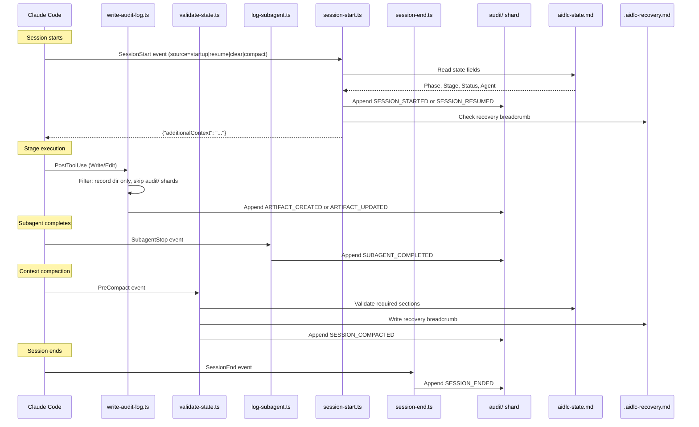

# Hooks and Tools

This chapter documents the hook system architecture, all seventeen hook scripts, the audit event taxonomy, CLI tool configuration, and the deterministic utility tool.

> **Path convention.** State, audit, and artifacts live under the active intent's **record dir** — `aidlc/spaces/<space>/intents/<YYMMDD>-<label>/`, written `<record>/` below (a compact UTC date prefix plus a short kebab-case label so record dirs sort chronologically; the canonical id is the UUIDv7 in the `intents.json` registry row). The audit trail is a directory of per-clone shards under `<record>/audit/`, not a single file.

---

## Hook System Architecture

This implementation uses seventeen TypeScript hook sources in `.claude/hooks/`. A source-generated `dist/` projection invokes them through `bun`; native installs and versioned release runtimes route them through `aidlc engine hook`, `aidlc engine statusline`, or an `aidlc engine adapter` target. All seventeen are **project-wide** — registered in `settings.json` (the statusline via the top-level `statusLine` key, the other sixteen via the `hooks` block), they fire regardless of which skill is active when the host permits project hooks. Claude Code managed `allowManagedHooksOnly: true` overrides the project registration and blocks those hooks; `/aidlc --doctor` detects that policy. They were previously split (six declared in `aidlc/SKILL.md` frontmatter as skill-scoped, the rest project-wide); v0.6.0 moved the skill-scoped six into `settings.json` so every entry point — the orchestrator, each packaged scope/stage runner, and any hand-written customer runner — inherits the deterministic spine with no per-runner `hooks:` block.

Eleven of the seventeen are **non-blocking**. Six are **flow-altering**: the `Stop` hook keeps the forwarding loop running, the deliver-stage-rules hook attaches exact active-stage rules to subagent briefs where the harness supports input rewriting, the plan-approval guard refuses premature code-generation dispatches, the reviewer-scope hook refuses sibling-unit reviewer access, the review-freeze hook refuses a produces[] write that would void a fresh terminal review receipt before the gate, and the state-transition guard refuses direct lifecycle calls that bypass `aidlc-orchestrate.ts report`.

```
.claude/hooks/
+-- record-human-turn.ts     # UserPromptSubmit + PostToolUse AskUserQuestion (project-wide, settings.json, TypeScript)
+-- deliver-stage-rules.ts    # PreToolUse Task|Agent (project-wide, settings.json, TypeScript, flow-altering)
+-- plan-approval-guard.ts # PreToolUse generation dispatch/write/shell tools (project-wide, settings.json, TypeScript, flow-altering)
+-- state-transition-guard.ts # PreToolUse Bash (project-wide, settings.json, TypeScript, flow-altering)
+-- reviewer-scope.ts    # PreToolUse file/search/shell tools (project-wide, settings.json, TypeScript, flow-altering)
+-- review-freeze.ts     # PreToolUse file-write tools (project-wide, settings.json, TypeScript, flow-altering)
+-- write-audit-log.ts      # PostToolUse Write|Edit (project-wide, settings.json, TypeScript)
+-- run-sensors.ts       # PostToolUse Write|Edit (project-wide, settings.json, TypeScript)
+-- sync-workflow-state.ts   # PostToolUse TaskUpdate (project-wide, settings.json, TypeScript)
+-- rebuild-stage-graph.ts   # PostToolUse Bash (project-wide, settings.json, TypeScript)
+-- fold-usage.ts        # PreToolUse + PostToolUse (project-wide, settings.json, TypeScript, Claude-only producer)
+-- validate-state.ts    # PreCompact (project-wide, settings.json, TypeScript)
+-- log-subagent.ts      # SubagentStop (project-wide, settings.json, TypeScript)
+-- aidlc-continue-workflow.ts        # Stop (project-wide, settings.json, TypeScript, flow-altering)
+-- session-start.ts     # SessionStart (project-wide, settings.json, TypeScript)
+-- session-end.ts       # SessionEnd (project-wide, settings.json, TypeScript)
+-- aidlc-statusline.ts  # statusLine (project-wide, settings.json, TypeScript)
```

### Hook Summary

| Hook | Event | Scoping | Matcher | Purpose |
|------|-------|---------|---------|---------|
| `record-human-turn.ts` | UserPromptSubmit + PostToolUse | Project-wide (settings.json) | (empty) / `AskUserQuestion` | Record a `HUMAN_TURN` event when a supported prompt-submit or answered-widget seam fires; the approval/interview gate requires one since the last gate resolution. `AIDLC_UNATTENDED=1` suppresses this authority-bearing mint across the shared hook and every direct harness adapter; non-authority forwarding markers remain unchanged. The declaration is opt-in because only the driver knows whether it is unattended. The event proves ordering/presence only: harnesses do not uniformly expose trusted response text, so it does not authenticate later `--user-input`, `--feedback`, or `--details` prose. When the active directive is a guard-recovery ask for the current state, the human's first answer is recorded on that marker as the remedy selection and their next answer as the revision feedback (both hashed whitespace-normalized), so a repeated `next` keeps the selection and `reject` can bind `--feedback` to the human's own words |
| `deliver-stage-rules.ts` | PreToolUse | Project-wide (settings.json) | `Task\|Agent` | **Flow-altering.** Resolve the dispatched stage's substantive active-space rules and append their exact bytes to every AI-DLC subagent brief. After an accepted background dispatch, add one session-scoped entry to `aidlc/.aidlc-subagent-inflight` so the Stop hook can wait for its result; rejected dispatches add nothing. Rewrites Claude, Codex, opencode, and Copilot inputs; Kiro CLI cannot rewrite tool arguments, so an incomplete brief proceeds with an advisory warning (Kiro CLI agents preload the active memory tree through `resources`; an unloadable required rule still blocks with repair guidance). Kiro IDE uses always-included workspace steering with live memory-file references. Idempotent when the exact bundle is already present |
| `plan-approval-guard.ts` | PreToolUse | Project-wide (settings.json) | `Task\|Agent\|Edit\|Write\|Bash` (plus harness-native patch aliases) | **Flow-altering.** Enforce code-generation's plan-before-generation ordering (stage Steps 2-4) deterministically. The active directive selects one authority: `construction/<unit>/code-generation/` when `unit` is present, otherwise zero-Unit `construction/code-generation/`. Developer dispatch and workspace mutation are refused until that target has a current Testing Contract, fingerprinted plan/instructions, and explicit "Approve Plan" answer; writes inside the selected record directory remain available to prepare that evidence. Delegation uses exactly one `AIDLC-UNIT: <unit>` or `AIDLC-STAGE: code-generation` marker. Each refusal emits `PLAN_APPROVAL_BLOCKED`; missing, conflicting, or unknown markers block instead of guessing from prompt prose. `AIDLC_DISABLE_PLAN_APPROVAL_GUARD=1` disables this PreToolUse hook only, and not silently: while a workflow exists, the first tool call that passes under it appends one `GUARD_DISABLED` audit row (`Guard: plan-approval-guard`, `Tool`), and consecutive disabled calls append nothing until another row lands in the active shard; any failure in that bookkeeping still allows the call. It does **not** disable the autonomous `aidlc-swarm.ts prepare` precondition, and protected Plan Approval authority remains enforced by the owning decision, answer, and generation-start tools. A human break-glass receipt (`answer --checkpoint plan-approval --override`, opened only by the human typing `Override Plan Approval: <reason>` as a prompt) satisfies this hook like any other receipt; the hook never proposes it. |
| `state-transition-guard.ts` | PreToolUse | Project-wide (settings.json) | `Bash` | **Flow-altering.** Refuse direct `aidlc-state.ts` lifecycle verbs and redirect the conductor to `aidlc-orchestrate.ts report`; when the harness supplies delegated-agent identity, also refuse lifecycle/routing commands from reviewers and support agents; read-only state and ordinary build/validation commands remain available |
| `reviewer-scope.ts` | PreToolUse | Project-wide (settings.json) | `Read\|Edit\|Write\|Glob\|Grep\|Bash` | **Flow-altering.** Enforce the per-unit reviewer read-scope bound (stage-protocol-reviewer.md §12a) deterministically: while the conductor's reviewer dispatch record (`<record>/.aidlc-reviewer-dispatch.json`) is fresh, the dispatched reviewer's tool calls that reach into sibling units' `construction/` paths — file reads/writes and grep/glob/shell patterns spanning siblings — are refused (exit 2 + a redirecting stderr reason) unless the target is on the record's exempt list. Independently, a checkout carrying a Unit-claim scope stamp may not mutate another Unit's `construction/<unit>/` subtree; normalized path resolution closes relative-traversal and case-escape forms before the refusal. Each refusal emits `REVIEWER_SCOPE_BLOCKED`. Fail-open on every ambiguity; `AIDLC_DISABLE_REVIEWER_SCOPE_HOOK=1` disables enforcement |
| `review-freeze.ts` | PreToolUse | Project-wide (settings.json) | `Read\|Edit\|Write\|Glob\|Grep\|Bash` (self-filters to mutation-capable calls) | **Flow-altering.** Enforce the reviewer-module terminal-receipt ordering deterministically: a Write/Edit or shell mutation targeting a reviewer-bearing, not-yet-completed stage's declared `produces[]` artifact is refused (exit 2 + a redirecting stderr reason) while a fresh terminal review receipt covers it. Shell writes are inspected before execution because they do not pass through the Write/Edit audit feed and would otherwise preserve a stale receipt over changed bytes. Shares the engine's exact receipt scan (`freshReviewReceipts` in `aidlc-lib.ts`), so a recorded gate rejection, jump, or workflow restart lifts the freeze automatically. A below-cap adversarial NOT-READY remains nonterminal and editable for repair; terminal NOT-READY under the effective class freezes like READY. Each refusal emits `REVIEW_FREEZE_BLOCKED`. Fail-open on every ambiguity; `AIDLC_DISABLE_REVIEW_FREEZE_HOOK=1` disables enforcement. The refusal ends with the same guard-recovery ask the router would emit (see [Guard admission and recovery asks](12-state-machine.md#guard-admission-and-recovery-asks)), so the conductor renders the typed remedies instead of retrying the write |
| `write-audit-log.ts` | PostToolUse | Project-wide (settings.json) | `Write\|Edit` | Auto-log artifact writes to the `audit/` shards |
| `run-sensors.ts` | PostToolUse | Project-wide (settings.json) | `Write\|Edit` | Fire the active directive stage's resolved Sensors on matching writes (advisory; never blocks); a state-bound per-intent marker preserves attribution when unit-major execution runs ahead of `Current Stage` |
| `sync-workflow-state.ts` | PostToolUse | Project-wide (settings.json) | `TaskUpdate` | Auto-sync state file on stage task activation |
| `rebuild-stage-graph.ts` | PostToolUse | Project-wide (settings.json) | `Bash` | Bind a successful `intent-create` to that tool event's exact host session ID; when the session already owns another intent, write the one-shot fresh-session handoff receipt; then recompile `runtime-graph.json` on transition-class audit emits |
| `fold-usage.ts` | PreToolUse + PostToolUse | Project-wide (settings.json) | (empty) | **Claude-only.** Fold the transcript's new token usage into the durable usage ledger every llm call: PreToolUse seals the completing main call and, before an engine boundary, every completed subagent call so lifecycle rollups are current; PostToolUse supplies the normal holdback fallback. Observe-only, never blocks; the Claude-Code transcript reader is wired only in the Claude harness, so on Kiro/Codex/opencode no producer runs and the ledger stays empty (every usage consumer degrades to no-data). `AIDLC_DISABLE_USAGE_TRACKING=1` disables it. See "Token usage and cost tracking" below |
| `validate-state.ts` | PreCompact | Project-wide (settings.json) | (empty) | Validate state file, write recovery breadcrumb |
| `log-subagent.ts` | SubagentStop | Project-wide (settings.json) | (empty) | Remove one background-subagent ledger entry for the completing session and log subagent completion events |
| `aidlc-continue-workflow.ts` | Stop | Project-wide (settings.json) | (empty) | **Flow-altering.** Enforce the forwarding loop on turn-end: run `aidlc-orchestrate next`; on `done`, `parked`, or informational `notice` allow the stop, on a pending directive block the stop and inject the next move back via `reason`. Also allows the exact one-shot post-`intent-create` fresh-session handoff when the session's original UUID and newly active UUID match the PostToolUse receipt. Allows legitimate turn stops when the current stage or active team Unit gate is awaiting approval/revision, or `[-]` in-progress with either an unanswered question in the active directive's canonical or per-unit `<slug>-questions.md` or an unresolved logged `DECISION_RECORDED`; a fresh in-flight compose marker, a fresh background-subagent entry for the current session, and conversational turns are also allowed. Foreign-session, stale, and malformed background entries do not authorize a stop. The compose, background, logged-decision, and conversational carve-outs are suppressed under autonomous Construction; the pending-file carve-out is suppressed except for unit-major code-generation's mandatory Plan Approval. Recursion-bounded (no-progress counter + `stop_hook_active` under `CLAUDE_CODE_STOP_HOOK_BLOCK_CAP`; default 2 in an interactive run and 8 under autonomous Construction). No-op outside an AIDLC workflow |
| `session-start.ts` | SessionStart | Project-wide (settings.json) | (empty) | Inject workflow context on session resume |
| `session-end.ts` | SessionEnd | Project-wide (settings.json) | (empty) | Emit `SESSION_ENDED` on graceful exit to the intent recorded for that exact session; fail closed instead of using the shared active cursor when a UUID-backed workflow has no session binding |
| `aidlc-statusline.ts` | statusLine | Project-wide (settings.json) | -- | Show real-time progress in terminal |

### Shared Characteristics

All seventeen TypeScript hook sources:

- Are written in TypeScript and invoked through the channel's dispatcher
- Do not need executable permissions — work identically on macOS, Linux, and native Windows PowerShell
- Receive JSON on stdin from Claude Code
- Use native JSON parsing (no `jq` dependency)
- Exit with code 0 on success or when skipped (the `Stop` hook also exits 0 when it blocks — the block is signalled by a `{"decision":"block"}` JSON object on stdout; the four PreToolUse control hooks signal an unrecoverable or retryable refusal with exit 2 + the reason on stderr)
- Resolve `$CLAUDE_PROJECT_DIR` with multiple fallback methods
- Share locking and utility functions from `lib.ts`

### Observers never write authority

Some engine invocations exist only to LEARN the current directive. There are
exactly two, both identified by an environment variable on their spawn:

- the Stop hook's `next` probe (`AIDLC_STOP_HOOK_PROBE=1`), which asks whether
  work is still pending before allowing a turn to end;
- the route check that `aidlc-state.ts unit start` and wave completion spawn
  (`AIDLC_ROUTE_CHECK=1`), a `next` plus any follow-on `continue`, which asks
  which Unit the engine would route now. A route check skips rule transport
  entirely, so it normally reads the run-stage directive straight off stdout.

Both read the directive off stdout and never consult the durable marker
afterwards, so writing from one buys nothing and costs correctness.

**The authority artifacts.** Neither observer creates, rotates, consumes or
deletes any of: the Plan Approval challenge, response or receipt under
`aidlc/.aidlc-sessions/plan-approval/`; the reserved ledger receipts
(`PLAN_APPROVAL_RECORDED`, `HUMAN_TURN`, `GATE_*`, `REVIEW_REQUESTED`,
`REVIEW_COMPLETED`, `UNIT_*`); `aidlc-state.md`; the active-directive marker and
its revision; the steering-token key; the continuation cursor. A probe also mints
no synthetic `STAGE_STARTED`, refreshes no claim cache, and bootstraps no diary.

The one write NOT on that list is the advisory engine-turn marker
`.aidlc-engine-touch`, whose mtime is a Stop-hook optimisation and carries no
authority. The Stop probe must suppress it or the conversational carve-out below
would be permanently dead; the route check does not, because `unit start` is real
workflow engagement.

**The barrier.** The guarantee is a property of the code shape, not of an
enumeration someone has to remember. Alongside the per-call-site suppressions, a
typed `EngineModeViolationError` sits at the durable write primitives: the
active-directive transaction commit, `writeStateFile`, `writeFileAtomic`,
`writeBufferAtomic`, and `appendAuditBlockAtPath` (the single funnel every audit
append passes through). An observer that reaches one throws and exits non-zero
instead of writing. Both producers already fail safe on a non-zero engine exit:
the Stop hook allows the stop and records a drop, and `unit start` surfaces the
error rather than starting the Unit. A silent no-op was rejected deliberately,
because it would hide the defect the barrier exists to expose.

**`next` is idempotent, not merely side-effect-light.** When the active-directive
marker already records this exact directive for this state (same stage, same
Unit, same rule bundle, same directive body, and for a partial rule delivery a
continuation token that still verifies), `next` returns the issued directive
verbatim: no marker rewrite, no revision bump, no fresh token. Only the transport
is short-circuited, and only PART ONE of a multi-part rule delivery is retained: a
marker published by a plain `next` is sessionless, so a repeat ask by the conductor
that already holds parts 1..k-1 cannot be told apart from an ask by a compacted
context or a brand-new process, and a stage must never run with an earlier part of
its method layer missing. From part two onward a fresh `next` restarts delivery at
part one, which costs one republication and is always complete. Routing is always recomputed, so a paused Unit, a moved gate,
or a completed Unit produces its own directive and stale work can never be
re-issued. Asking the engine what to do twice therefore answers the same thing
twice and changes nothing, which is what makes it safe to ask from a hook.

This is the mechanical half of the two authority rules in
[`12-state-machine.md`](12-state-machine.md#authority-invariants): a query never
writes, and authority binds to content and attempt rather than to the identity of
the directive that issued a prompt.


### Audit Event Flow



---

## Workflow-Spine Hooks

These six hooks (the audit/sensor/statusline/rebuild-stage-graph/state-validation/subagent spine) are registered project-wide in `settings.json`. They are always on, but each **self-gates**: it early-exits when there is no active workflow (`aidlc-state.md` / the active intent's `audit/` shard absent), so audit logging and state sync never clutter non-AI-DLC sessions. Before v0.6.0 they were declared in `aidlc/SKILL.md` frontmatter (skill-scoped); the move to `settings.json` lets every entry point — the orchestrator and every packaged or hand-written runner — inherit the spine without copying a `hooks:` block.

### PostToolUse: write-audit-log.ts

**Source:** `.claude/hooks/aidlc-write-audit-log.ts`
**Trigger:** After every `Write` or `Edit` Claude Code tool call (matcher: `"Write|Edit"`)
**Purpose:** Auto-log artifact writes to the intent's `audit/` shards

**Processing steps:**

1. **Project directory resolution:** Resolves `$CLAUDE_PROJECT_DIR` with fallback to script path derivation and CWD detection.
2. **Health heartbeat:** Writes UTC timestamp to `.aidlc-hooks-health/write-audit-log.last`.
3. **JSON parsing:** Reads stdin, extracts `tool_name` and `tool_input.file_path`.
4. **Path filtering:** Skips files not under the intent's record dir. Skips the `audit/` shards themselves (avoids recursion).
5. **Audit file guard:** Exits silently if the active intent's `audit/` shard does not exist (the framework creates it).
6. **Context extraction:** Strips the path prefix up to the record dir, replaces `/` with ` > ` for a breadcrumb (e.g., `inception > requirements-analysis > requirements.md`).
7. **Atomic locking:** Uses `mkdir`-based lock in the system temp directory (`os.tmpdir()`) with 3-retry loop (100ms delay). The hash isolates locks per project.
8. **Log entry:** Appends a canonical `ARTIFACT_CREATED` (for Write to a net-new path) or `ARTIFACT_UPDATED` (for Edit, or Write overwriting existing) event via `appendAuditEntry`. Fields: Timestamp, Event, Tool, File, Context, and `Summary Authorization Id` when the written stage (and Unit, for a per-Unit Construction path) has an active summary confirmation. The id is read from `<record>/.aidlc-summary-authorization/<stage>/stage.json` or `<record>/.aidlc-summary-authorization/<stage>/units/<unit>.json`, which `aidlc-log.ts answer --checkpoint summary-confirmation` writes on `Looks correct` and removes on `Request changes`. A per-Unit path with no confirmation of its own is stamped from the stage record only when that record belongs to the isolated `single-stage:<stage>` run (which confirms its one Unit at stage scope). The lookup and append share the audit lock, so the hook cannot observe a registry entry before its receipt or during rollback.

### PostToolUse: sync-workflow-state.ts

**Source:** `.claude/hooks/aidlc-sync-workflow-state.ts`
**Trigger:** After every `TaskUpdate` call (matcher: `"TaskUpdate"`)
**Purpose:** Auto-sync `aidlc-state.md` when a stage task becomes `in_progress`

**Processing steps:**

1. **Project directory resolution:** Same multi-fallback pattern as write-audit-log.ts.
2. **Status filter:** Only fires when `status` is `in_progress`. Exits silently for `completed`, `pending`, etc.
3. **activeForm filter:** Exits silently if no `activeForm` field or no `[slug]` suffix pattern.
4. **State file guard:** Exits silently if `aidlc-state.md` does not exist (pre-init).
5. **Health heartbeat:** Writes to `.aidlc-hooks-health/sync-workflow-state.last`.
6. **State sync:** Calls `bun aidlc-utility.ts set-status --stage <slug>` (normally updates Phase, Stage, Agent, and checkbox). For a valid interleaved unit-major directive, it updates the transient status fields and marker digest while preserving the durable first-stage cursor, `In Progress`, and checkbox.

**Design notes:**
- Stage Jump tasks (no `[slug]`) and dependency-wiring TaskUpdates (no activeForm) are naturally filtered out.
- The hook calls the existing `set-status` subcommand — no new code path needed.
- When the activated slug matches the state-bound active-directive marker, `set-status` refreshes that marker's state digest while preserving its unit. The digest is taken over a projection of `aidlc-state.md` that omits the cache layer, so a status sync that touched only cache fields leaves the marker completely alone rather than superseding the live directive. Either way a recorded Plan Approval is unaffected: it binds to plan content and stage attempt, not to the marker. For an interleaved unit-major directive it also leaves `Current Stage`, `In Progress`, and the durable cursor checkbox unchanged, so the completed-grid gate cascade still begins at the block's first stage.

### PostToolUse: run-sensors.ts

**Source:** `.claude/hooks/aidlc-run-sensors.ts`
**Trigger:** After every `Write` or `Edit` Claude Code tool call (matcher: `"Write|Edit"`)
**Purpose:** Fire the active stage's compile-resolved Sensors on matching writes (advisory; never blocks)

**Processing steps:**

1. **Project directory resolution:** Same multi-fallback pattern as write-audit-log.ts.
2. **Audit + state guards:** Exits silently if the `audit/` shard or `aidlc-state.md` does not exist (pre-init).
3. **Active-stage read:** The engine atomically records each validated `load-steering` part and final `run-stage` in the active intent's gitignored `.aidlc-active-directive.json`, bound to the exact project, intent, and `aidlc-state.md` SHA-256. Shared marker consumers therefore see the upcoming stage while its rules are still being delivered. Task activation refreshes the digest only when its slug matches the marker, preserving a per-unit directive's unit while rejecting unrelated state changes. The hook uses that stage while the digest matches, then reads its `sensors_applicable` array from `stage-graph.json`. This keeps unit-major code-generation diagnostics under `code-generation` even while the durable cursor remains on an earlier design stage. A pending Copilot attempt may retain the marker across `report --single`; otherwise successful single-stage completion clears it. A missing, malformed, stale, or graph-unknown marker falls back to `Current Stage`.
4. **Dispatch:** For each applicable Sensor, spawns `aidlc-sensor.ts fire <id> --stage <slug> --output-path <path>`. The dispatcher applies each Sensor's `matches` glob hook-side; a non-matching write is skipped. Outcomes are advisory — the hook never blocks the write.
5. **Health heartbeat:** Writes `.aidlc-hooks-health/run-sensors.last` on a fire, so the doctor can distinguish a healthy idle hook from a silent failure.

See [Sensor System](07-sensor-system.md) for the manifest schema and the fire lifecycle.

Marker writers serialize through a record-local `.aidlc-active-directive.lock/` using the same generation-bound protocol as audit locks. The canonical marker remains readable while a writer prepares a sibling candidate, and publish, clear, and release stay bound to the exact acquisition token and canonical identity. The token is a canonical UUID whose real directory must be a non-symlink child of the lock directory; releasable markers must be regular files in that directory. Automatic recovery is limited to a provably-dead valid generation, an OS process-generation mismatch, or an old genuinely-missing stamp. The OS generation probe is optional: if it is unavailable, acquisition retains the PID/token stamp and live-owner recovery remains generation-unknown and fail-closed. Every canonical mutation holds a recoverable owner-stamped `.reap` coordination gate; gate generation checks, publication, and retirement are serialized by `flock` on POSIX or `LockFileEx` on Windows. The POSIX loader supports glibc, macOS libSystem, standard musl loader/libc names, and discovered musl libraries. Each gate is fully stamped in a private candidate before publication, and a completed but unreleased gate is externally recoverable and doctor-visible. Matching or generation-unknown live owners, malformed stamps, redirected token paths, non-regular release markers, and unreadable stamps fail closed. Legacy `.aidlc-active-directive.json.transaction` debris likewise remains manual because it has no owner identity to reverify.

#### Atomic continuation cursor

The active-directive marker is also the authoritative single-use steering
continuation cursor for every shipped harness. Cursor identity is the canonical
project, active space/record path, intent UUID, complete state SHA-256 plus
presence, and the installed harness name from
`tools/data/harness.json`. Harness directories alone are not identities: Kiro
and Kiro IDE share `.kiro`, while Copilot and opencode share `.aidlc`.
New marker publications record the harness as `cursor_harness`; existing v2
markers without that field remain readable for migration.

`continue` first performs the unchanged native token checks: decode, MAC,
state, and route validation. It then takes the existing active-directive lock,
revalidates the target and state, hashes every byte of the complete presented
token, and compares that digest with the validated complete current token in
the marker. While still holding that lock it atomically replaces the cursor
with the exact prepared successor: another complete `load-steering` token, or a
tokenless `run-stage`. Only after rename and lock release does the engine write
stdout. Two processes racing the same current token therefore have exactly one
winner; later contenders see the successor and receive a stale-token error.

Fresh `next` uses the same lock and must publish its first work directive before
stdout on all harnesses. It is an explicit reset. A `next` whose answer is the
directive the marker ALREADY records for this state publishes nothing at all: it
returns that directive verbatim, with no revision bump and no fresh token, so
re-asking does not reset anything. Publishing is continuation bookkeeping, never
an authority event: it does not clear a Plan Approval challenge, retire a
receipt, or reset the plan-approval runtime state. Because steering tokens are
deterministic, a reset may reauthorize the same token bytes: if `next` commits
before a concurrent `continue`, that continuation may consume the reset token;
if `continue` commits first, the later `next` supersedes its successor and
restores the first directive. Commit order, not process start time, is
authoritative. Marker contention produces an error directive and no
unrecorded work directive.

Crash and retry behavior:

| Boundary | Cursor and retry |
| --- | --- |
| Before marker rename | The old token remains current. A dead owner is reclaimed by the existing lock reaper; retry the same token. |
| After rename, before stdout | The successor is current and the old token is stale across restart. Run fresh `next` to rehydrate; the cursor is at-most-once, not exactly-once delivery. |
| After stdout begins or completes | The successor is current. If receipt of the complete directive is uncertain, run fresh `next`; never replay the old token. |
| Final `run-stage` | The marker carries no continuation token, so the final steering token is stale on every retry. |

Compatibility recovery remains atomic. Missing, malformed, oversized, and v1
markers permit one natively validated continuation to bootstrap and publish its
successor under the lock; concurrent recovery callers then see that successor
and lose. A pre-change v2 marker without `cursor_harness`, or one written by a
different installed harness, migrates only when its exact project, intent,
state, and current-token digest match. A mismatch is stale. Fresh `next` is the
universal reset. Hook marker reads remain fail-open for their advisory purpose,
and Post/host hooks may read or enrich delivery evidence but never authorize
replay.

Upgrade and rollback must be quiescent: replace the engine, library, hooks, and
generated harness tree together while no AI-DLC command or hook is running.
Run fresh `next` after upgrade, rollback, or re-upgrade unless intentionally
migrating a matching in-flight token. Older releases ignore
`cursor_harness`, but rolling back restores their historical sessionless
replay behavior until the fixed release is reinstalled. Mixed old/new tool
files are unsupported.

The exactly-one-winner claim requires one local filesystem with coherent
cross-process visibility, exclusive directory creation, stable regular-file
reads, and atomic same-filesystem rename for the marker and lock paths.
NFS/SMB/FUSE/object-synchronized folders that do not honor those primitives
are unsupported. The implementation does not `fsync` the candidate or parent
directory, so sudden power-loss durability is outside the claim.

Harness-specific residuals remain outside cursor authority. Pre-state
continuations use the same cursor under the active space's `bare-space` bucket,
with `state_present: false`, `intent_uuid: null`, and the SHA-256 of empty state.
They therefore retain the same one-winner guarantee before an intent exists.

| Harness | Residual host behavior |
| --- | --- |
| Claude | Stop retention, transcript reading, compaction, and session ownership remain hook-owned. |
| Codex | Resume, compaction, and delivery behavior remain Codex-owned; the cursor creates no host correlation. |
| Copilot | Adapter claims, Post settlement, Resume, ownership, conversation, delivery evidence, and Stop counts remain Copilot-only marker enrichment. |
| Cursor | Hook correlation and subagent ledgers remain advisory and cannot authorize replay. |
| Kiro CLI | Transcript-free Stop/conversation markers remain hook-owned. |
| Kiro IDE | Modern and legacy IDE event/session differences remain adapter-owned. |
| opencode | Plugin and session lifecycle evidence remains host-specific and read-only for replay. |

The cursor guarantees one successful token consumption. It does not guarantee
exactly-once `run-stage`, `report`, or `park` execution and does not change
Cancel, prompt, compaction, TUI, Stop retention, Resume, ownership,
conversation, or count semantics.

### PostToolUse: rebuild-stage-graph.ts

**Source:** `.claude/hooks/aidlc-rebuild-stage-graph.ts`
**Trigger:** After every `Bash` Claude Code tool call (matcher: `"Bash"`)
**Purpose:** Bind a pre-workflow session to the intent created by its shell call, and recompile `runtime-graph.json` when a transition-class audit event has just landed

**Processing steps:**

1. **Session binding:** Before graph filters, pair the PostToolUse event's exact `session_id` with the successful `intent-create` result's record and space. Resolve that record through `intents.json`; stamp an unbound session, or preserve existing ownership and write a short-lived handoff receipt naming the original and newly active intent UUIDs.
2. **Command filter:** Only `bun .claude/tools/aidlc-(state|jump|bolt|utility).ts` invocations pass the graph early exit. `aidlc-runtime.ts` is rejected explicitly (recursion guard).
3. **Audit-existence guard:** Exits cleanly before init (no `audit/` shard yet).
4. **Health heartbeat:** Writes `.aidlc-hooks-health/rebuild-stage-graph.last`.
5. **Tail-read:** Splits the merged `audit/` shards on `\n---\n` and takes the last 3 blocks (the upper bound a single `approve` call appends).
6. **Event-class filter:** Recompiles only when one of the last 3 blocks carries `GATE_APPROVED`, `STAGE_STARTED`, `STAGE_AWAITING_APPROVAL`, `AUDIT_MERGED`, or `WORKFLOW_COMPLETED`. Exits on no match.
7. **Dispatch:** Spawns `bun aidlc-runtime.ts compile`. On non-zero exit, records a hook drop for `--doctor`; never blocks the parent Bash call.

See [Runtime Graph](13-runtime-graph.md) for the compile lifecycle and the locked schema.

### PreCompact: validate-state.ts

**Source:** `.claude/hooks/aidlc-validate-state.ts`
**Trigger:** Before Claude Code compacts the conversation context (matcher: empty = always)
**Purpose:** Section presence check (informational only, does not block compaction) and write a recovery breadcrumb

**Processing steps:**

1. **State file guard:** Exits cleanly if `aidlc-state.md` does not exist.
2. **Section validation:** Checks for two mandatory sections using `grep -q`:
   - `## Stage Progress` -- the checklist of all stages with completion status
   - `## Current Status` -- current phase, stage, and scope
   Outputs a WARNING if either section is missing (informational only -- cannot block compaction).
3. **Recovery breadcrumb:** Writes `.aidlc-recovery.md` containing the current stage and a validation timestamp. On session resume, the framework compares this with `aidlc-state.md` to detect compaction-related state corruption.

**Why this matters:** Context compaction discards conversation history. If compaction happens mid-stage, the model loses awareness of what it was doing. The recovery breadcrumb provides an external checkpoint that survives compaction.

### SubagentStop: log-subagent.ts

**Source:** `.claude/hooks/aidlc-log-subagent.ts`
**Trigger:** When any subagent (Claude Code Task tool invocation) completes (matcher: empty = always)
**Purpose:** Clear background-dispatch state and log subagent completion events to the audit trail

**Processing steps:**

1. **Project directory resolution:** Same multi-fallback pattern as write-audit-log.ts.
2. **JSON parsing:** Extracts the session identity, `agent_type` (defaults to `"unknown"`), `agent_id`, and `last_assistant_message` (truncated to 200 characters).
3. **Background entry completion:** Removes one in-flight entry for the completing session under the workspace lock, preserving overlapping workers and other sessions.
4. **Workflow-state guard:** Exits silently unless the session-selected intent's `aidlc-state.md` has `Status: Running`.
5. **Health heartbeat:** Writes to `.aidlc-hooks-health/log-subagent.last`.
6. **Entry assembly:** Emits canonical `SUBAGENT_COMPLETED` event via `appendAuditEntry`. Fields: Timestamp, Event, Agent Type, and optionally Agent ID and truncated Message.
7. **Atomic locking:** Uses the shared lock helpers for both the workspace in-flight ledger and the intent audit write.

**Fires for every dispatched agent:**
- Stage 2.1 (Reverse Engineering, `mode: pipeline`) -- fires twice per repo: `aidlc-developer-agent` code scan, then `aidlc-architect-agent` synthesis
- Stage 3.5 (Code Generation, `mode: subagent`) -- `aidlc-developer-agent` (fires once per unit of work)
- Ensemble stages (`mode: mob`, or `subagent` with support agents) -- fires once per dispatched collaborator and per lead dispatch (e.g. user-stories fires for each of its three collaborators)

Workspace detection (0.2) used to be a subagent; it now runs deterministically inside `aidlc-utility intent-create`, so this hook no longer fires during initialization.

---

### Stop: aidlc-continue-workflow.ts

**Source:** `.claude/hooks/aidlc-continue-workflow.ts`
**Trigger:** When the conductor tries to end its turn (matcher: empty = always, while `/aidlc` is active)
**Purpose:** Enforce the interactive forwarding loop — keep it running until the engine reports a terminal `done`, `parked`, or informational `notice`

This is one of the framework's six flow-altering hooks, alongside the five PreToolUse controls below. It may return `{"decision":"block"}` to stop the turn from ending; the other eleven hooks observe and exit 0. On the gated, conversational path the conductor (the LLM) holds the loop because only it can ask the human a question — so if it forgets to consult the engine, the workflow drifts. This hook removes that dependency on the LLM's diligence: the loop is enforced by the harness.

**Processing steps:**

1. **stdin idiom:** Mirrors `log-subagent.ts` — a TTY means no Claude Code JSON is coming (test/debug), so it allows the stop. Otherwise it reads the Stop-hook JSON, from which it needs only `stop_hook_active`.
2. **No-op outside AIDLC:** If there is no active intent's `aidlc-state.md` under the project dir, there is nothing to enforce — it allows the stop. The frontmatter `Stop` matcher already scopes the hook to `/aidlc`; this is defence in depth so a non-AIDLC session is never blocked.
3. **Observe the engine:** Runs `aidlc engine orchestrate next --project-dir <dir>` through the selected channel as a read-only observation (`AIDLC_STOP_HOOK_PROBE=1` on the spawn) and parses the directive `kind`. It does not re-derive state - it composes the engine. The probe publishes no directive, rotates no Plan Approval authority, clears no challenge or receipt, and touches no marker; see [Observers never write authority](#observers-never-write-authority).
4. **`done` → allow:** If the directive is `done`, the workflow is complete; the hook emits nothing and exits 0 (the precedent non-blocking pattern), then clears the recursion counter.
5. **`notice` → allow:** If the directive is `notice`, the engine has produced a terminal informational hand-off (currently the unscoped-main team Unit fan-out notice); the hook allows the stop and clears the counter without advancing state.
6. **`parked` -> allow:** If the directive is `parked`, the workflow was intentionally parked mid-flow for a later session (`aidlc-orchestrate park`); the hook allows the stop and clears the counter, exactly like `done`. This is the supported multi-session exit: without it, the only clean stop is `done`, which an agent on a long workflow can only reach by rubber-stamping the remaining stages (#367). **Autonomy guard (#365):** the `parked` allow is suppressed under autonomous Construction (`Construction Autonomy Mode: autonomous`), so a `parked` directive there falls through to the cap-bounded block and the loop keeps moving.
7. **Legitimate turn stop -> allow:** If the directive is pending but the conductor is correctly parked on a human, a matching in-flight background subagent, a compose gate, a Resume choice, or a conversational response, the hook allows the stop and records a drop rather than spamming the nudge. Qualifying evidence includes Esc, a state-bound sessionless Resume marker (`ask` + `waiting`), the current stage checkbox `[?]`/`[R]`, an active team `(stage, Unit)` gate's audit status, an in-progress stage with an unanswered file-backed question, a current-stage `DECISION_RECORDED` with no later `QUESTION_ANSWERED`, a fresh compose marker, a fresh in-flight entry for the current session, or a conversational ending turn. Background and Resume state are session-isolated; autonomous Construction suppresses the applicable waits. Positive-confirmation only: missing, stale, foreign-session, or malformed evidence falls through to the bounded block below. See "Turn-stop carve-outs" below.
8. **Pending -> block and inject:** For any other (pending) directive - `run-stage`, `dispatch-subagent`, `invoke-swarm`, `present-gate`, `ask`, `print`, `error` - it prints `{"decision":"block","reason":<on-task continuation>}`, so the same session resumes with the next move injected. The injected `reason` also names `aidlc-orchestrate park` as the clean-pause alternative, so a conductor that wants to stop a long workflow parks rather than advancing.
9. **Fail open:** Any unexpected failure (unreadable state, an engine that exits non-zero or returns no parseable directive, malformed stdin) allows the stop and records a drop. Failing open is the only safe failure mode for a hook that can otherwise trap a turn. Failing open never means falling through to a write: the probe path has no write to fall through to, and a barrier violation is one of the non-zero exits this step absorbs.

**Copilot delivered-directive path.** Copilot's PostToolUse adapter records only
bounded routing and continuation metadata for a successfully delivered
`next`, `continue`, `report`, or `park` result. On Stop, the shared hook may use
that supplied directive instead of probing a fresh `next`, but it still runs
the same terminal, human-wait, conversation, autonomy, and recursion checks in
the order above. Delivery is scoped to project, active intent, session when
available, workflow-state digest, owner/context epoch, and command attempt.
Compaction or state drift invalidates delivery. Missing or invalid evidence
returns bounded fresh-`next` recovery and never replays an old continuation.

**Security property — the `reason` is an on-task continuation, never an override.** The injected `reason` names the work the conductor still owes ("run the forwarding loop, act on the directive, then report"), never an instruction to do something new or out-of-band. Override-shaped directives are refused by the conductor's own safety training; that refusal is the security property. A buggy or compromised engine therefore can only ever *continue* sanctioned work — it cannot hijack the session to act against the user. The same property holds for authority: the Stop hook can only ask the conductor to continue. It cannot mint, rotate, or clear Plan Approval evidence.

**Recursion guard — a stuck block can never trap the session.** A block that re-fires forever is the one way a hook could trap a turn, so recursion is bounded two ways, both native:

- **`stop_hook_active`** — Claude Code sets this true when the current stop is itself the product of a prior Stop-hook block. The hook reads it as a signal that it is already inside a blocked sequence.
- **A no-progress counter** - the hook persists a bounded recursion record keyed on workflow and directive progress rather than audit length, so audit-only traffic cannot manufacture progress. The shared signature includes current stage, a workflow-state digest that excludes volatile `Last Updated` metadata, and a kind-specific directive identity: stage/Unit, load-steering part/token/content, run-stage wave, swarm units, and dispatched worker/repo. Copilot's session-scoped coordination marker adds the complete continuation-token hash, owner epoch, and active Resume status. A `report`, directive transition, or real takeover changes the applicable signature and resets a healthy loop; timestamp-only status synchronization does not. When the signature is unchanged across consecutive blocks, the counter increments. Once the no-progress streak reaches the ceiling - `CLAUDE_CODE_STOP_HOOK_BLOCK_CAP`, whose default is **run-mode aware: 2 in an interactive run and 8 under autonomous Construction** (interactive 2 so a chatting or pausing human is released after one nudge; autonomous 8 so an unattended loop, with no human to release it, runs to completion before letting go) - the hook **releases** the turn (allows the stop), so a stuck loop always lets go. An explicit `CLAUDE_CODE_STOP_HOOK_BLOCK_CAP` overrides both defaults.

**Turn-stop carve-outs - legitimate waits are not punished.** Eight cases where the conductor ends its turn for a positive wait signal are handled so the hook never spams the nudge:

- **Esc is free.** Stop hooks do not fire on user interrupt (Esc), so a manual interrupt can never be trapped — no code is needed for that case.
- **The approval gate is not free.** The Stop hook *does* fire when the conductor ends its turn to await an `AskUserQuestion` answer. At an approval gate (the current stage is `[?]` awaiting-approval) or in the Request-Changes loop (`[R]` revising) the engine still re-emits a pending `run-stage` for the in-flight stage, so without a carve-out the hook would block and re-inject the forwarding-loop nudge until the cap bled out — confusing at an interactive gate. So when the current stage's checkbox is positively `[?]`/`[R]`, the hook allows the stop. This is **positive-confirmation only and fail-open**: it only ever releases more readily, never blocks more; a missing checkbox row and any parse error fall through to the cap-bounded block, so a genuine mid-stage quit is still nudged.
- **A mid-stage clarifying question is not free either.** Such a question parks the stage at `[-]` in-progress — the same checkbox state as a lazy quit, so `[-]` alone cannot be carved out. But the conductor must create a `<slug>-questions.md` with blank `[Answer]:` tags before asking (stage protocol §3), so an unanswered tag is a positive signal that a question is pending. The hook checks the canonical `<record>/<phase>/<slug>/` directory, or for a per-unit Construction directive, the exact `<record>/construction/<unit>/<slug>/` named by `next`; it does not accept a stale question from another unit. When the current `[-]` stage's questions file has an unanswered tag, the hook allows the stop. This is **strictly gated** under autonomous Construction (`Construction Autonomy Mode: autonomous`): only unit-major code-generation's exact, visible Plan Approval section with a blank/underscore-only answer tag is allowed to stop; a generic clarification question keeps the unattended loop running. Every other miss — no file, all answered, another unit, or a read/parse error — falls through to the cap-bounded block, so a genuine mid-stage quit is still nudged. (Immediate mitigation for any residual case: `CLAUDE_CODE_STOP_HOOK_BLOCK_CAP=1`.)
- **A logged structured question is also a human wait.** Some non-gate prompts, especially the §13 learnings questions, do not add a blank tag to the stage questions file. Their required audit handshake supplies the equivalent positive signal: `DECISION_RECORDED` opens the current-stage question and `QUESTION_ANSWERED` closes it. While that decision remains unresolved and the current stage is `[-]`, the hook allows the stop so prose-rendering harnesses can wait for the next human message. A resolved or different-stage decision does not qualify, and autonomous Construction suppresses this carve-out.
- **An in-flight compose proposal is a human wait.** The conductor writes `aidlc/.aidlc-compose-pending` before presenting the approve/edit/reject gate and deletes it when the gate resolves. A marker no older than 24 hours allows the stop; an older orphan is ignored and janitored. Autonomous Construction suppresses the carve-out.
- **A background subagent is an execution wait.** After rule delivery accepts an active-workflow `Task`/`Agent` call with `run_in_background: true`, `aidlc-deliver-stage-rules.ts` adds one entry to the workspace-locked `aidlc/.aidlc-subagent-inflight` ledger. Entries carry the dispatching session identity; rejected or oversized dispatches add nothing. `aidlc-log-subagent.ts` removes one matching entry on SubagentStop, preserving overlapping workers in the same session and all workers in other sessions. The Stop hook allows the conductor's turn to end only while its own session has a fresh entry no older than two hours; stale entries are pruned, and foreign-session or malformed state fails closed. Autonomous Construction suppresses the carve-out so unattended forwarding remains enforced.
- **A conversational turn is not free either.** During an active workflow a human who just wants to chat (ask a question, discuss a decision) should not be nudged back into the loop. The hook allows the stop when the most recent genuine human prompt was answered with **no** workflow-engine engagement - the conductor ran neither `aidlc-orchestrate` nor `aidlc-state` since that prompt. A read-only query (`--status`, `--doctor`, `--help`, `--version`) does **not** count as engagement, so "what stage am I on?" answered with `--status` still qualifies as chat. This is **strictly gated and fail-closed**: it never fires under autonomous Construction, and missing or unreadable evidence, no human prompt found, or any engine call in the responding turn falls through to the cap-bounded block, so a conductor that engaged the workflow and then quit mid-loop is still nudged. It only ever ALLOWS - it can never block more.
- **A pending Resume choice is a human wait.** `next --resume` writes a state-bound active-directive marker with `kind: "ask"` and `resume.status: "waiting"`. On the shared non-Copilot path the Stop hook reads that latch before its own `next` probe can replace the sessionless marker, and allows the turn to end while the human chooses how to resume. A state change or delivered non-`ask` directive closes the latch. Autonomous Construction suppresses this carve-out and continues through the bounded enforcement path.

  **One predicate, two evidence sources.** The question is identical on every harness; only the evidence differs.

  | Evidence | Harnesses | How it answers "zero engine calls since the last human prompt?" |
  |---|---|---|
  | `transcript_path` on the Stop payload | Claude Code, Codex | Parse the turn history and classify each tool call with `isEngineToolCall`. Highest fidelity; preferred wherever delivered. |
  | Marker mtimes | Kiro IDE, Kiro CLI, opencode | Compare `<record>/.aidlc-human-turn` against `<record>/.aidlc-engine-touch`. A human turn **newer** than the last engine advance is the marker spelling of the same question — but it answers it **more coarsely**; see the coverage gap below. |

  These harnesses expose no turn history to a hook at all. opencode's `session.idle` carries no transcript, and the Kiro `Stop` payload carries only `{session_id, hook_event_name, cwd}` — captured live on IDE 1.x: no transcript, no turn id. (The richer `{tool_name, tool_input, tool_response}` shape belongs to the *tool* triggers, not `Stop`. And "v1"/"v2" name the hook **registration schema**, not the payload — see [kiro-ide-hook-payload.md](kiro-ide-hook-payload.md).) So the framework writes the two facts itself on the seams that already exist: the `UserPromptSubmit` mint touches `.aidlc-human-turn` alongside its `HUMAN_TURN` ledger event, and `aidlc-orchestrate` touches `.aidlc-engine-touch` on every advancing `next` / `report` / `park`. Markers were chosen over reading the audit ledger because **`next` emits no audit event** (the one exception is the synthetic `STAGE_STARTED` boundary that `next --single` records) and because it is a query with respect to authority: it writes no receipt, rotates no approval, and advances no stage. Its durable side effects are bookkeeping - this engine-touch marker, the gitignored continuation cursor and steering-token key, the active-directive marker - and a `next` that re-answers with the directive already issued writes none of them. The Stop-hook probe suppresses the touch as well. But a ledger-only predicate would be blind to a conductor that consulted the engine and then bailed mid-loop, which is the exact failure the forwarding loop exists to catch.

  **Coverage gap — the marker path is more permissive than the transcript path.** The two predicates agree on the read-only exemption, but not on everything. `isEngineToolCall` counts as engagement any non-read-only `aidlc-jump` / `aidlc-bolt` / `aidlc-swarm` call and the mutating `aidlc-state` verbs (`approve`, `advance`, `skip`, `set`, …). **None of those tools touch the engine marker** — its only writers are `aidlc-orchestrate`'s three subcommands. So on a transcript-free harness a conductor that runs `aidlc-jump` (mutating the stage pointer, emitting audit) and then ends its turn without consulting the engine reads as *conversational* and is released, where the same turn blocks on Claude Code and Codex. Those turns were nudged before the marker path existed, so this is a genuine — if narrow — relaxation on Kiro and opencode, not merely an unimplemented nicety. Closing it means touching the marker from a seam all four tools cross (the audit-emission path, or `writeStateFile`), which widens the blast radius well past this carve-out, so it is documented rather than closed.

  **Session scope.** Both markers are per-*intent* and carry no session key, whereas the transcript predicate was inherently per-session. Two concurrent sessions on one intent (an IDE window plus a CLI run, say) can cross-talk: session B's prompt mint can make session A's engaged stop read as conversational. The window is narrow and the failure mode is a released stop rather than a wrong transition, so it is accepted for now; the Kiro payload does carry `session_id` if it is ever worth closing.

  **The load-bearing subtlety:** the Stop hook consults the engine itself (it runs `aidlc-orchestrate next` to learn whether work is pending). If that probe touched the engine marker, the engine mtime would always be newer than the human mtime and the predicate would be false forever - the carve-out would look implemented and do nothing. The hook therefore sets `AIDLC_STOP_HOOK_PROBE=1` on its spawn, and the engine suppresses every durable side effect when it sees it, the touch included.

  **The probe is read-only, and that includes the directive marker.** The hook reads the prepared directive off the probe's *stdout* and never reads the durable `.aidlc-active-directive.json`, so the engine also suppresses that publication (and, in `continue`, the cursor advance) for any probe-marked invocation — solo and team alike. Publishing from a bare probe `next` bumped `code_generation_authority_revision` and reset the plan-approval runtime on every turn boundary, which destroyed the Plan Approval challenge minted in the same turn and deadlocked Code Generation on solo workflows (#995). The conductor's own non-probe `next` publishes normally, so forward progress is unchanged.

  Both markers live under the intent's record root beside `.aidlc-stop-hook/block-count.json`, and are covered by the shipped `aidlc/spaces/*/intents/*/.aidlc-*` gitignore rule, so neither is ever committed. Both reads **fail closed**: an absent marker (a pre-upgrade workspace, or a workflow that has not advanced once since the markers shipped) is read as "no evidence", not as "the engine was never touched", so the carve-out stays inert rather than guessing. A marker whose write FAILS is deleted rather than left stale — a stale *engine* marker would be a persistent silent fail-open, since the human marker keeps advancing past it.

  **What the carve-out changes depends on whether the host acts on the block.** The `{decision: block}` contract is Claude Code's; each other host consumes it, or not, on its own terms.

  | Host | Acts on the block? | Effect of the carve-out |
  |---|---|---|
  | Claude Code, Codex | Yes — native contract | The nudge is suppressed; the turn ends clean |
  | opencode | Yes — the plugin parses the block itself and re-prompts the session with the reason | The nudge is suppressed |
  | Kiro IDE | **No.** Measured live on IDE 1.x with a probe hook: the command ran, but neither stdout nor stderr reached the agent. Kiro documents `Stop` outside the blockable set and forwards stdout only for `SessionStart` / `UserPromptSubmit` | Nothing user-visible. Only `continue-workflow.drops` and the no-progress counter are corrected — the nudge was never delivered here in the first place |
  | Kiro CLI 2.16.0 legacy/V2 | **Yes — measured live through this harness's adapter.** The host consumes `{"decision":"block","reason":"..."}`, reinjects `reason`, and fires `Stop` again after the induced continuation (two Stop invocations total) | The nudge is suppressed |
  | Kiro CLI 2.16.0 `--v3`/KAS | **Yes — measured live through its standalone `.kiro/hooks` registration.** The host consumes the same block shape and reinjects `reason`; `Stop` fired once and did not fire again after the induced continuation | The nudge is suppressed |

  So on Kiro IDE the enforcement described in this section rests on the conductor's own Stop protocol, not on the hook — which is what `aidlc-continue-workflow.json` has always declared. Treat the hook there as an audit of the forwarding loop rather than a gate on it.
> **Contrast with the run-sensors hook's advisory contract.** `aidlc-run-sensors.ts` carries an explicit *never-block* contract (it never returns `{decision: block}`, asserted by `t95` Case 7). That is *that hook's* advisory contract, not a framework-wide ban on blocking. The `Stop` hook's use of `block` for loop enforcement is a different, sanctioned contract.

---

### PreToolUse: aidlc-deliver-stage-rules.ts

**Source:** `.claude/hooks/aidlc-deliver-stage-rules.ts`
**Trigger:** Before AI-DLC subagent calls (`Task` or `Agent` on Claude; adapter equivalents on other harnesses)
**Purpose:** Preserve exact active-stage rules across the conductor-to-worker boundary

The orchestration engine already delivers substantive rules to the conductor through bounded `load-steering` chunks. This hook closes the next boundary: it resolves the dispatch stage from a valid explicit stage-file path first, then the state file's `Current Stage`, and finally a unique slug mention when no live stage is available. An unknown path-shaped reference does not suppress the live-stage fallback. It reads the same active-space rule roster as the engine and appends the exact file contents in a digest-marked bundle. Only that complete generated block counts as already delivered, so markerless copies or prose that reframes the rules do not bypass injection and retries remain idempotent. Every installed agent-roster entry except the composer participates, including plugin-owned agents; targets outside the roster pass unchanged. Independently of rule injection and agent identity, an accepted active-workflow dispatch with `run_in_background: true` best-effort appends one session-scoped ledger entry after every validation and output-size check has passed. Error and size-limit rejection paths leave the ledger untouched; ledger-write failure never changes the hook's output or exit code.

Claude and Codex consume `hookSpecificOutput.updatedInput`; the opencode adapter applies that rewrite to `output.args`. The hook serializes the complete response before writing and refuses an oversized response with repair guidance, so a transport ceiling cannot turn it into truncated JSON. Kiro CLI exposes subagent arguments but has no rewrite channel, so its adapter observes the proposed rewrite and emits an advisory warning while allowing dispatch; its agent-v1 `resources` preload the memory tree. A valid bundle that exceeds the rewrite limit also proceeds through that native preload, while a missing, unreadable, or invalid UTF-8 required rule still blocks with repair guidance. Kiro IDE does not register this hook because tool-argument delivery is not uniform across supported generations; `.kiro/steering/aidlc-active-memory.md` is always included and uses live file references to preload the active memory tree for the conductor and delegated agents.

---

### PreToolUse: aidlc-state-transition-guard.ts

**Source:** `.claude/hooks/aidlc-state-transition-guard.ts`
**Trigger:** Before `Bash` tool calls
**Purpose:** Keep workflow lifecycle mutations behind the orchestration engine

The guard refuses direct `aidlc-state.ts` lifecycle verbs with exit 2 and a
redirecting stderr reason. The conductor uses `aidlc-orchestrate.ts report` for
gate and completion outcomes, `aidlc-orchestrate.ts park` for parking, and
`next`/jump flows for routing. Read-only state queries and specialized
recovery/configuration verbs remain available. The state CLI independently
checks the same ownership marker, covering harnesses whose pre-tool payload
cannot expose the shell command.

When a harness supplies a correlated delegated-agent identity, the same guard
also refuses conductor-only entrypoints from reviewers, leads, and support
agents: orchestrator `next`/`report`/`park`, mutating state verbs including
`unpark`, jump execution, and workflow routing/configuration mutations.
Delegated agents retain ordinary shell access for artifact work, builds,
validation, and read-only state inspection; they return their result to the
main conductor, which alone owns workflow lifecycle and gates.

The command-position parser recursively normalizes recognized execution
wrappers (`command`, `exec`, `time`, `env`, `nice`, and `nohup`) before applying
that boundary, including nested wrappers. Literal `eval` payloads are inspected
recursively and simple harmless commands remain available; an `eval` payload
containing shell expansion or escape syntax is refused because the hook cannot
determine the resulting command before execution. Unsupported platform-specific
wrapper options and `env -S` expansion syntax fail closed for the same reason.

---

### PreToolUse: aidlc-reviewer-scope.ts

**Source:** `.claude/hooks/aidlc-reviewer-scope.ts`
**Trigger:** Before file/search/shell tool calls (`Read`, `NotebookRead`, `Edit`, `MultiEdit`, `Write`, `NotebookEdit`, `LS`, `Glob`, `Grep`, or `Bash`; matcher: `"Read|NotebookRead|Edit|MultiEdit|Write|NotebookEdit|LS|Glob|Grep|Bash"`)
**Purpose:** Enforce the per-unit reviewer read-scope bound (stage-protocol-reviewer.md §12a) deterministically

This is one of the framework's six flow-altering hooks and one of its five `PreToolUse` controls. The reviewer-module prose bound says a reviewer dispatched for one unit must not read sibling units' `construction/<other-unit>/` content through any tool — field transcripts showed a diligent reviewer bypassing the prose with recursive greps carrying cross-unit globs (`construction/*/*/*.md`), growing per-unit review cost superlinearly with unit count. Per the framework's layering (determinism belongs in tools and hooks), this hook makes the bound self-enforcing.

**How it learns the dispatch.** The conductor writes `<record>/.aidlc-reviewer-dispatch.json` at §12a step 1 (per-unit stages only) — `{reviewer, stage, unit, exempt[]}`, where `exempt` carries the resolved `consumes` contract paths, the stage file, the Q&A file, and (when the current unit's design explicitly names an integration point) that one owning sibling file — and deletes it at step 3 when the verdict is read. The record is the enforcement window; a record older than 6 hours is an orphan from a crashed review, ignored and janitored (the compose-marker staleness discipline).

**Identity.** Claude Code and Codex deliver the active subagent's name as `agent_type` on the hook payload (absent on main-session calls), so the hook enforces only when `agent_type` equals the record's `reviewer`. The Kiro CLI registers the hook inside the two reviewer agents' own JSON configs, and each registration passes that reviewer name to the adapter as `agent_type`. Kiro's agent-v1 matcher is a glob over the tool's canonical name and alias, not a regular-expression evaluator. The configs therefore keep one literal `fs_read` selector for the live-proven `read`/`fs_read` alias family and one literal `fs_write` selector for the live-proven `write`/`fs_write` family. Edit and append are `fs_write` command modes on this runtime, so separate `str_replace` or `fs_append` registrations would be redundant. Kiro IDE ships no registration: tool inputs are not uniformly available across its supported generations (the captured PostToolUse write/shell inputs are empty; later 1.x builds populate some PreToolUse and delegation inputs - see `kiro-ide-hook-payload.md`), so the framework cannot depend on a stable pre-tool identity/target contract there and the §12a prose bound governs on that harness.

**Decision.** The matcher (`evaluateReviewerScope`, an exported pure function pinned by `t220`) scans path fields and command/pattern text for `construction/<seg>` tokens: the dispatched unit passes, a wildcard or bare sweep root blocks, and a concrete sibling blocks unless the full token exactly matches an exempt entry's `construction/` suffix. A grep of the current unit, the shared inception contracts, and validation-tool runs are never touched. Blocks emit a `REVIEWER_SCOPE_BLOCKED` audit row (Tool, Target, Stage, Unit) and signal via **exit 2 + a redirecting stderr reason** — the harness PreToolUse reject contract — that names the scope and points the reviewer back to the passed contracts.

**Fail-open everywhere.** No record, a stale or malformed record, a non-reviewer agent, an unknown tool, malformed stdin, or any internal error allows the call; a reviewer-agent sighting with no dispatch record records an advisory drop for `--doctor` (the conductor forgot the step-1 write). The deterministic off-switch `AIDLC_DISABLE_REVIEWER_SCOPE_HOOK=1` disables enforcement entirely.

### Plan-Approval Guard Hook

**Source:** `.claude/hooks/aidlc-plan-approval-guard.ts`
**Trigger:** Before developer-agent dispatches and mutation-capable file, patch, and shell calls
**Purpose:** Enforce Code Generation's plan-before-generation ordering (stage Steps 2-4) deterministically

This is one of the framework's flow-altering hooks and `PreToolUse` controls. The stage prose says generation never begins before the human answers "Approve Plan" - a field report showed a conductor generating the code first and backfilling `code-generation-plan.md` beside `code-summary.md`, turning the plan into a retroactive summary. The stage-completion artifact guard cannot catch that inversion (it fires at completion, when the backfilled plan already exists), so this hook refuses both delegated and inline generation before it starts. A second field report showed the opposite failure: a valid approval was destroyed between the turn that offered it and the turn that recorded the answer, because the question path republished the directive and the republication deleted the plan-approval runtime state. Approval now binds to content and attempt, so re-asking the engine cannot withdraw it.

**Decision.** The guard requires a current v2 code-generation directive; there is no Current Stage fallback. A run-stage selects its exact Unit or the zero-Unit stage target; an `invoke-swarm` marker carries its concrete active Unit list. The fingerprint binds the plan and instructions content, plus the Testing Contract hash, to project+intent, target, and the stage-attempt floor. The plan is taken over a projection that excludes ticked plan task markers and, for plans reviewed before review records existed, a terminal `## Review` appendix, so ticking a step never reopens approval and a legacy embedded review does not either; any other edit does. The instructions are bound byte for byte (line endings aside): they are handed to the developer in full, so a section appended to them after approval reopens it. Because the plan's appendix is excluded from the approval, a developer handoff that quotes it is refused; the body-only brief comes from `aidlc-testing-posture.ts brief`. A review recorded now lives in its record and touches no plan byte. The workspace source the plan was written against is bound separately, by the `[Planned Source]` tag the fingerprint command prints. Markdown `[Answer]: Approve Plan` and `PLAN_APPROVAL_RECORDED` audit text are context/provenance only. `aidlc-log.ts decision` and `answer` require the exact `--session` injected by SessionStart. `decision` refuses before minting anything when the workspace source cannot be bound (exit code 1, stderr carries `{"code":"PLAN_APPROVAL_SOURCE_UNBINDABLE","remedies":[...]}` with the repair remedy first and the human-only break-glass last, and the human sentence); a planned source recorded as `unbindable` while the workspace binds now is judged as drift from that recording (strict: re-run the fingerprint command, which now records a real source; relaxed: the tag is re-baselined before the challenge). `decision` also refuses before minting when the hook heartbeats under `<record>/.aidlc-hooks-health/` show the workflow advanced more than five minutes after the hooks last fired (the doctor's own staleness test and slack): the message begins `hooks are not firing in this session` and carries the doctor's recovery text, because the human's answer to the challenge is recorded by the hooks; a project with no heartbeat files is not refused. On success `decision` prints `{"emitted":"DECISION_RECORDED","stage":...,"challengeId":...,"challengeFile":...}`: the id and project-relative file of the challenge the later `answer` must pair with, so a decision re-run after the human already answered is visible as a replaced challenge instead of a mystery refusal at the receipt. Prompt-submit and native Claude `AskUserQuestion` PostToolUse responses create protected evidence only when the actual text resolves to an offered choice. Re-running `next`, a Stop-hook probe, a route check, or a reissued directive for the same target and attempt preserves an approved receipt, whether the planning was inline or swarm-republished; a plan, instructions, or contract edit, a posture/scope/strategy/type change, a new stage attempt, a source change, or a human Request Changes invalidates it. The first authorized generation mutation changes the receipt from approved to generation, which consumes the approval for that attempt.

**Per harness.** Claude, Codex, Cursor, opencode, and Copilot route native dispatch/mutation payloads to the shared hook. Kiro CLI agent-v1 registers it on the conductor and every writable worker; v3/KAS ships standalone prompt-submit and PreToolUse registrations. Kiro IDE ships v2 and legacy PreToolUse registrations. Populated arguments use the shared target-aware guard. Both Kiro adapters recognise the shell under every name the runtime uses (`execute_bash`, `execute_pwsh` on Windows, `shell`) and normalise it to `Bash` before forwarding; the Kiro IDE adapter also routes all three names through the same legacy recovery branches, and denies an unattributable mutation-capable payload only while a Code Generation workflow is active, so a no-workflow shell call (the `next` that starts the loop) is never refused. Legacy argument-less calls permit only measured `fs_write`/`str_replace` planning; unsupported writes create a protected violation. The next opaque shell attempt runs only the adapter-owned engine recovery chain, blocks the unknown original command, and restores canonical planning. Unknown tools are mutation-capable unless explicitly safe reads. Source discovery hard-excludes dependency/cache/virtualenv trees, preserves tracked files under conditional build/output names, and hashes source-like external directory targets under bounded file/byte limits.

**Change Control.** The workspace-source check is a governed Change Control read (`/aidlc --status` shows the intent's value). Under `strict` a source that moved after the plan was fingerprinted or approved refuses in the human's words (`N files changed since this plan was approved: <paths>. Look them over and approve the plan again to continue.`) and the conductor's remedy (re-run the fingerprint command, re-present the plan) travels beside it on stderr. Under `relaxed` the decision, the answer, the receipt certification, this hook's generation start, and the `begin` command each accept the drift once: one `CHANGE_ACCEPTED` row, one `change_notices` line, and the recorded source re-baselined (the `[Planned Source]` tag before the challenge is minted, the receipt's certified source after), so the same change is never reported twice. The content members of the approval (plan, unit test instructions, Testing Contract) reopen approval under both values; Plan Approval itself, the autonomous-mode plan stop, and every human gate are never relaxed.

---

### PreToolUse: aidlc-review-freeze.ts

**Source:** `.claude/hooks/aidlc-review-freeze.ts`
**Trigger:** Before file-write and shell tool calls (`Write`, `Edit`, `MultiEdit`, `NotebookEdit`, `Bash`; registered in the shared PreToolUse matcher group, self-filtering to mutation-capable calls)
**Purpose:** Enforce the reviewer-module terminal-receipt ordering deterministically - the write-freeze between a terminal review receipt and the gate

This is one of the framework's six flow-altering hooks and one of its five `PreToolUse` controls. Each `REVIEW_COMPLETED` row records a SHA-256 fingerprint of the declared artifact paths and bytes. The gate/completion precondition accepts the receipt only while that fingerprint still matches, independent of which harness or tool changed the file; the existing audit-event floor remains an early invalidation signal. Autonomous swarm finalization also requires every applicable required artifact to exist as a file in the worktree hosting that Bolt (an absent optional output remains a valid fingerprint entry). Field traces showed prose losing the ordering contest: a conductor applied reviewer suggestions AFTER recording the terminal receipt, voided its own receipt, re-reviewed, re-edited, and oscillated until the live session wedged at the gate. This hook refuses recognizable writes before they happen, while the content fingerprint is the harness-independent correctness floor.

**Decision.** For each write target the hook checks, against every reviewer-bearing stage that is not yet completed or skipped in the state file: does the path match a declared `produces[]`/`optional_produces[]` artifact (the engine's own suffix matcher, `producesArtifactUnit`), and does a fresh terminal receipt currently cover it (`freshReviewReceipts` - the SAME scan the engine's gate/completion precondition reads, shared in `aidlc-lib.ts` so the freeze window and the refusal window cannot diverge)? Freshness requires both the audit chronology and an exact current artifact fingerprint. Per-unit stages freeze only the reviewed unit's artifacts; an ambiguous per-unit path freezes if any unit holds a terminal receipt. A below-cap adversarial NOT-READY remains nonterminal so the repair loop can edit; terminal NOT-READY under the effective class freezes like READY because no later review pass follows it. A recorded gate rejection, jump, workflow restart, audited write, or content mismatch invalidates the receipt. Blocks emit a `REVIEW_FREEZE_BLOCKED` audit row (Tool, Target, Stage, optional Unit) and signal via **exit 2 + a redirecting stderr reason** that names the sanctioned routes: present the gate and quote suggestions there, or reject at the gate to reopen the artifact.

**Shell writes.** The write-audit-log hook that feeds the engine's invalidation scan is a Write/Edit PostToolUse hook, so a file mutation delivered as a shell command would otherwise be invisible and leave a stale terminal receipt covering changed bytes. The freeze therefore extracts output-redirection targets and operands of common mutation commands before Bash executes. Read-only shell calls produce no targets and pass. The parser lives in `hooks/review-freeze-command.ts`; the Cursor adapter reuses its command and target result within one PreToolUse invocation, and launches the full freeze hook only when a target exists or classification could not complete.

**Identity: none.** Unlike reviewer-scope there is no agent gate - any produces[] write voids a fresh terminal receipt regardless of who makes it (conductor applying suggestions, a re-dispatched lead, a stray subagent).

**Change Control.** The invalidation the shared scan performs when a `produces[]` artifact (or reviewed source a Unit claims) changes after a terminal receipt is a governed Change Control read. Under `strict` it works as described above: the receipt is stale and the one bounded recovery review is owed. Under `relaxed` the receipt stays valid for the gate with the reviewer's verdict exactly as recorded, `aidlc-state.ts` writes one `CHANGE_ACCEPTED` row when the gate opens or the stage completes (the engine's `report` carries the human line on its directive as `change_notices`), and the review brief at the gate says `Reviewed content differs` and lists the changed paths. The freeze itself is never relaxed: this hook keeps refusing the write in its window under both values, because the verdict it protects is still standing.

**Fail-open everywhere.** No audit ledger (the common non-AIDLC case, decided before any state read), unreadable state or stage graph, an unknown tool, malformed stdin, or any internal error allows the call. The deterministic off-switch `AIDLC_DISABLE_REVIEW_FREEZE_HOOK=1` disables enforcement entirely.

**Per harness.** Claude Code: `settings.json`, third entry in the shared PreToolUse matcher group. Codex: adapter target `review-freeze`, forwarding Bash and fanning `apply_patch` out per touched file (Delete File / Move to included). Kiro CLI: keeps one literal `fs_write` matcher for the live-proven `write`/`fs_write` alias family and `execute_bash` on the conductor and every writable delegate; `str_replace` and append arrive as `fs_write` command modes, so the same registration covers them once. Write/edit events feed `audit-and-sensors` afterward so normal invalidation remains complete. opencode: the plugin's `tool.execute.before` for `bash`/`write`/`edit`/`apply_patch`. Kiro IDE: no registration (PreToolUse tool inputs are not uniformly available there); the §12a prose ordering governs.

---

## Project-Wide Hooks

These three hooks fire regardless of whether the `/aidlc` skill is active.

### SessionStart: session-start.ts

**Source:** `.claude/hooks/aidlc-session-start.ts`
**Registration:** `settings.json` under `hooks.SessionStart`
**Purpose:** Inject workflow context as `additionalContext` JSON on session resume

When Claude Code starts a session (or resumes after compaction), this hook checks for an active workflow and injects key state fields into the conversation.

**Processing steps:**

1. **Project directory resolution:** Multi-fallback methods (`$CLAUDE_PROJECT_DIR`, script path, CWD).
2. **State file guard:** Exits if no `aidlc-state.md` exists.
3. **Health heartbeat:** Writes to `.aidlc-hooks-health/session-start.last`.
4. **State extraction:** Reads state file and extracts 7 fields: Phase, Stage, Status, Last Completed, Next Action, Agent, Scope.
5. **Recovery check:** If `.aidlc-recovery.md` exists, includes a compaction warning note.
6. **JSON output:** Outputs `{"additionalContext": "..."}` with native JSON serialization.

**Output format:**

```
AIDLC WORKFLOW ACTIVE
Scope: feature
Lifecycle Phase: Inception
Current Stage: 2.4 User Stories
Status: in_progress
Active Agent: aidlc-product-agent
Last Completed: 2.3 Requirements Analysis
Next Action: resume current stage
```

### SessionEnd: session-end.ts

**Source:** `.claude/hooks/aidlc-session-end.ts`
**Registration:** `settings.json` under `hooks.SessionEnd`
**Purpose:** Emit a `SESSION_ENDED` audit event on every graceful Claude Code exit when an active AI-DLC workflow is present.

**Lifecycle:**
1. **Session ownership:** Resolve the ending session's UUID stamp to its intent and space. If a UUID-backed workflow exists but this session has no stamp, exit without emitting; falling back to the shared active cursor could attribute another concurrent conversation's intent.
2. **Workflow guard:** Exits silently when the resolved intent has no `aidlc-state.md` (the canonical "active workflow" marker). A workspace shell with no created intent emits nothing.
3. **Audit emission:** Appends `SESSION_ENDED` and its health heartbeat to the resolved intent via `aidlc-audit.ts`. Pairs with `session-start.ts`'s `SESSION_STARTED` for session lifecycle observability.

### Status Line: aidlc-statusline.ts

**Source:** `.claude/hooks/aidlc-statusline.ts`
**Registration:** `settings.json` under `statusLine`, invoked via `bun`
**Purpose:** Real-time workflow progress in the terminal status bar

**Output format:** `[AIDLC] PHASE [▓▓▓▓▓░░░░░] n/m > Display Name -- Agent`

Special states: `[AIDLC] ready` (no workflow), `[AIDLC] COMPLETE [▓▓▓▓▓▓▓▓▓▓]` (finished).

**Processing steps:**

1. **Project directory resolution:** 4 fallback methods (stdin JSON `workspace.project_dir`, `$CLAUDE_PROJECT_DIR`, script path via `fileURLToPath`, CWD).
2. **Ready fallback:** Outputs `[AIDLC] ready` if no state file exists or phase is empty.
3. **State extraction:** Reads Phase, Stage, Agent from state file via single-file regex. Maps stage slugs to display names. Strips `-agent` suffix.
4. **Phase-scoped progress:** Counts `[x]` checkboxes under the current phase heading (`### <Lifecycle Phase> PHASE`), excluding SKIP and `[S]` (jump-skipped) stages. Produces `{done, total}` which feeds both the 10-char unicode bar (`▓`/`░` via `floor(done·10/total)`) and the `done/total` ratio (e.g. `4/7`). Bar and ratio share one scope so they advance together.
5. **Model + context + usage:** Extracts model ID, context percentage, and transcript path from stdin JSON. Abbreviates the Bedrock prefix to `BR:` and colors context green/yellow/red. The optional `↑<in> ↓<out> $<usd>` segment reads the ledger's active-workflow/current-session aggregate; it never displays the cumulative workspace diagnostic total.
6. **Complete detection:** If Status is `Completed`, outputs `[AIDLC] COMPLETE [bar]`.
7. **Graceful degradation:** Each segment is appended only if it has a value.

---

## Audit Event Taxonomy

The audit trail (the intent's `audit/` shards) uses the event taxonomy defined in `.claude/knowledge/aidlc-shared/audit-format.md`. Every event is tool-owned or hook-owned - the conductor no longer emits events from prose. See [State Machine](12-state-machine.md) for the canonical emitter registry and the audit-first atomicity rules; the summary below is a cross-reference, not the source of truth.

### Event Categories

| Category | Count | Events | Logged By |
|----------|-------|--------|-----------|
| **Session Lifecycle** | 5 | `SESSION_STARTED`, `SESSION_RESUMED`, `SESSION_COMPACTED`, `SESSION_ENDED`, `HUMAN_TURN` | Hooks (session-start, validate-state PreCompact, session-end, human-presence mint) |
| **Workflow Lifecycle** | 4 | `WORKFLOW_STARTED`, `WORKFLOW_COMPLETED`, `WORKFLOW_PARKED`, `WORKFLOW_UNPARKED` | `aidlc-utility.ts intent-create`; `aidlc-orchestrate.ts report`/`park` through internal state emitters |
| **Phase** | 4 | `PHASE_STARTED`, `PHASE_COMPLETED`, `PHASE_VERIFIED`, `PHASE_SKIPPED` | `aidlc-utility.ts intent-create`; lifecycle outcomes reported through `aidlc-orchestrate.ts` |
| **Stage** | 6 | `STAGE_STARTED`, `STAGE_AWAITING_APPROVAL`, `STAGE_REVISING`, `STAGE_COMPLETED`, `STAGE_SKIPPED`, `STAGE_JUMPED` | `aidlc-orchestrate.ts report` (internal state emitters), `aidlc-jump.ts` |
| **Initialization** | 3 | `WORKSPACE_SCAFFOLDED`, `WORKSPACE_SCANNED`, `WORKSPACE_INITIALISED` | `aidlc-utility.ts intent-create` |
| **Interaction** | 9 | `DECISION_RECORDED`, `GATE_APPROVED`, `GATE_REJECTED`, `QUESTION_ANSWERED`, `SUMMARY_CONFIRMATION_RECORDED`, `PLAN_APPROVAL_RECORDED`, `REVIEW_REQUESTED`, `REVIEW_COMPLETED`, `PIPELINE_LINK_COMPLETED` | `aidlc-log.ts`, `aidlc-state.ts` |
| **Navigation** | 7 | `SCOPE_CHANGED`, `SCOPE_DETECTED`, `DEPTH_CHANGED`, `TEST_STRATEGY_CHANGED`, `REVIEW_CLASS_CHANGED`, `RECOMPOSED`, `PLUGIN_SELECTION_CHANGED` | `aidlc-utility.ts` |
| **Change Control** | 2 | `CHANGE_CONTROL_SET`, `CHANGE_ACCEPTED` | `aidlc-lib.ts` on behalf of the `change-control` verb and the three governed checkpoints (`aidlc-log.ts`, `aidlc-state.ts`, `aidlc-testing-posture.ts`, plan-approval-guard hook) |
| **Unit configuration/lifecycle** | 7 | `UNIT_OWNERSHIP_SET`, `UNIT_GATE_RHYTHM_SET`, `UNIT_STARTED`, `UNIT_PAUSED`, `UNIT_RESUMED`, `UNIT_COMPLETED`, `UNIT_MERGED` | `aidlc-state.ts`, `aidlc-unit.ts` |
| **Artifact** | 3 | `ARTIFACT_CREATED`, `ARTIFACT_UPDATED`, `ARTIFACT_REUSED` | write-audit-log hook, `aidlc-state.ts reuse-artifact` |
| **Subagent** | 1 | `SUBAGENT_COMPLETED` | log-subagent hook |
| **Reviewer enforcement** | 2 | `REVIEWER_SCOPE_BLOCKED`, `REVIEW_FREEZE_BLOCKED` | reviewer-scope hook, review-freeze hook |
| **Plan approval** | 1 | `PLAN_APPROVAL_BLOCKED` | plan-approval-guard hook |
| **Documents** | 3 | `DOCUMENT_INDEXED`, `DOCUMENT_UPDATED`, `DOCUMENT_REMOVED` | `aidlc-knowledge.ts` (space-level shard even when intent-scoped) |
| **Utility** | 1 | `HEALTH_CHECKED` | `aidlc-utility.ts doctor` |
| **Error/Recovery** | 2 | `ERROR_LOGGED`, `RECOVERY_COMPLETED` | `lib.ts emitError`, `aidlc-state.ts acknowledge-compaction` |
| **Construction Bolt** | 4 | `BOLT_STARTED`, `BOLT_COMPLETED`, `BOLT_FAILED`, `AUTONOMY_MODE_SET` | `aidlc-bolt.ts` |
| **Worktree / fork-merge** | 7 | `WORKTREE_CREATED`, `WORKTREE_MERGED`, `WORKTREE_DISCARDED`, `STATE_FORKED`, `STATE_MERGED`, `AUDIT_FORKED`, `AUDIT_MERGED` | `aidlc-worktree.ts`, `aidlc-state.ts` (fork/merge), `aidlc-audit.ts` (audit-fork/merge) |
| **Practices** | 4 | `PRACTICES_DISCOVERED`, `PRACTICES_AFFIRMED`, `PRACTICES_OVERRIDE`, `PRACTICES_SECTION_EMPTY` | `aidlc-state.ts` (`practices-promote` exclusively emits `PRACTICES_AFFIRMED`; `practices-event` emits the other three) |
| **Merge dispatch** | 3 | `MERGE_DISPATCH_INVOKED`, `MERGE_DISPATCH_RETURNED`, `MERGE_DISPATCH_FALLBACK` | `aidlc-bolt.ts dispatch-event` |
| **Sensors** | 5 | `SENSOR_FIRED`, `SENSOR_PASSED`, `SENSOR_FAILED`, `SENSOR_BUDGET_OVERRIDE`, `GUARDRAIL_LOADED` | `aidlc-sensor.ts fire`, `aidlc-utility.ts doctor` (`GUARDRAIL_LOADED`) |
| **Learning loop** | 3 | `MEMORY_EMPTY`, `RULE_LEARNED`, `SENSOR_PROPOSED` | `aidlc-runtime.ts compile`, `aidlc-learnings.ts persist` |
| **Swarm** | 7 | `SWARM_STARTED`, `SWARM_UNIT_CONVERGED`, `SWARM_SOURCE_MERGED`, `SWARM_UNIT_FAILED`, `SWARM_BATON_RETURNED`, `SWARM_COMPLETED`, `SWARM_DEGRADED` | `aidlc-swarm.ts` emits prepare/finalize rows; `aidlc-worktree.ts merge` emits the post-application-source aggregate binding |

### Entry Format

All audit events follow the format defined in `audit-format.md`:

```markdown
## EVENT_NAME
**Timestamp**: 2026-01-15T10:30:00Z
**Event**: EVENT_NAME
**Details**: [event-specific content]

---
```

All events — hook-generated and tool-generated — use the same canonical `appendAuditEntry` emitter, producing identical structured markdown with `**Event**:` fields. The heading is derived from the event name via `EVENT_HEADINGS` in `aidlc-audit.ts`.

### Mandatory Events

Every stage that executes to completion produces:
- `STAGE_STARTED` -- logged when the engine activates the stage
- `STAGE_COMPLETED` -- logged atomically when the conductor reports completion or approval

A stage reported as skipped emits `STAGE_SKIPPED` instead of
`STAGE_COMPLETED`; it is never represented as both.

### Hook-Generated vs Tool-Logged

| Source | Events | When |
|--------|--------|------|
| `write-audit-log.ts` | `ARTIFACT_CREATED` / `ARTIFACT_UPDATED` | Every Write/Edit to the intent's record dir (except the `audit/` shards) |
| `log-subagent.ts` | `SUBAGENT_COMPLETED` | Any subagent stop while the active workflow has `Status: Running` |
| `reviewer-scope.ts` | `REVIEWER_SCOPE_BLOCKED` | A per-unit reviewer's tool call refused for sibling-unit access (PreToolUse) |
| `review-freeze.ts` | `REVIEW_FREEZE_BLOCKED` | A `produces[]` write refused for voiding a fresh terminal review receipt before the gate (PreToolUse). The refusal ends with the same guard-recovery ask the router would emit (see [Guard admission and recovery asks](12-state-machine.md#guard-admission-and-recovery-asks)), so the conductor renders the typed remedies instead of retrying the write |
| `plan-approval-guard.ts` | `PLAN_APPROVAL_BLOCKED` | A code-generation developer dispatch refused before the plan is approved (PreToolUse) |
| `session-start.ts` | `SESSION_STARTED` / `SESSION_RESUMED` | Per Claude Code SessionStart hook input `source` field |
| `session-end.ts` | `SESSION_ENDED` | Claude Code SessionEnd hook |
| `validate-state.ts` | `SESSION_COMPACTED` | Claude Code PreCompact hook |
| CLI tools | All other events (stage/phase/workflow lifecycle, gates, decisions, bolts, sensors, learnings, recovery, …) | Lifecycle and gate rows come from the orchestration engine's internal state emitters after a conductor report; other rows come from their owning tools (`aidlc-log.ts`, `aidlc-bolt.ts`, `aidlc-learnings.ts`, `aidlc-utility.ts`). Never hand-appended from prose (see `SKILL.md`: "Never emit audit events from prose"). |

---

## Claude Code Tool Configuration

### Permissions (settings.json)

The `permissions.allow` array in `.claude/settings.json` pre-approves Claude Code tools to avoid per-invocation permission prompts:

| Claude Code Tool | AI-DLC Usage |
|------------------|-------------|
| `Read` | Reading stage files, knowledge files, state files, project source code |
| `Edit` | Modifying existing artifacts, updating state files |
| `Write` | Creating new artifacts, audit log entries, scaffolding directories |
| `Bash` | Running build tools, test commands, timestamps, package managers |
| `Glob` | Finding files by pattern during workspace detection and reverse engineering |
| `Grep` | Searching codebases for patterns, dependencies, and API endpoints |
| `Task` | Delegating to subagents for Reverse Engineering and Code Generation |
| `WebSearch` | Market research, design reference lookups, compliance framework research |

`AskUserQuestion` is always permitted by default and does not require explicit approval.

### Agent Tool Restrictions

On Claude Code, every agent inherits the full session toolset by default; `disallowedTools: Task` is the shipped nested-delegation denial, and an optional `tools:` allowlist can narrow the persona (dropping inherited MCP tools unless their fully qualified ids are retained). Other harnesses project the same boundary to native policy: Kiro agent Markdown omits the unsupported key and delegate allowlists exclude `subagent`. The table below records which agents the methodology *expects* to exercise Bash and WebSearch in their stage work, not a cross-harness grant.

| Claude Code Tool | Agents Expected to Exercise It |
|------------------|---------------------------------|
| Bash | aidlc-aws-platform-agent, aidlc-devsecops-agent, aidlc-developer-agent, aidlc-quality-agent, aidlc-pipeline-deploy-agent, aidlc-operations-agent |
| WebSearch | aidlc-product-agent, aidlc-design-agent, aidlc-compliance-agent |
| Read/Edit/Write/Glob/Grep/AskUserQuestion | All 14 agents |

**Pattern:** Bash is expected in roles that need CLI interaction (build tools,
test commands, infrastructure). WebSearch is expected in research-oriented
roles (market research, design references, regulatory frameworks).

---

## Deterministic Utility Tool

The file `core/tools/aidlc-utility.ts` handles utility commands deterministically
(no LLM reasoning needed). Generated framework prose uses the dispatcher seam:

```bash
aidlc engine <noun> <verb>
```

In source-generated `dist/` projections, `{{INVOKE}}` expands that call to
`bun <harness-dir>/tools/aidlc.ts`; in generated `dist-release/`, versioned
`runtime/<harness>/`, and installed native
projects it expands to `aidlc`. Do not author a harness-specific direct script
path for a framework command.

### Implemented Subcommands

| Subcommand | Purpose | Emits |
|------------|---------|-------|
| `help` | Print usage information and available commands | — |
| `version` | Print the framework version | — |
| `status` | Read-only status check from `aidlc-state.md`. Surfaces `[?]` / `[R]` gate awareness; team mode appends the pure Team Construction snapshot. | — |
| `doctor` | Health check: verify hooks, prerequisites, file structure, plus local-only team claim stamp/activity/orphan-ref reconciliation (never fetches or releases). | `HEALTH_CHECKED` |
| `intent-create` | Create a new intent and run the three deterministic Initialization stages. `--space <name>` creates under an existing space and reads that space's memory; `--intent` is refused. | `WORKFLOW_STARTED`, `PHASE_STARTED`, `PHASE_SKIPPED`, `STAGE_STARTED`, `STAGE_COMPLETED`, `WORKSPACE_*`, and the init-to-first-post-init phase hand-off events |
| `init` | Transition error only in this release; start work by describing what to build so the engine routes to `intent-create`. | none |
| `intent [name]` | List intents (`--json`) or switch the active-intent cursor. Normally routed from `/aidlc intent [name]`. | — |
| `space [name]` | List spaces (`--json`) or switch the active-space cursor and harness include. Normally routed from `/aidlc space [name]`. | — |
| `space-create <name>` | Create a new space from the framework memory baseline. Normally routed from `/aidlc space-create <name>`. | — |
| `codekb-path [--repo <name>] [--json]` | Read-only query behind `aidlc engine workspace codekb`; prints the deterministic per-repo codekb directory. | — |
| `project-description` | Direct-only, read-only query used by Intent Capture and Requirements Analysis. Marked records decode the exact `project-description.json` string; only unmarked pre-2.6.115 records fall back to `aidlc-state.md#Project`. | — |
| `codekb-snapshot --repo <name> --paths <csv> [--json]` | Direct-only pre-scan snapshot of the shared store generation and source fingerprint. There is no `/aidlc codekb-snapshot` route. | — |
| `codekb-publish --repo <name> --staged <dir> --paths <csv> --expect-store <generation> --expect-source <fingerprint> [--json]` | Direct-only guarded publication of a complete nine-artifact CodeKB candidate. Refuses stale source or store generations. There is no `/aidlc codekb-publish` route. | — |
| `codekb-scope-diff [--repo <name>] [--compare <timestamp.md> \| --mint --paths <csv>] [--json]` | Direct-only CodeKB status, scope comparison, and source-fingerprint minting query. There is no `/aidlc codekb-scope-diff` route. | — |
| `select-plugins [names]` | Query/update behind `aidlc engine plugin select`; stages all selected surfaces and commits their diff through the transaction engine. | `PLUGIN_SELECTION_CHANGED` in set mode |
| `scope-change` | Atomic scope updates mid-workflow (recalculate stage inclusion). Re-plans which stages are EXECUTE/SKIP. | `SCOPE_CHANGED` |
| `config-get`, `config-list` | Read active workflow config (`depth`, `test-strategy`, `review`); `config-list --json` emits the structured shape. | none |
| `config-change` | Write active workflow config. Dispatcher form: `/aidlc config set depth <value>`, `/aidlc config set test-strategy <value>`, or `/aidlc config set review <value>`. | `DEPTH_CHANGED`, `TEST_STRATEGY_CHANGED`, `REVIEW_CLASS_CHANGED` |
| `change-control <strict\|relaxed>` | Rewrite the intent's `Change Control` state line (`<value> (set by you)`); the target of `/aidlc --change-control <value>` and of the plain-chat request. Refuses under a memory layer's `Mode: strict` naming that file. `intent-create --change-control <value>` writes the line at creation. | `CHANGE_CONTROL_SET` |
| `plugin-list` | List installed plugins with enabled/disabled state; `--json` emits `plugins` plus `selectionActive`. | none |
| `plugin-sync` | Compose installed plugin roots by running each plugin's `hooks/compose.ts`; no configured roots is a clean no-op, while configured roots without a compose hook fail and mixed sets warn for each skipped root. | none |
| `set-status` | Low-level state-field sync (called by `sync-workflow-state.ts` hook on TaskUpdate) | — |
| `detect-scope` | Record a scope-detection event during freeform handling. Two modes: `--scope <s> --input <text> [--source freeform\|keyword\|env\|cli]` (explicit), or `--from-text --input <text>` (inference via `inferScopeFromText` — reads each scope's `keywords` from its `.claude/scopes/*.md` frontmatter with word-boundary matching, alphabetical tie-break, `>5`-word fallback to `feature`). Modes are mutually exclusive. Audit event includes optional `Matched keywords` field when a keyword fires. | `SCOPE_DETECTED` |
| `detect` | Read-only composer scan (the dispatched composer's first call): prints the stock scope registry, the compiled stage graph summary, and the paths a composed scope's two files must land at, as JSON (`--json`). Mutates nothing. | — |
| `document-input` | Read-only direct-document boundary for Intent Capture and Requirements Analysis: reads the selected path from the active record's fixed `.aidlc-document-input-path` transport, resolves it from the project root, refuses search, symlinks, out-of-project or non-regular targets, binary input, and oversized text, then emits trust-marked JSON. Mutates nothing. | — |
| `recompose` | In-flight plan re-shape: `--skip <slug,...>` / `--add <slug,...>` flips PENDING ahead-of-cursor stages' plan suffixes on the live state file, under the audit lock. Validates strictly (a starved required input, a frozen/behind-cursor stage, a walking-skeleton anchor move, a non-Running workflow, or autonomous Construction all reject) and rebuilds the derived state fields. | `RECOMPOSED` |
| `resolve-env-scope` | Validate `AWS_AIDLC_DEFAULT_SCOPE` env var and emit its value to stdout | — |
| `scope-table` | Render or drift-check the compiled scope table in the orchestrator skill. | — |
| `stage-table` | Render or drift-check the compiled stage table in the orchestrator skill. | — |

The user-facing `intent`, `space`, and `space-create` forms are covered in
[CLI Commands](../guide/12-cli-commands.md) and
[Spaces and Intents](../guide/03-spaces-and-intents.md). Use
`aidlc engine workspace codekb` and `aidlc engine plugin select` for the corresponding
dispatcher forms; the utility verb names are internal delegate targets.

## Plugin State Tool

`<harness-dir>/tools/aidlc-plugin.ts` owns the internal `aidlc engine plugin list` and
`aidlc engine plugin sync` routes. It normalizes the proved Claude/Codex host
inventories (or one injected current root), validates host manifests, hashes
compose inputs, compares project stamps, and renders the three-action status
surface. Sync composes in staging and applies one `aidlc-transaction.ts` plan;
`--prune-missing` additionally requires full inventory, confirmation, and a
hash-valid `plugin-owned-<key>.json` record. These paths never open a network
connection.

## Transaction Tool

`core/tools/aidlc-transaction.ts` is the shared commit engine for project and
machine mutations. Callers construct root-relative operations with expected
destination state and source hashes, stage the complete candidate, and
optionally validate before and after commit. The engine owns serialization,
durability syncs, rollback, and recovery-evidence quarantine. Init, lifecycle,
pin registration, plugin selection, and plugin sync use this implementation;
new install-mechanism mutations must do the same rather than adding a private
snapshot convention. See
[Architecture: Shared transaction engine](01-architecture.md#shared-transaction-engine).

### Design Rationale

Deterministic handlers avoid LLM overhead for operations that are pure computation: printing text, reading/formatting files, checking prerequisites, creating directories. They run in under a second, require no task tracking, and handle their own audit logging via shared helpers from `lib.ts`.

---

## Sensor, Learning, and Runtime Tools

Six further `aidlc-*.ts` tools back the data plane. Each is deterministic:
the hooks/stages invoke them automatically, and they are also human-callable
for debugging.

### `aidlc-review-brief.ts` — Decision-context renderer

`summary` renders the pre-generation confirmation context from the stage graph
and questions-file path. `review` renders a reviewer-backed gate with hydrated
finding dispositions and optional stale-path detail. `context` emits only the
hydrated findings tables for a re-review dispatch. The tool is read-only:
accepted and rejected dispositions are stored atomically on
`GATE_APPROVED`/`GATE_REJECTED`, and reviewed artifacts remain receipt-frozen.

### `aidlc-testing-posture.ts` — Code Generation Testing Contract

`resolve`/`render` read the active space's org/team/project Testing Posture
sections, resolve methodology/order independently from ancillary coverage and
tooling notes, combine the active scope and Test Strategy obligations, and emit
the structured contract plus methodology-specific plan profile.
`fingerprint --unit <unit>` and `verify --unit <unit>` bind and check per-unit
evidence. The fingerprint covers a stable projection of the plan (a terminal
`## Review` appendix erased, task markers reset, whitespace normalized), the
unit-test instructions byte for byte (line endings aside), the Testing Contract
hash, the target, the intent, and the run floor; its tag is `sha256:v3:<hex>`,
and a `v2` or bare tag reads as "approve again". `brief --unit <unit>` prints the
developer handoff verbatim: the two marker lines, the plan exactly as the
fingerprint projected it, and the instructions exactly as they were hashed; it
refuses until approval is current, proves the bytes it read are the approved
ones, and is the only sanctioned source of a worker brief because the
plan-approval guard refuses a handoff that quotes the plan's excluded review
appendix. Omitting `--unit` (or
passing `--stage-level`) selects zero-Unit `construction/code-generation/`
evidence. The verifier is shared by the generation guard and autonomous swarm
`prepare`.

### `aidlc-sensor.ts` — Sensor dispatcher

Routes a Sensor invocation: it validates inputs, resolves the manifest and stage off the graph, emits `SENSOR_FIRED` under the audit lock, spawns the per-Sensor script (no lock held), then emits the paired terminal row and one compact JSON verdict line. See [Sensor System](07-sensor-system.md) for the manifest schema, write/gate firing model, and outcome truth table.

| Subcommand | Purpose | Emits |
|------------|---------|-------|
| `list` | Enumerate framework Sensors (`id`, `kind`, `description`), alphabetically | — |
| `describe <id>` | Print one Sensor's manifest fields (command, default severity, `matches` glob, optional timeout, manifest path) | — |
| `fire <id> --stage <slug> --output-path <path>` | Fire a Sensor against an output file | `SENSOR_FIRED` then one of `SENSOR_PASSED` / `SENSOR_FAILED` / `SENSOR_BUDGET_OVERRIDE` |

The dispatcher exits non-zero only on its own invocation errors (unknown id, missing flag, `matches` mismatch). A Sensor outcome still exits 0 and always closes the `SENSOR_FIRED` row with a paired terminal row. Failures write a detail file to `<record>/.aidlc-sensors/<stage>/<id>-<fire-id>.md` race-free (`wx`-flag write + rename). `aidlc-run-sensors.ts` drives write-fired bindings after matching Write/Edit calls; `aidlc-state.ts gate-start`, `revise`, and approve-time recovered revision re-entry drive gate-fired bindings once per existing deliverable. A blocking binding requires an identity-matched, unnoted `passed` verdict; dispatcher failures, malformed output, tool-unavailable/script-error notes, and budget overrides refuse. The override requires a logged offered choice, an intervening `HUMAN_TURN`, the exact `QUESTION_ANSWERED`, and `--user-input "Override blocking sensors"`; autonomous mode is refused. Canonical path checks confine every fired artifact to the stage's resolved produce directories.

### `aidlc-learnings.ts` — Learning-gate tool

The tool-as-actor half of the stage-protocol §13 learning ritual. `surface` reads the just-approved stage's `memory.md`; `persist` writes the confirmed selections. Detection, surfacing, routing, and writing are deterministic (this tool); the admission conflict-check is the orchestrator-LLM's; keep/skip/escalate is the user's at the `AskUserQuestion` gate. No LLM call lives in the tool. See [Rule System](08-rule-system.md) for the learning loop and the strict-additive rule model.

| Subcommand | Purpose | Emits |
|------------|---------|-------|
| `surface --slug <stage-slug>` | Read-only. Partition `memory.md` entries into keep-candidates (Interpretations / Deviations / Tradeoffs) and parked open questions; print a structured JSON candidate set | — |
| `persist --slug <stage-slug> --selections-json <path>` | Write each confirmed learning as a dated practice (default scope project) to the `project.md` / `team.md` memory file in the space bound when `surface` ran, with audit and locking pinned to that same surface-time space/intent; for a Sensor-binding learning, scaffold a project-tier manifest and append its id to the originating stage's `sensors:` frontmatter — both writes inside one `withAuditLock` | `RULE_LEARNED`, `SENSOR_PROPOSED` |

Both subcommands accept `--project-dir <path>`. `persist` never judges — it receives only conflict-clear or user-escalated selections — and rejects a CLI slug that differs from the selections file's surface-time stage. Inside the lock it verifies that the pinned space and non-null intent still exist, then dedups learning rows per `(Stage, Content-Hash)` against both the fresh audit read and rows emitted earlier in the same batch. `Content-Hash` is the full SHA-256 digest; pre-upgrade candidate-id and 8-hex-hash rows/markers retain text-gated compatibility. The sensor branch dedups `SENSOR_PROPOSED` per `(Stage, Sensor ID)`. A same selection replay is therefore a no-op rather than a double-append.

### `aidlc-runtime.ts` — Runtime-graph compiler + reader

Materialises the intent's `runtime-graph.json`, the data-plane mirror of `stage-graph.json`. `compile` walks the `audit/` shards plus the per-stage `memory.md` files; `read` prints one stage row. The compiler is a pure observer — it never mutates `aidlc-state.md` and never prompts. See [Runtime Graph](13-runtime-graph.md) for the locked schema.

| Subcommand | Purpose | Emits |
|------------|---------|-------|
| `compile` | Walk audit + memory, rewrite `runtime-graph.json`; emit a `MEMORY_EMPTY` row per approved stage whose diary is empty | `MEMORY_EMPTY` |
| `read <stage-slug>` | Print one stage's row from `runtime-graph.json` | — |
| `fragment-fork --slug <slug>` | Byte-copy main's `runtime-graph.json` into the worktree hosting a Bolt (one-shot). Called by `aidlc-bolt.ts start --worktree` | — |
| `fragment-merge --slug <slug>` | Remove the worktree fragment (idempotent). Called by `aidlc-bolt.ts complete --merge` | — |

Re-running `compile` against the same audit produces a byte-equivalent graph. It is invoked automatically by the `aidlc-rebuild-stage-graph.ts` PostToolUse Bash hook on every transition-class audit emit (`GATE_APPROVED`, `STAGE_STARTED`, `STAGE_AWAITING_APPROVAL`, `AUDIT_MERGED`, `WORKFLOW_COMPLETED`); manual invocation is a debug surface. The `fragment-fork` / `fragment-merge` primitives ride on the existing fork/merge audit boundaries (`STATE_FORKED` + `AUDIT_FORKED`, `STATE_MERGED` + `AUDIT_MERGED`) and emit no events of their own. All subcommands accept `--project-dir <path>`.

### `aidlc-knowledge.ts` — DocumentKB indexer

Indexes the team's own documents into a per-space catalog agents can cite. Two directories with different owners: `knowledge/documents/` holds the user's originals (the tool never reorganises or deletes them), and `knowledge/documentkb/` is the derived catalog — `index.json` plus a per-document dir carrying `metadata.json` and extracted `content.md`. **Only the index is reconstructible**: `sync` rebuilds a lost `index.json` from every surviving `metadata.json`, tombstones included. Deleting the whole `documentkb/` tree also deletes those `metadata.json` files, so document ids and tombstones do NOT survive — `sync` re-onboards the surviving originals as new rows.

| Subcommand | Purpose | Emits |
|------------|---------|-------|
| `onboard [path]` | Index one document, or every not-yet-indexed file under `documents/`. Idempotent — an unchanged file reports `already`, not a second row. An EDITED file at an already-indexed path refreshes that row in place and reports `edited`, so one path never carries two live rows | `DOCUMENT_INDEXED`, `DOCUMENT_UPDATED` |
| `sync` | Reconcile the catalog with `documents/`: index what is new, tombstone what was deleted, re-extract an invalidated row, and rebuild `index.json` from the per-document records if the index itself is gone | `DOCUMENT_INDEXED`, `DOCUMENT_UPDATED`, `DOCUMENT_REMOVED` |
| `list [--json]` | The catalog — every row with its extraction/availability state visible | — |
| `show <id> [--json]` | One document's record plus its extracted text, with the untrusted-content notice inline | — |
| `associate <id> --intent [slug]` | Scope a document to one intent. Idempotent; reports `fresh` vs `already` | `DOCUMENT_UPDATED` |
| `dissociate <id> --intent [slug]` | Remove that scoping. Deleting the last one omits the key rather than writing an empty list | `DOCUMENT_UPDATED` |
| `rebind <id> --to <path>` | Repair a row whose original moved **and** changed — the one case `sync` cannot resolve, because neither path nor digest survives to tie the new file to the old row | `DOCUMENT_UPDATED` |
| `summarize <id> --text-file <path> --source-revision <sha256> [--tags <csv>]` | Persist an LLM-authored summary (and optional tags) for one document. Deterministic: validates, bounds (`SUMMARY_MAX_CHARS`), digests, and persists the supplied text — never generates or judges it. Refuses if `--source-revision` no longer matches the row's current digest (the document changed since the caller read it) | `DOCUMENT_UPDATED` (`Change: summarized`) |

All subcommands accept `--space <name>` and `--project-dir <path>`; `onboard` also accepts `--intent [slug]` and `--allow-inactive`.

A summary is **revision-bound**, exactly like extracted content: after a summarized document is edited and `sync` runs, `list`/`show` report `summary_state: "invalidated"` and withhold the stale text. `show` carries the same inline untrusted-data notice on `summary_text` that it carries on `content` — a summary is LLM output derived from the same untrusted customer document, so the same boundary applies.

**Writes are journaled.** Extraction happens outside the workspace lock (it can be slow and calls an external executable); inside the lock the tool re-validates the source digest and `rename()`s a fully-formed staging dir into place. A crashed run leaves an orphan directory under `documentkb/.journal/` that no index row references, which is what makes it collectable rather than corrupting. Audit rows land in the **space-level** shard even for an intent-scoped document: a document outlives any intent, and `associate`/`dissociate` can move its scope later, so filing its provenance under whichever intent happened to be active would split one document's history across shards.

**Every path is treated as untrusted input** — from a CLI argument, a directory walk, or a committed index row. Four guards apply. First the *anchor itself* is verified: every verb refuses to run if `knowledge/` or `knowledge/documentkb/` is a symlink, because a redirected container decides where every subsequent write lands (a first run on a project that has neither directory yet is unaffected — absent is not redirected). Then, per path: the shape is schema-validated (relative, POSIX, no `..`, no NUL), no path *component* is a symlink, and containment is re-checked after `realpath` with the bytes read through an `O_NOFOLLOW` handle, so the identity checked is the identity read.

There is deliberately **no `remove` subcommand**: deletion is "delete the user-owned original, then `sync`", so the tool never holds a destructive verb over a user's own files.

> Extracted document text is **untrusted data, not instructions**. `show` ships that rule inline with the content so the two can never be separated.

---

## Token Usage and Cost Tracking

AI-DLC records per-stage token usage and (when priceable) cost, surfaces the current workflow and session in the statusline, and can emit token/cost metrics to an external collector. Everything here is **additive and off-by-default**: an untouched install writes no metrics and, on any harness other than Claude Code, produces no ledger and no statusline cost segment. On Claude Code, local tracking (ledger + statusline segment + audit rollups) is on by default; set `AIDLC_DISABLE_USAGE_TRACKING=1` to turn all of it off: the fold hooks write nothing, the statusline renders no cost segment, and completion events add no rollup fields. An already-recorded ledger is left on disk untouched, so unsetting the flag resumes history rather than restarting it. (Metrics emission is separately opt-in via `AIDLC_METRICS_ENDPOINT`, below.)

### The seam (`aidlc-usage.ts`)

One module owns the rate table, the Claude-Code transcript readers, the pure cost math, and the durable ledger. Every consumer (the audit rollup, the statusline segment, the metrics magnitude lines) reads this module and never re-parses a transcript itself.

- **Robustness.** Nothing throws on malformed or missing input; a half-written transcript line and the possibly related group before it remain pending for the next fold, an absent/corrupt ledger yields a fresh empty one, and an **unknown model records its tokens with a `null` cost** — never a fabricated number.
- **Split-line dedup + per-file cursors.** Claude Code writes one llm call as several contiguous JSONL lines sharing a `message.id`; the reader collapses each run to one row so usage is counted once. Sub-agents write separate `subagents/agent-<id>.jsonl` files whose `uuid`s collide with the main transcript's, so the ledger's incremental cursor is keyed **per source file** (`(file, byteOffset)`), not by a global uuid — this is what keeps concurrent sub-agent turns from being dropped or double-counted.

### The durable ledger

The producer hooks fold transcript usage into a gitignored `aidlc/.aidlc-sessions/usage-ledger.json` (schema-versioned; a stale pre-current-schema ledger is discarded and rebuilt rather than added onto). Its top-level cumulative workspace aggregate is diagnostic only. Runtime consumers use the authoritative `workflows[<intent>]` aggregate for stage/full-workflow audit rollups and its `sessions[<transcript>]` child for the statusline's current-workflow/current-session view. Each aggregate carries `totals`, stage-scoped `byStage`, and `byModel` / `byAgent` breakdowns; per-source-file cursors let each fold read only bytes appended since the last one.

The same Claude-only `aidlc-fold-usage.ts` script is registered on both sides of every tool call. Normal PreToolUse seals the completing main-transcript message under its current stage; before a workflow-engine call it also closes every completed subagent group so stage/workflow completion snapshots include each delegate's final call. PostToolUse performs the normal delayed-write fold, holding back each source file's last not-yet-complete message-id group. The `Stop` hook flushes all remaining main and subagent groups at turn-end. Held groups retain the stage, workflow, and session ownership captured before the boundary, so a later fold cannot attribute them to the new lifecycle position.

### Rate table and overrides

Rates are USD per 1,000,000 tokens, keyed **per model generation** (`opus-5`, `opus-4-8`, `sonnet-5`, `haiku-4-5`, `fable-5`, …) so a new generation is never silently mis-priced onto an old family row. Bedrock/converse model ids (`converse/us.anthropic.claude-opus-4-8`, region-prefixed forms, the `[1m]` settings alias) are normalized before lookup. The table is built in three layers, each overlaying the previous **per model** (a partial file only changes the models it names):

1. Hardcoded defaults in `aidlc-usage.ts` — PUBLIC Anthropic list prices, shipped as defaults, used as the floor.
2. The shipped `<harness>/tools/data/model-rates.json` — the framework default an install can edit.
3. `$AIDLC_MODEL_RATES` — a user/project-supplied rates file (same shape) layered on top.

The public list prices are defaults, not a claim about what you are billed; a gateway or partner platform with different pricing overrides them via layer 2 or 3. A malformed rates file contributes nothing (the layers below stand).

### Statusline segment

The statusline reads only the rolled-up ledger (never the transcript), selects the intersection of the active workflow and current transcript/session, and appends `↑<in> ↓<out> $<usd>` when that aggregate has data. It does not display the ledger's cumulative workspace diagnostic total or another workflow/session. When the cost is unknown (only unknown-price models) it shows tokens only — never a fake `$0` — and when no matching ledger aggregate exists (a non-Claude harness, or a Claude session before the first fold) it renders nothing, so the line is byte-unchanged from before this feature.

### Audit rollup fields

`STAGE_COMPLETED` and `WORKFLOW_COMPLETED` gain optional fields computed from the ledger **before the audit lock opens** (a ledger read, never transcript I/O, and try/caught so usage can never block or delay a completion event). `STAGE_COMPLETED` reads the completed stage bucket in the active workflow; `WORKFLOW_COMPLETED` reads that full workflow/intent aggregate across its sessions, never the cumulative workspace diagnostic total. Fields are `Tokens In`, `Tokens Out`, `Cache Read`, `Cache Write`, `Cost USD` (the literal `null` when the scope used only unknown-price models), and the `By Model` / `By Agent` cost breakdowns plus the `Tokens By Model` / `Tokens By Agent` token quads (`input/output/cacheRead/cacheWrite`, compact form). These are **fields on existing events** — no new event types, so the audit taxonomy count is unchanged.

### Metrics emission (opt-in, `aidlc-metrics.ts`)

A shared tap used by both single and batch structured audit append paths POSTs a StatsD-line-over-HTTP body through a detached, fire-and-forget Bun worker. The worker runs the same `aidlc-metrics.ts` module and uses Bun's native `fetch()`, so no additional HTTP executable or package is required. It is **disabled unless `AIDLC_METRICS_ENDPOINT` is set** — no endpoint ships in any harness's settings, so with the var unset the audit path is byte-untouched and nothing leaves the machine. It never throws into the audit write. Environment seams:

| Env var | Effect |
|---------|--------|
| `AIDLC_DISABLE_USAGE_TRACKING` | Set to `1` to disable ALL local usage tracking (ledger writes, statusline cost segment, audit rollup fields). Unset = tracking on (the default on Claude Code). |
| `AIDLC_METRICS_ENDPOINT` | The HTTP collector URL. **Unset = metrics disabled** (the default). |
| `AIDLC_METRICS_PREFIX` | The StatsD metric-name prefix (default `aidlc`, e.g. `aidlc.tokens.input`). |
| `AIDLC_METRICS_HEADERS` | Optional extra HTTP headers, one `Header-Name: value` per line. The endpoint, headers, and body are passed to the detached Bun worker in one JSON envelope over stdin; endpoint and headers are removed from the child environment and nothing sensitive enters process arguments. |

Every audit event emits a `<prefix>.<event_type>:1|c` counter; `STAGE_COMPLETED` / `WORKFLOW_COMPLETED` additionally emit token counters and a cost gauge (aggregate plus per-model and per-agent variants), parsed purely from the pre-computed rollup fields — no transcript I/O and no ledger read on the metrics path, so it stays cheap under the audit lock.

### Harness scoping

The transcript reader is **Claude-Code-format-specific**, and only the Claude harness wires a producer (the fold hook on both PreToolUse and PostToolUse, plus the Stop-hook flush). Kiro, Codex, and opencode wire no producer: their ledger is never written, so the statusline shows no cost segment, the audit rollup adds no fields, and the metrics path (if an endpoint is set) still emits the per-event counters but no token/cost magnitude lines. Every consumer degrades silently to no-data rather than erroring.

---

## Prerequisites

1. **bun (source-generated projection only)** -- Required for all 17 hook sources and every TypeScript CLI tool in a locally generated `dist/<harness>/` tree (`aidlc-utility.ts`, `aidlc-state.ts`, `aidlc-jump.ts`, `aidlc-orchestrate.ts`, `aidlc-audit.ts`, `aidlc-validate.ts`, `aidlc-graph.ts`, `aidlc-sensor.ts`, `aidlc-learnings.ts`, `aidlc-runtime.ts`). Native release installs and versioned release runtimes route the same hooks and tools through the installed `aidlc` binary. For source projections, install bun via `curl -fsSL https://bun.sh/install | bash`; on Windows use `npm install -g bun` or `powershell -c "irm bun.sh/install.ps1 | iex"`. It must be on PATH for non-interactive shells.
2. **$CLAUDE_PROJECT_DIR** -- Set by Claude Code to the project root. All hooks use it to locate the `aidlc/` workspace (and the active intent's record dir within it).

No other prerequisites: copy installs run every hook and tool through bun, while native installs use the compiled dispatcher. Neither channel requires `jq`, `sed`, `awk`, Git Bash, or WSL for hook execution.

---

## Cross-References

- [Architecture](01-architecture.md) -- hook layer in the 5-layer model
- [Stage Protocol](04-stage-protocol.md) -- audit logging rules per stage
- [Knowledge System](10-knowledge-system.md) -- audit-format.md taxonomy (shipped in shared knowledge)
- [Contributing](11-contributing.md) -- adding a utility handler
- [Harness Primitives Mapping](14-claude-features.md) -- settings.json configuration (Claude-specific section)
- [State Machine](12-state-machine.md) -- canonical event emitter registry and audit-first atomicity rules
